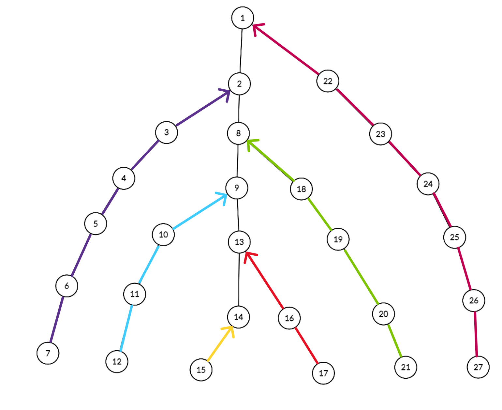
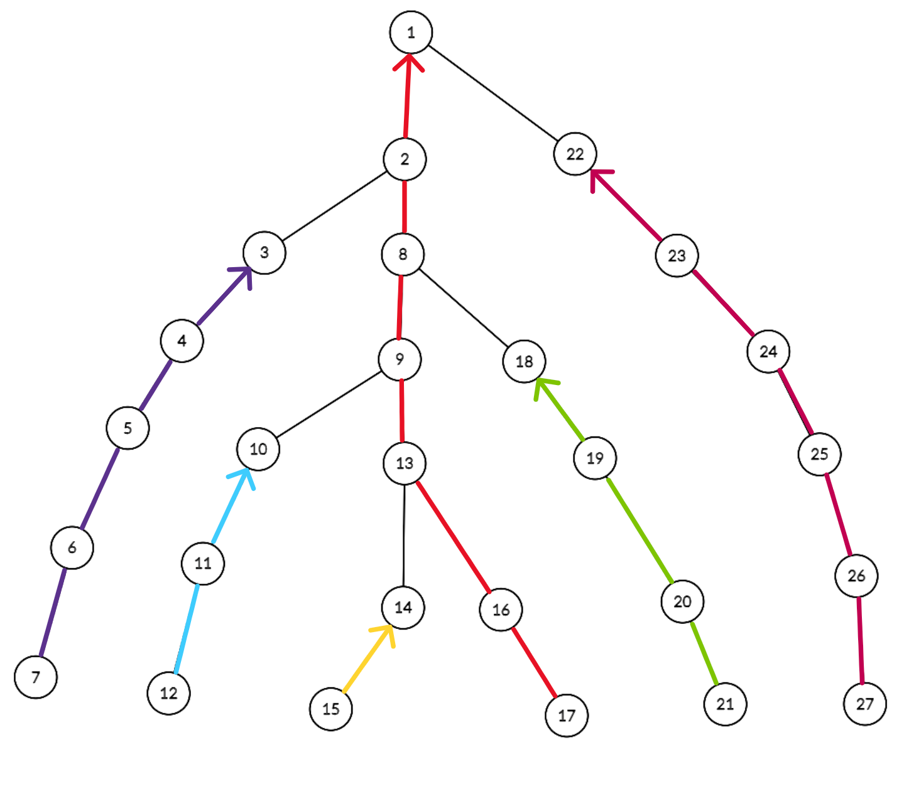

**Heavy-light decomposition** este o tehnică ce ne ajută să efectuăm query-uri și update-uri într-un timp eficient pe un **arbore**.

## Introducere

Fie un arbore $G$ cu $N$ noduri, iar rădăcina acestuia să fie în nodul 1.

Ideea din spatele algoritmului este de a **sparge arborele în mai multe lanțuri** pentru a atinge rădăcina din orice nod din arbore în timp **logaritmic**.

Evident, dacă efectuăm această descompunere pe arborele nostru, ne va permite să reducem anumite interogări sau update-uri unice de forma: "calculează ceva pe lanțul care leagă nodul $a$ pe nodul $b$" în mai multe interogări sau update-uri de forma: "calculează ceva pe segmentul $[l,r]$ din lanțul $K$". Pentru a calcula eficient pe segmentul $[l,r]$ din lanțul $K$, ne vom folosi de arbori de intervale.

## Construcția lanțurilor

Pentru început, vom presupune că pentru fiecare nod din $G$ se va efectua aceași metodă.

Știm că funcția logaritmică crește foarte lent, astfel încât este convenabil să construim lanțuri de lungimi cât mai mari, pentru a minimiza numărul de operații necesare pentru interogări și update-uri pe un număr cât mai mare de noduri din lanț. Așadar, pentru fiecare nod $x$, vom alege să continuăm crearea lanțului cu fiul care are cele mai multe noduri în subarborele său.

De ce nu am ales fiul care are cel mai lung lanț creat până la el? Când avem $\sqrt N$ lanțuri elementare, atunci vom avea o complexitate de $\mathcal{O}(\sqrt N)$ pentru parcurgerea de la un nod $x$ până la rădăcină. În concluzie, vom avea o complexitate de **$\mathcal{O}(\sqrt N \cdot \log N)$** pentru fiecare interogare sau update.



Dacă alegem fiul care are cele mai multe noduri în subarbore, constatăm că numărul de lanțuri pe care le vom parcurgem până la rădăcină se reduce la **$\log N$**.

Următoarea imagine ilustrează descompunerea arborelui cu tehnica descrisă anterior, cunoscută în termeni de specialitate sub denumirea de **heavy path decomposition**.



Complexitatea finală pe fiecare interogare va fi $\mathcal{O}(( \log N ) ^ 2)$, iar pentru update-ul unui singur nod în $\mathcal{O}(\log N)$.

## Implementarea în C++

Există și alte tehnici de precalculare a lanțurilor, dar aceasta este cea mai ușor de înțeles.

```cpp
/// nodurile arborelui sunt inițializați de la 1

const int MAX = 2e5 + 5;  /// limita de noduri din arbore

vector<int> G[MAX];  /// G[i] - nodurile în care putem intra din nodul i
bitset<MAX> viz;     /// viz[i] - verificăm dacă am intrat în nodul i
int niv[MAX];        /// niv[i] - nivelul la care se află nodul i în arbore
int w[MAX];          /// w[i] - dimensiunea subarborelui cu root i
int nrL;             /// numărul de lanțuri
int L[MAX];          /// L[i] - în ce lanț se află nodul i
int Lfather[MAX];  /// Lfather[L[i]] - primul nod al lanțului în care se află i
int Lniv[MAX];  /// Lniv[L[i]] - nivelul primului nod al lanțului în care se
                /// află i
vector<int> Lant[MAX];  /// Lant[i] - toate nodurile din lanțul i de la frunză
                        /// până la nodul root al lanțului

void dfs(int node) {
    int leaf = 1, maxl = -1;

    viz[node] = 1;
    w[node] = 1;

    for (auto x : G[node]) {
        if (viz[x]) {
            continue;
        }

        leaf = 0;
        niv[x] = niv[node] + 1;

        dfs(x);

        w[node] += w[x];

        /// actualizăm fiul care are cea mai mare dimensiune al subarborelui
        if (maxl == -1) {
            maxl = x;
        } else if (w[maxl] < w[x]) {
            maxl = x;
        }
    }

    /// daca node este o frunză
    if (leaf) {
        L[node] = ++nrL;  /// se crează un nou lanț
        Lant[L[node]].push_back(node);
    }
    /// altfel o să legăm pe node de maxl
    else {
        L[node] = L[maxl];
        Lant[L[node]].push_back(node);

        /// aici vom fixa nodul de start pentru fii care au rămas, aceștia fiind
        /// primi în lanțul creat păna la ei
        for (auto x : G[node]) {
            if (x == maxl or niv[x] < niv[node]) {
                continue;
            }

            Lfather[L[x]] = node;
            Lniv[L[x]] = niv[node];
        }
    }
}
```

## Probleme rezolvate

### Problema [Heavy Path Decomposition](https://www.infoarena.ro/problema/heavypath)

Se dă un arbore cu $N$ noduri, fiecare având asociată o valoare $v_i$, $1 \leq i
\leq N$. Se dau $M$ operații de forma $(t, x, y)$, cu următoarea semnificație:

- dacă $t$ este 0, operația este de tipul update, iar valoarea $v_x$ asociata nodului cu indicele $x$ devine $y$;
- dacă $t$ este 1, operația este de tipul query și se cere să se afișeze valoarea maximă asociată unui nod aflat pe lanțul elementar care unește nodurile $x$ și $y$.

Pentru a rezolva această problemă clasică, trebuie să implementăm arbori de intervale pentru lanțurile create de noi, iar apoi să efectuăm cele două tipuri de operații: query și update.

Pentru operația de tip update, putem opera doar pe lanțul unde se află nodul $x$.

Pentru operația de tip query, va trebuie să parcurgem mai multe lanțuri până când vom ajunge cu cele două noduri în același lanț. Această operațiune este chiar cea de la [Lowest common ancestor (LCA)](../dificil/lowest-common-ancestor.mdx).

O implementare de 100 de puncte poate fi citită mai jos:

```cpp
#include <algorithm>
#include <bitset>
#include <climits>
#include <fstream>
#include <vector>
using namespace std;

const string fn("heavypath");

ifstream in(fn + ".in");
ofstream out(fn + ".out");

#define cin in
#define cout out

const int MAX = 1e5;

int n, q, val[MAX + 5], niv[MAX + 5], w[MAX + 5], nrL, L[MAX + 5],
    Lfather[MAX + 5], Lniv[MAX + 5], Ldecal[MAX + 5];
int Tree[4 * MAX + 5];
vector<int> g[MAX + 5], Lant[MAX + 5];
bitset<MAX + 5> viz;

void dfs(int node) {
    int leaf = 1, maxl = -1;

    viz[node] = 1;
    w[node] = 1;

    for (auto x : g[node]) {
        if (viz[x]) {
            continue;
        }

        leaf = 0;
        niv[x] = niv[node] + 1;

        dfs(x);

        w[node] += w[x];

        if (maxl == -1) {
            maxl = x;
        } else if (w[maxl] < w[x]) {
            maxl = x;
        }
    }

    if (leaf) {
        nrL++;
        L[node] = nrL;
        Lant[L[node]].push_back(node);
    } else {
        L[node] = L[maxl];
        Lant[L[node]].push_back(node);

        for (auto x : g[node]) {
            if (x == maxl or niv[x] < niv[node]) {
                continue;
            }

            Lfather[L[x]] = node;
            Lniv[L[x]] = niv[node];
        }
    }
}

void build(int node, int l, int r, int decal, int pozl) {
    if (l == r) {
        Tree[node + decal] = val[Lant[pozl][l - 1]];
    } else {
        int m = (l + r) / 2;

        build(2 * node, l, m, decal, pozl);
        build(2 * node + 1, m + 1, r, decal, pozl);

        Tree[node + decal] =
            max(Tree[2 * node + decal], Tree[2 * node + 1 + decal]);
    }
}

void update(int node, int l, int r, int target, int val, int decal) {
    if (l == r) {
        Tree[node + decal] = val;
    } else {
        int m = (l + r) / 2;

        if (target <= m) {
            update(2 * node, l, m, target, val, decal);
        } else {
            update(2 * node + 1, m + 1, r, target, val, decal);
        }

        Tree[node + decal] =
            max(Tree[2 * node + decal], Tree[2 * node + 1 + decal]);
    }
}

int query(int node, int l, int r, int a, int b, int decal) {
    if (r < a or b < l) {
        return INT_MIN;
    }

    if (a <= l and r <= b) {
        return Tree[node + decal];
    }

    int m = (l + r) / 2;

    return max(query(2 * node, l, m, a, b, decal),
               query(2 * node + 1, m + 1, r, a, b, decal));
}

void make_paths() {
    niv[1] = 1;

    dfs(1);

    for (int i = 1; i <= nrL; i++) {
        reverse(Lant[i].begin(), Lant[i].end());

        if (i > 1) {
            Ldecal[i] = Ldecal[i - 1] + Lant[i - 1].size() * 4;
        }

        build(1, 1, Lant[i].size(), Ldecal[i], i);
    }
}

void solve() {
    int t, x, y;

    cin >> t >> x >> y;

    if (t == 0) {
        update(1, 1, Lant[L[x]].size(), niv[x] - Lniv[L[x]], y, Ldecal[L[x]]);
    } else {
        int ans = INT_MIN;

        while (1) {
            if (L[x] == L[y]) {
                if (niv[x] > niv[y]) {
                    swap(x, y);
                }

                ans =
                    max(ans, query(1, 1, Lant[L[x]].size(), niv[x] - Lniv[L[x]],
                                   niv[y] - Lniv[L[x]], Ldecal[L[x]]));

                break;
            }
            if (Lniv[L[x]] < Lniv[L[y]]) {
                swap(x, y);
            }

            ans = max(ans, query(1, 1, Lant[L[x]].size(), 1,
                                 niv[x] - Lniv[L[x]], Ldecal[L[x]]));
            x = Lfather[L[x]];
        }

        cout << ans << '\n';
    }
}

int main() {
    cin >> n >> q;

    for (int i = 1; i <= n; i++) {
        cin >> val[i];
    }

    for (int i = 1, x, y; i < n; i++) {
        cin >> x >> y;

        g[x].push_back(y);
        g[y].push_back(x);
    }

    make_paths();

    while (q--) {
        solve();
    }
    return 0;
}
```

### Problema [Struct arbore{}](https://kilonova.ro/problems/2844/)

Această problemă necesită cunoștințe de la [string hashing](../mediu/hashing.mdx), respectiv [Lowest common ancestor (LCA)](../dificil/lowest-common-ancestor.mdx).

În primul rând, ne vom folosi de tehnica string hashing pentru a afla în $\mathcal{O}(1)$ valoarea unui lanț. Pentru că problema ne cere să operăm și update-uri, va trebui să facem update pe fiecare lanț când schimbăm litera de la un nod. Astfel, complexitatea pentru update și query pe un lanț va rămâne tot $\mathcal{O}(\log(N))$, datorită string hashing. Dacă vrem să aflăm valoarea hash pe un lanț care leagă două noduri, aceasta va intra în complexitate $\mathcal{O}((\log N)^2)$, deoarece putem parcurge maxim $\log N$ lanțuri în tot arborele.

În al doilea rând, trebuie să aflăm în mod eficient strămoșul celor 2 noduri, astfel încât acesta să fie la o distanță cât mai mare, iar cele 2 stringuri formate să fie identice. Ne vom folosi de tehnica LCA pentru a afla în $\mathcal{O}(\log
N)$ al $K$ strămoș pentru nodul $x$, iar de căutarea binară pentru a afla valoarea $K$ în timp logaritmic. Astfel rezultă o complexitate finală de $\mathcal{O}((\log N)^3)$ pentru fiecare query și $\mathcal{O}(\log N)$ pentru update.

O implementare de 100 de puncte poate fi citită mai jos:

```cpp
/// Autor: Ardelean Raul, CNVL - Baia Mare
/// Cuvinte cheie: Binary Lifting, Hashing, Heavy Path Decomposition, Heavy
/// Light Decomposition, Binary Search Complexitate: O(Q * log(n) ^ 3)
#include <algorithm>
#include <bitset>
#include <cmath>
#include <iostream>
#include <vector>
#define ll long long
using namespace std;

const int MAX = 1e5 + 6, base = 57, mod = 1e9 + 7;

vector<int> G[MAX], v[30];
int n, q;
string s;

class kth {
public:
    int l, timer;
    vector<int> tin, tout;
    vector<vector<int>> up;

    void dfs(int node, int father) {
        tin[node] = ++timer;
        up[node][0] = father;

        for (int i = 1; i <= l; i++) {
            up[node][i] = up[up[node][i - 1]][i - 1];
        }

        for (auto x : G[node]) {
            if (x != father) {
                dfs(x, node);
            }
        }

        tout[node] = ++timer;
    }

    int kthancestor(int node, int k) {
        for (int i = 0; i <= l and node != -1; i++) {
            if (k & (1 << i)) {
                node = up[node][i];
            }
        }

        return node;
    }

    void init(int root) {
        tin.resize(MAX + 5);
        tout.resize(MAX + 5);

        timer = 0;
        l = ceil(log2(MAX + 5));

        up.assign(MAX + 5, vector<int>(l + 5));

        dfs(root, root);
    }

} kth;

class hpd {
public:
    int niv[MAX + 5], w[MAX + 5], fact[MAX + 5], invfact[MAX + 5];
    int nrL, L[MAX + 5], Lfather[MAX + 5], Lniv[MAX + 5], Ldecal[MAX + 5];
    int Tree[4 * MAX + 5], sz[4 * MAX + 5];

    vector<int> Lant[MAX + 5];
    bitset<MAX + 5> viz;

    void dfs(int node) {
        int leaf = 1, maxl = -1;

        viz[node] = 1;
        w[node] = 1;

        for (auto x : G[node]) {
            if (viz[x]) {
                continue;
            }

            leaf = 0;
            niv[x] = niv[node] + 1;

            dfs(x);

            w[node] += w[x];

            if (maxl == -1) {
                maxl = x;
            } else if (w[maxl] < w[x]) {
                maxl = x;
            }
        }

        if (leaf) {
            L[node] = ++nrL;
            Lant[L[node]].push_back(node);
        } else {
            L[node] = L[maxl];
            Lant[L[node]].push_back(node);

            for (auto x : G[node]) {
                if (x == maxl or niv[x] < niv[node]) {
                    continue;
                }

                Lfather[L[x]] = node;
                Lniv[L[x]] = niv[node];
            }
        }
    }

    int upd(int a, int b, int size) {
        if (size <= 0) {
            return a;
        }

        if (min(a, b) == 0) {
            return max(a, b);
        }

        return 1LL * (1LL * a * fact[size] % mod + 1LL * b) % mod;
    }

    void build(int node, int l, int r, int decal, int root) {
        if (l == r) {
            Tree[node + decal] = (s[Lant[root][l - 1]] - 'a' + 1);
            sz[node + decal] = 1;
        } else {
            int m = (l + r) / 2;

            build(2 * node, l, m, decal, root);
            build(2 * node + 1, m + 1, r, decal, root);

            sz[node + decal] = sz[2 * node + decal] + sz[2 * node + 1 + decal];
            Tree[node + decal] =
                upd(Tree[2 * node + decal], Tree[2 * node + 1 + decal],
                    sz[2 * node + 1 + decal]);
        }
    }

    void update(int node, int l, int r, int target, int val, int decal) {
        if (l == r) {
            Tree[node + decal] = val;
        } else {
            int m = (l + r) / 2;

            if (target <= m) {
                update(2 * node, l, m, target, val, decal);
            } else {
                update(2 * node + 1, m + 1, r, target, val, decal);
            }

            Tree[node + decal] =
                upd(Tree[2 * node + decal], Tree[2 * node + 1 + decal],
                    sz[2 * node + 1 + decal]);
        }
    }

    int query(int node, int l, int r, int a, int b, int decal) {
        if (r < a or b < l) {
            return 0;
        }

        if (a <= l and r <= b) {
            return Tree[node + decal];
        }

        int m = (l + r) / 2;

        int left = query(2 * node, l, m, a, b, decal);
        int right = query(2 * node + 1, m + 1, r, a, b, decal);

        return upd(left, right, min(r, b) - m);
    }

    void make_paths() {
        fact[0] = 1;

        for (int i = 1; i <= MAX; i++) {
            fact[i] = 1LL * fact[i - 1] * base % mod;
        }

        niv[1] = 1;

        dfs(1);

        for (int i = 1; i <= nrL; i++) {
            reverse(Lant[i].begin(), Lant[i].end());

            if (i > 1) {
                Ldecal[i] = Ldecal[i - 1] + Lant[i - 1].size() * 4;
            }

            build(1, 1, Lant[i].size(), Ldecal[i], i);
        }
    }

    int find(int x, int y) {
        int hash = 0, tlen = 0;

        while (1) {
            if (L[x] == L[y]) {
                if (niv[x] > niv[y]) {
                    swap(x, y);
                }

                int len = niv[y] - Lniv[L[x]] - niv[x] + Lniv[L[x]] + 1;

                hash = upd(query(1, 1, Lant[L[x]].size(), niv[x] - Lniv[L[x]],
                                 niv[y] - Lniv[L[x]], Ldecal[L[x]]),
                           hash, tlen);
                tlen += len;

                break;
            }

            if (Lniv[L[x]] < Lniv[L[y]]) {
                swap(x, y);
            }

            int len = niv[x] - Lniv[L[x]];

            hash = upd(query(1, 1, Lant[L[x]].size(), 1, niv[x] - Lniv[L[x]],
                             Ldecal[L[x]]),
                       hash, tlen);
            tlen += len;

            x = Lfather[L[x]];
        }

        return hash;
    }
} tree;

void read() {
    cin >> n >> s;

    s = " " + s;

    for (int i = 1; i <= n; i++) {
        v[s[i] - 'a'].push_back(i);
    }

    for (int i = 2, x; i <= n; i++) {
        cin >> x;
        G[x].push_back(i);
    }
}

void init() {
    kth.init(1);
    tree.make_paths();
}

void solve() {
    cin >> q;

    while (q--) {
        int t, a, b;

        cin >> t;

        if (t == 1) {
            cin >> a >> b;

            int l = 0, r = min(tree.niv[a], tree.niv[b]) - 1, target = 0;

            while (l <= r) {
                int med = (l + r) / 2;

                int ancestor_a = kth.kthancestor(a, med);
                int ancestor_b = kth.kthancestor(b, med);

                if (tree.find(ancestor_a, a) == tree.find(ancestor_b, b)) {
                    target = med + 1, l = med + 1;
                } else {
                    r = med - 1;
                }
            }

            cout << target << '\n';
        } else {
            char ch;

            cin >> a >> ch;

            s[a] = ch;
            tree.update(1, 1, tree.Lant[tree.L[a]].size(),
                        tree.niv[a] - tree.Lniv[tree.L[a]], ch - 'a' + 1,
                        tree.Ldecal[tree.L[a]]);
        }
    }
}

signed main() {
    ios_base::sync_with_stdio(false);
    cin.tie(0);

    read();
    init();
    solve();
    return 0;
}
```

## Concluzii

**Heavy-light decomposition** este un algoritm foarte important și puternic, care apare rar, datorită numărului mare de linii de cod necesare pentru a restrânge arborele și a prelucra operații asupra lanțurilor. Orice idee care poate fi realizată cu arbori de intervale poate fi extinsă și folosită pe un arbore.

## Probleme suplimentare

- [Path Queries II](https://cses.fi/problemset/task/2134/)
- [Company Queries II](https://cses.fi/problemset/task/1688)
- [confuzie](https://kilonova.ro/problems/217/)
- [Disconnect](https://www.infoarena.ro/problema/disconnect)
- [Sever](https://www.infoarena.ro/problema/sever)
- [Petarbore](https://www.infoarena.ro/problema/petarbore)
- [mogger](https://kilonova.ro/problems/3182)
- [Cow Land](https://usaco.org/index.php?page=viewproblem2\&cpid=921)
- [QTREE3 - Query on a tree again!](https://www.spoj.com/problems/QTREE3/en/)
- [Milk Visits](https://usaco.org/index.php?page=viewproblem2\&cpid=970)
- [Delay](https://infoarena.ro/problema/delay)
- [Aladdin and the Return Journey](https://lightoj.com/problem/aladdin-and-the-return-journe)
- [Disruption](https://usaco.org/index.php?page=viewproblem2\&cpid=842)
- [Subtrees And Paths](https://usaco.guide/plat/hld?lang=cpp)
- [Grass Planting](https://usaco.org/index.php?page=viewproblem2\&cpid=102)
- [Vertex Set Path Composite](https://judge.yosupo.jp/problem/vertex_set_path_composite)
- [Caves and Tunnels](https://acm.timus.ru/problem.aspx?space=1\&num=1553)
- [Tree Queries](https://codeforces.com/contest/1254/problem/D)
- [The Tree](https://codeforces.com/contest/1017/problem/G)
- [Tree Game](https://tlx.toki.id/problems/troc-14/H/)
- [Synchronization](https://oj.uz/problem/view/JOI13_synchronization)
- [Cats or Dogs](https://oj.uz/problem/view/JOI18_catdog)
- [Probleme cu HLD de pe Kilonova](https://kilonova.ro/tags/295)

## Resurse suplimentare

- [HLD - CP Algorithms](https://cp-algorithms.com/graph/hld.html)
- [HLD - USACO Guide](https://usaco.guide/plat/hld)
- [Tree decompositions - Infoarena](https://infoarena.ro/tree-decompositions)
- [Template HLD - Stefdasca](https://github.com/stefdasca/CompetitiveProgramming/blob/master/Algorithms/heavy-light.cpp)
- [Easiest HLD with subtree queries - Codeforces adamant's blog](https://codeforces.com/blog/entry/53170)
- [Heavy path decomposition - Centrul InfO(1)](https://sites.google.com/site/centrulinfo1/materiale-video/algoritmi-video/heavy-path-decomposition?authuser=0)
- [Heavy Light Decomposition - robert1003](https://robert1003.github.io/2020/09/04/heavy-light-decomposition.html)
