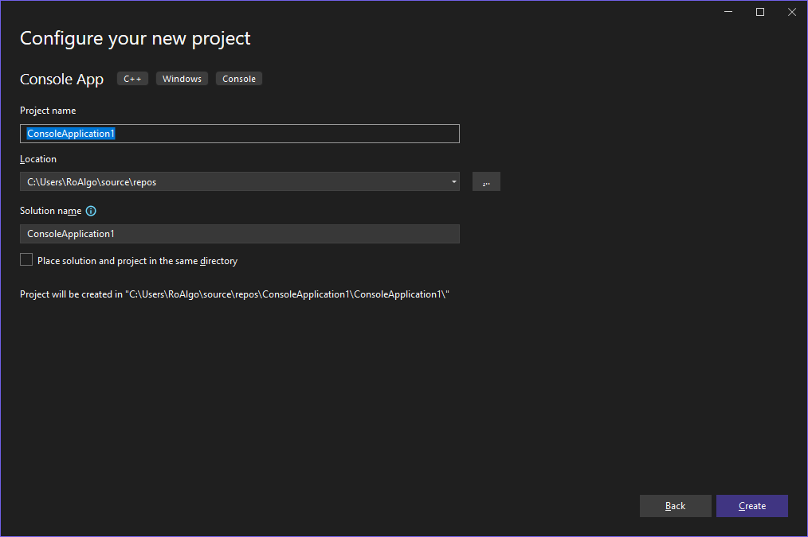

## Instalare

Pentru a instala:

1. Descarcă executabilul de setup de aici (Visual Studio 2022 Community, este varianta gratuită și arhisuficientă pentru nevoile tale):

   [Descarcă Visual Studio 2022 Community :material-download:](https://c2rsetup.officeapps.live.com/c2r/downloadVS.aspx?sku=community\&channel=Release\&version=VS2022\&source=VSLandingPage)

2. Rulează executabilul. La prima fereastră cu titlul Visual Studio Installer, apasă pe butonul Continue. După ce se descarcă installer-ul oficial, o să ai o fereastră similară cu asta:

   

3. Visual Studio 2022 are conceptul de *workload*. Fiecare workload este specializat pe un anumit domeniu sau limbaj și instalează un set anume de componente. Majoritatea workload-urilor sunt țintate către cei pe C#, însă pe noi ne interesează workload-ul **Desktop development with C++**. Așa ar trebui să arate fereastra ta după ce ai selectat opțiunea asta:

      

4. Apasă butonul de install și așteaptă să se instaleze. După cum se poate vedea în ultima poză, este destul de mare Visual Studio. Totuși, după ce se termină de instalat, se deschide singur. La această fereastră, ori te poți loga cu contul de GitHub sau Microsoft, ori poți să dai skip, nu e necesar să ai un cont pentru a putea folosi Visual Studio.

   

5. La următoarea fereastră, poți să lași setările implicite sau să schimbi tema. Tot ce mai rămâne să faci este să apeși pe "Start Visual Studio" și să aștepți puțin în timp ce se configurează. Dacă tot procesul a mers cum trebuie, se va deschide această fereastră:

   

## Configurare și utilizare

Felicitări! Ai instalat Visual Studio 2022. Acum vremea să îl configurăm și folosim.

Pentru a crea un proiect C++, facem următorii pași:

1. La fereastra de mai sus (care apare în momentul în care deschizi Visual Studio 2022), apasă pe "Create a new project".
2. O să fii întâmpinat de mai multe șabloane pe care le poți folosi:

   

3. Avem două șabloane care ni-s utile:

   1. Console App, care gestionează proiectul folosind MSBuild și este specific Visual Studio;
   2. CMake Project, care poate rula pe mai multe platforme (oriunde este suportat CMake, inclusiv Linux și \*BSD) și nu este limitat de Visual Studio.

   Dacă nu ai nevoie să editezi proiectul și cu alte editoare/IDE-uri sau pe alte platforme, Console App este suficient, așa că asta vom folosi și noi acum. Dă dublu click pe Console App (sau selectează-l, apoi apasă Next).

4. Ajungem la această fereastră:

   

   În primul rând, avem numele proiectului.

   <Callout type="tip">
   Fă numele proiectului sugestiv, chiar numele problemei la care lucrezi
   acum, pentru că nu este prea drăguț să umpli printr-o mare de proiecte
   care încep cu ConsoleApplication.
   </Callout>

   Apoi avem locația acestuia. Calea implicită este `$$USER\source\repos`, dar poți să-l pui undeva separat (recomand acest lucru). După locație avem numele soluției. O soluție este un container pentru unul sau mai multe proiecte. Poți selecta și dacă vrei să fie soluția și proiectul în același director (caz în care numele proiectului este același cu cel al soluției).

   <Callout type="warning">
   Nu există soluții dacă alegi șablonul cu CMake. Există moduri prin
   care poți emula acest lucru, dar cea mai simplă cale (fără integrarea
   de care ai parte cu Console App) este să pui în directoare separate
   (de fapt, asta face și o soluție).
   </Callout>

   <Callout type="tip">
   Nu este obligatoriu, însă dacă lucrezi de pe un site (e.g. Kilonova)
   sau faci probleme de la un concurs, recomand să le grupezi într-o
   soluție. Zece soluții sunt mult mai ușor de gestionat decât 40 de
   proiecte, dacă este nevoie să cauți pe viitor rezolvările la o
   problemă.
   </Callout>

   De dragul exemplului, voi numi proiectul "ConsoleApplication1" sub locația implicită și pun proiectul în același loc cu soluția. Dacă totul a mers cum trebuie, vei vedea o fereastră similară cu asta:

   

Poți acum să apeși ++ctrl+f5++ (Start without Debugging) și vei vedea că rulează programul și afișează Hello World. Asta înseamnă și că ai compilatorul MSVC funcțional.

<Callout type="tip">

Obișnuiește-te cu această scurtătură (++ctrl+f5++), o să o folosești
*foarte des*. În timp, uită-te prin meniuri și învață niște scurtături
comune pentru acțiunile pe care le faci cele mai des, așa vei deveni
mai rapid și mai fluid la a folosi Visual Studio. [Vezi această
pagină](https://visualstudio.microsoft.com/keyboard-shortcuts.pdf)
care este cheatsheet de la Microsoft cu cele mai comune scurtături
specifice VS. Scurtăturile generale gen ++ctrl+c++, ++ctrl+v++,
++ctrl+s++ etc. le poți găsi și din VS și sunt în mare parte general
valabile.

</Callout>

Acum, timpul pentru niște chestii pe care le poți face ca să îmbunătățești performanța (VS este un program mare și ia multă memorie, deci poate fi uneori încet):

1. Visual Studio deschide automat fișierele care au fost deschise în vechea sesiune. Din această pricină, o soluție poate lua mai mult să se deschidă, pentru că toate fișierele sunt analizate în paralel. Pentru a dezactiva acest comportament:

   1. Apasă în meniu pe Tools, apoi Options (ultima din dropdown, cea cu o rotiță zimțată);
   2. Du-te la Projects and Solutions, apoi la General și dezactivează "Reopen documents on solution load". În final, ar trebui să arate similar cu asta:

   

   În schimb, putem să ne folosim de ce se află la Edit > Go To. Aici se află toate opțiunile:

   

   Cea mai importantă din ele este ++ctrl+t++ care funcționează ca un Go To generalizat. Pentru fișiere recente avem ++ctrl+1++, ++ctrl+r++, și pentru fișiere în general avem ++ctrl+shift+t++. Ocazional folosesc și ++ctrl+1++, ++ctrl+s++ ca să caut un simbol (o funcție, o variabilă etc.), ceea ce se poate dovedi util la fișiere mari.

2. Dacă instalezi extensii, acestea sunt activate când este nevoie. Problema la această abordare este că dacă ai una sau mai multe extensii care rulează imediat la pornire, atunci programul se va încetini. Poți folosi Help > Visual Studio Performance Manager pentru a inspecta de ce VS este încet.

3. Visual Studio își ajustează efectele bazat pe performanța clientului, însă acest lucru de cele mai multe ori încetinește tot. Pentru a rezolva acest lucru, mergem la Tools > Options și apoi la Environment > General. Opțiunea pe care vrem să o dezactivăm se cheamă "Automatically adjust visual experience based on client performance", împreună cu "Enable rich client visual experience". Ultima opțiune, cea cu accelerarea hardware, trebuie să rămână activă, pentru a nu randa software Visual Studio (excepție fiind dacă ai un calculator cu o placă video *foarte* slabă sau dacă ești pe mașină virtuală). După ce ai terminat, fereastra trebuie să fie similară cu asta:

4. Windows Defender rulează constant în fundal pentru a ne proteja de viruși. Totuși, asta impactează negativ performanța pentru că scanează toate directoarele din sistem, inclusiv cele ale lui Visual Studio și cele ale proiectelor noastre. Pentru acest lucru, trebuie să facem excepții. Am creat un script de PowerShell care să automatizeze acest proces. Acesta poate fi descărcat de aici:

   [Descarcă script :material-download:](./vs2022/ImproveVS2022.ps1)

   Pentru a-l folosi, trebuie făcuți următorii pași (presupun că ai descărcat
   scriptul în `C:\Users\<nume>\Downloads` (adică în folderul de Descărcări)):

   1. Deschide o fereastră de PowerShell ca administrator. Pentru a face acest
      lucru, fie poți apăsa incantația ++win+x++, ++a++ și apoi ++enter++, fie
      poți să cauți Windows Powershell (sau doar Terminal, dacă ești pe Windows
      11\) în meniu, apoi selectezi Executare ca administrator.

   2. Navighează până la calea unde ai descărcat cu `cd C:\Users\<cale>`. În
      cazul meu, va fi `cd C:\Users\RoAlgo\Downloads`.

   3. Scrie `.\ImproveVS2022.ps1` (presupunând că așa ai numit fișierul).

   4. Trebuie doar să furnizezi calea unde îți stochezi proiectele de obicei.
      Dacă ești cu setările implicite, atunci poți scrie exact ce îți zice
      exemplul (adică `C:\Users\<nume>\source\repos`). Dacă nu există calea,
      atunci programul iese.

   5. Apeși ++enter++ și aștepți să își facă treabă (termină repede).

Asta este tot cu configurarea. Poți acum să mergi către următorul articol:

[Mergi la introducere](./../../intro.mdx)
