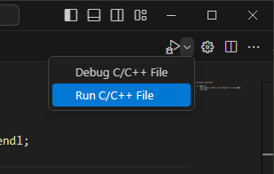
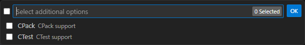
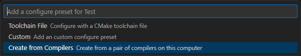

## Instalare

Procesul de instalare este unul foarte simplu:

1. Descarcă installerul de Visual Studio Code:

   [Link direct :material-download:](https://go.microsoft.com/fwlink/?LinkID=534107)

2. După ce s-a descărcat, rulează installerul (care ar trebui să fie numit `VSCodeUserSetup-x64-{versiune}.exe`). Procesul nu durează mult, de cele mai multe ori este un minut.

3. Implicit, VS Code este instalat sub `C:\Users\{nume utilizator}\AppData\Local\Programs\Microsoft VS Code`.

Alternativ, poți descărca o arhivă .zip, să o extragi și să rulezi VS Code de acolo. Acest lucru este util în caz că vrei să rulezi portabil (de pildă, la școală, unde nu ai drepturi de administrator pentru a putea instala VS Code în mod normal).

[Descarcă arhiva .zip :material-download:](https://code.visualstudio.com/docs/?dv=winzip)

## Configurare și utilizare

Înainte de a continua, părțile principale ale interfeței sunt:

- Editorul, unde deschizi și schimbi fișiere sursă (și nu numai). Aici îți vei petrece majoritatea timpului. Poți avea mai mult de un fișier deschis.
- Bara laterală (sidebar) arată fișierele și directoarele cu care lucrezi. Poate fi ascunsă pentru a vedea mai mult din cod.
- Bara de status, care se află în partea de jos, și arată informații precum linia și coloana pe care te afli, tipul de fișier, numărul de erori ș.a.m.d.
- Panel-uri, care sunt arii care apar pentru sarcini specifice precum căutare, inspectarea erorilor, gestionarea extensiilor ș.a.m.d.

Implicit nu vine cu suport integrat pentru C++. Totuși, Visual Studio Code are o gamă largă de extensii (pe care le putem accesa folosind butonul de extensii care arată ca patru cuburi dintre care unul este desprins, dar poate fi accesat și cu scurtătura ++ctrl+shift+x++). De acolo, caută "C/C++ Extension Pack" și apasă pe prima extensie de la Microsoft (nu este greu să o recunoști).

Acum să facem un fișier de C++ pentru a putea continua procesul. Creează un fișier nou, fie din File > New Text File, fie folosind scurtătura ++ctrl+n++. Îl salvăm imediat undeva (++ctrl+s++), locația nu este importantă pe moment. Numele fișierului trebuie să se termine cu `.cpp` la final, să-i zicem `main.cpp`. Imediat ce ai salvat, O să vezi că Visual Studio Code a recunoscut fișierul nostru gol ca unul de C++ și a activat extensia pe care tocmai am instalat-o. Dacă îți cere într-un pop-up să te duci la o versiune de pre-release a extensiei de C++, refuză.

Apasă ++ctrl+shift+p++ pentru a activa Command Palette (o să folosești asta foarte des). Scrie "Intellisense" și selectează opțiunea "C/C++: Select IntelliSense Configuration...". Alege g++. În cazul în care ai instalat și Visual Studio 2022, o să ai opțiunea de cl.exe. Dacă nu ai instalat GCC cu MinGW, este bună și această opțiunea, deși ar fi bine să ai g++ în schimb.

Ca să testezi dacă a mers, scrie `#include <ios`. Dacă îți oferă sugestii precum `ios`, `iostream` și `iso646.h`, atunci este funcțional.

Creează un director gol într-un loc pe care îl știi și apoi navighează până la el folosind File > Open Folder (++ctrl+k++ ++ctrl+o++). Dacă ai un popup cu "Do you trust the authors of the files in this folder?", apasă "Yes, I trust the authors" (pentru că tu ești autorul, logic). Poți opțional să bifezi să aibă încredere și în fișierele din directorul părinte. Apoi poți crea un nou fișier pe care să-l numești tot `main.cpp`, ca data trecută. Adaugă aceste linii în fișier:

```cpp
#include <iostream>

int main() {
    std::cout << "Hello from VSCode!" << std::endl;
    return 0;
}
```

Interfața ta ar trebui să arate similar cu asta:


Apoi poți să rulezi fișierul astfel:

1. Du-te la butonul de debug din tab bar (este un triunghi cu un gândac) și extinde-l. Din lista aceea, selectează Run C/C++ code. Așa ar trebui să arate:



2. Selectează de acolo "C/C++: g++.exe build and debug active file", ca să poată compila folosind G++. Este posibil să vezi și opțiuni cu Clang sau cl.exe, dar poți să le ignori. Dacă îți cere extensia de CMake Tools ceva legat de vizibilitate, dă-i Do not show again, nu îți este relevantă ție acum.

3. Dacă totul a mers cum trebuie, ar trebui să vezi undeva jos în terminal mesajul "Hello from VSCode!".

Metoda pe care o folosesc eu când folosesc Visual Studio Code este următoarea:

1. Când ai instalat extensia, ți-a instalat și suport pentru CMake. Pentru a crea un proiect de CMake, du-te în Command Palette prin ++ctrl+shift+p++ și apoi scrie "CMake: Quick Start" și selectează acea opțiune;

2. Scrie numele proiectului tău. De obicei este la fel ca numele problemei pe care o faci, dar poate fi orice. Nu trebuie să conțină spații (doar linii sau bară jos).


3. Aici te pune să alegi limbajul în care va fi proiectul. Cum este o introducere în C++, noi vom alege C++, firește.


4. Noi dorim să avem un executabil, deci vom alege opțiunea corespunzătoare.


5. Niciuna din aceste opțiuni (CPack sau CTest) nu ne este relevantă, deci nu alegem niciuna și trecem mai departe.



6. Alegem fișierele pe care dorim să le avem în target. În cele mai multe cazuri, va fi doar un singur fișier, probabil numit `main.cpp`. Este important să existe acest fișier *înainte* de a folosi Quick Start.


7. În această fază trebuie să configurăm un preset. În acest caz, este un preset de configurare, care îi zice lui CMake cum să configureze proiectul nostru. Printre altele, dictează generatorul, fișierul de toolchain (care detectează efectiv care este compilatorul și face disponibile toate fișierele antet) și locul unde se va da build. Apasă ++enter++.


8. Cea mai simplă opțiune de a crea un preset de configurare este de la compilator, deci vom selecta "Create from Compilers".



9. Aici selectăm kit-ul nostru. În esență, un kit este un compilator. Alegem GCC (sau Visual Studio 17 2022 x64, dacă ai instalat Visual Studio 2022 înainte).


10. Acest preset are nevoie de un nume, îl putem numi simplu GCC (sau MSVC, dacă ai ales VS).


Cel mai important fișier este `CMakeLists.txt`. El arată așa în momentul de față:

```cmake
cmake_minimum_required(VERSION 3.5.0)
project(cppintro VERSION 0.1.0 LANGUAGES C CXX)
add_executable(cppintro main.cpp)
```

Mai trebuie să adăugăm unele chestii. Un CMakeLists.txt adecvat arată astfel:

```cmake
cmake_minimum_required(VERSION 3.27)
project(cppintro VERSION 0.1.0 LANGUAGES C CXX)
set(CMAKE_CXX_STANDARD 20)
set(CMAKE_CXX_EXTENSIONS OFF)
set(CMAKE_CXX_STANDARD_REQUIRED ON)
add_executable($${PROJECT_NAME} main.cpp)
if (MSVC)
    target_compile_options($${PROJECT_NAME} PUBLIC /W4 /WX)
    target_compile_options($${PROJECT_NAME} PRIVATE $$<$$<CONFIG:Debug>:/Od /Zi> $$<$$<CONFIG:Release>:/O2>)
    target_link_options($${PROJECT_NAME} PRIVATE $$<$$<CONFIG:Debug>:/DEBUG> $$<$$<CONFIG:Release>:/DEBUG:NONE>)
else()
    target_compile_options($${PROJECT_NAME} PUBLIC -Wall -Wextra -Wpedantic -Wfloat-conversion)
    target_compile_options($${PROJECT_NAME} PRIVATE $$<$$<CONFIG:Debug>:-O0 -g> $$<$$<CONFIG:Release>:-O3>)
endif()
```

În esență, ce face acest CMakeLists.txt nou este că setează standardul la C++20 și îl face obligatoriu, și adaugă mai multe flag-uri pentru a afișa mai multe avertizări (ne ajută să găsim erori mai devreme) și a scoate optimizările în momentul în care depanăm codul.

Acum că avem toate astea, apasă ++shift+f5++ și bucură-te de executabil.

Aici sunt mai multe scurtături și concepte utile care te pot ajuta în a configura editorul:

1. Poți să îți schimbi tema folosind "Preferences: Color Theme" din Command Palette sau folosind ++ctrl+k++ ++ctrl+t++. De asemenea, poți găsi alte teme interesante ca extensii.
2. Pentru a accesa setările, folosește fie ++ctrl+comma++, fie "Preferences: Open Settings (UI)" din Command Palette. Unele setări necesită configurare care nu se poate face din interfață, deci avem nevoie să modificăm un fișier JSON. Pentru acest lucru, avem în partea de sus o icoană cu o foaie de hârtie și o săgeată. Alternativ, poți ajunge în același loc din Command Palette, dacă scrii "Preferences: Open User Settings (JSON)".


3\. Din setări, poți ajusta fontul. Adaugă fonturile pe care vrei să le ai, în ordinea descrescătoare a preferinței. Dacă numele fontului are spațiu, trebuie să pui între ghilimele. De asemenea, poți modifica și mărimea fontului, în funcție de preferințe.
4\. Recomand să activezi funcția de auto-save. Aceasta îți salvează automat codul. Setează-l pe afterDelay.
5\. Pentru a ascunde bara laterală, apasă ++ctrl+b++. Pentru a o aduce înapoi, apasă aceeași scurtătură. Poate fi util în cazul în care lucrezi pe jumătate din ecran sau dacă vrei să ai mai mult loc.
6\. Poți apăsa ++f11++ pentru a face editorul să fie fullscreen. Un efect secundar este că dispare bara de meniu, dar este în regulă. Pentru a ieși din modul fullscreen, apasă din nou ++f11++.
7\. Uneori, și modul fullscreen are prea multe distrageri. Poți activa modul Zen cu ++ctrl+k++, ++z++ pentru a ascunde tot în afară de editor.
8\. Poți să împarți editorul în două folosind fie butonul dedicat din bara de tab-uri (arată ca un pătrat împărțit în două), fie cu ++ctrl+backslash++. Alternativ, poți trage un fișier în editor și vei avea o indicație vizuală.
9\. Pentru a ne asigura că avem un stil consistent, putem lăsa Visual Studio Code să formateze codul. Pentru acest lucru, putem apăsa ++shift+alt+f++. Dacă nu ești sigur de scurtătura pe platforma ta, poți căuta "Format Document" din Command Palette.
10\. Uneori, ai nevoie să cauți un șir într-un fișier. Pentru acest lucru, apasă ++ctrl+f++ (sau ++ctrl+shift+f++ pentru a căuta în toate fișierele). Dacă în loc de ++f++ apeși ++h++ în combinațiile respective, poți să și înlocuiești text.
11\. La capitolul de căutat fișiere, dacă apeși ++ctrl+p++, poți să cauți numele unui fișier. Dacă adaugi `:`, poți să sari la o linie anume în fișierul curent (de pildă, în cazul unei erori de la compilator) sau la un simbol anume cu `@` (dacă trebuie să ajungi la o variabilă sau la o funcție anume).
12\. Deseori vei avea nevoie să modifici în mai multe locuri simultan. Visual Studio Code are suport nativ pentru mai multe cursoare. Pentru a crea mai multe cursoare, apasă ++ctrl+alt+up++ (sau ++ctrl+alt+down++).
13\. Pentru a selecta cuvântul curent, apasă ++ctrl+d++. Poți să apeși de mai multe ori pentru a găsi mai multe apariții.

!!! tip "Sfat"

Sunt atâtea setări pe care le poți modifica și atâtea extensii pe care să le
poți instala, însă recomand să înveți mai multe scurtături pentru acțiuni pe
care le faci în mod comun. Dacă folosești mai mult tastatura, devii mai
eficient pentru că nu este nevoie să îți muți mâna spre mouse.

Asta este tot cu configurarea. Poți acum să mergi către următorul articol:

[Mergi la introducere](./../../intro.mdx)
