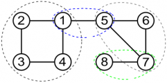

În cele ce urmează, vom prezenta componentele biconexe, algoritmul prin care le aflăm și cum putem folosi aceste informații în probleme.

## Introducere

În cele ce urmează, vom prezenta componentele biconexe, elementele principale asociate componentelor biconexe și cum putem implementa algoritmul specific pentru aflarea lor. De asemenea, vom prezenta și alte tehnici asociate, împreună cu probleme exemplu.

Ca și cunoștințe necesare pentru înțelegerea componentelor biconexe, se recomandă studiul parcurgerii grafurilor și dinamicilor pe arbore.

<Callout type="def">
  Într-un graf neorientat, componentele biconexe sunt submulțimi maximale de
  noduri cu proprietatea că pentru oricare pereche de noduri $$(a, b)$$ care
  aparțin unei astfel de componente, se poate ajunge de la $$a$$ la $$b$$ chiar și
  dacă scoatem un nod din graful rezultat.
</Callout>

<Callout type="obs">
  Se poate observa că componentele biconexe sunt o versiune mai avansată a
  componentelor conexe, prelucrarea lor va fi una mai specifică și așa cum
  veți vedea în acest articol, destul de ușor de aplicat după câteva exemple
  explicate.
</Callout>

<Callout type="example">
  De exemplu, dacă avem următorul graf: $$n = 8$$, $$m = 9$$ și următoarele muchii de tip $$(a, b)$$: $$(1, 2)$$,$$ (2, 3)$$,$$ (3, 4)$$,$$ (4, 1)$$,$$ (1, 5)$$,$$ (5,     6)$$,$$ (6, 7)$$,$$ (7, 5)$$,$$ (7, 8)$$, componentele biconexe sunt $$\{1, 2, 3, 4}$$, $$\{7, 8}$$, $$\{5, 6, 7}$$ și $$\{1, 5}$$. Mai jos găsiți un desen reprezentativ.

  
</Callout>

Pentru aflarea componentelor biconexe, există mai multe metode de a le afla, dar aici vom prezenta una dintre ele, care se bazează pe o parcurgere DFS și împărțirea muchiilor în două categorii, creându-se ceea ce vom numi un arbore DFS.

## Arborele DFS (DFS Tree)

<Callout type="obs">
  Recomandăm în mod special [acest blog](https://codeforces.com/blog/entry/68138) de pe Codeforces
  pentru înțelegerea conceptului și chiar pentru explicații suplimentare
  pentru unele conținuturi care vor fi prezentate ulterior în acest articol.
</Callout>

<Callout type="def">
  Un arbore DFS este un arbore pe care îl obținem parcurgând un graf
  neorientat folosind o parcurgere DFS, dacă păstrăm doar muchiile care au
  fost folosite pentru a apela DFS din noduri noi.
</Callout>

Deoarece grafurile cu care lucrăm nu sunt arbori, se impune împărțirea muchiilor grafului în funcție de apartenența la arborele DFS.

<Callout type="def">
  Muchiile care nu aparțin arborelui DFS, dar aparțin grafului inițial
  reprezintă muchii de întoarcere.
</Callout>

<Callout type="obs">
  Se poate observa că în funcție de ordinea în care se realizează parcurgerea
  DFS, unele muchii principale pot deveni muchii de întoarcere și invers, dar
  există muchii care nu vor fi niciodată muchii de întoarcere, acestea
  devenind subiectul nostru de discuție ulterior în articol.
</Callout>

În desenul de mai jos, muchiile îngroșate reprezintă arborele DFS. Muchiile care nu sunt îngroșate reprezintă muchiile de întoarcere.


## Elemente esențiale

În cele ce urmează, vom prezenta câteva dintre cele mai importante noțiuni care se regăsesc atunci când lucrăm cu componente biconexe.

### Muchii critice

Muchiile critice (numite în engleză bridges) reprezintă muchiile care dacă le scoatem din graf, acesta nu va mai fi conex. Un astfel de exemplu în desenul de mai sus este muchia $$(2, 4)$$.

<Callout type="obs">
  O muchie de întoarcere nu va fi niciodată o muchie critică, arborele DFS s-a
  putut construi deja fără ea.
</Callout>

### Puncte de articulație

Punctele de articulație reprezintă nodurile care dacă le scoatem din graf, acesta nu va mai fi conex. Un astfel de exemplu în desenul de mai sus este nodul 9.

## Algoritmul de aflare a componentelor biconexe

Pentru a afla componentele biconexe, precum și celelalte valori relevante (muchiile critice și punctele de articulație), vom folosi un algoritm bazat pe o parcurgere DFS și o abordare specifică programării dinamice.

În primul rând, vom avea nevoie să știm pentru fiecare nod, nivelul la care se află conform arborelui DFS, lucru ce se poate afla foarte ușor.

În al doilea rând, și poate cel mai important aspect al acestui algoritm, reprezintă recurența prin care aflăm pentru fiecare nod care este cel mai mic nivel pe care îl putem accesa folosind nodurile din subarborele său, împreună cu **muchiile de întoarcere** ale nodurilor din acesta, recurență care va fi numită $$low$$.

Pentru a calcula valoarea lui $$low$$ pentru fiecare nod, ne vom folosi de valorile lui $$low$$ calculate pentru fiecare fiu al nodului curent, împreună cu nivelele la care se află nodurile din muchiile de întoarcere corespunzătoare nodului curent. Cu alte cuvinte, această recurență este foarte similară cu alte recurențe cu care sunteți obișnuiți de la dinamicile pe arbore, scopul acesteia reprezintă aflarea nivelului la care se află cel mai apropiat nod de rădăcină pe care îl putem accesa.

Un alt aspect de implementare foarte important reprezintă memorarea nodurilor într-o stivă, în ordinea în care au fost accesate, scopul fiind acela de a identifica componentele biconexe, deoarece de fiecare dată când dăm de un punct de articulație, putem separa nodurile ce fac parte din componenta biconexă curentă de restul grafului, în ordinea inversă celei în care au fost adăugate în stivă.

### Implementare

Pentru a implementa acest algoritm, tot ce trebuie să facem este să aplicăm pașii de mai sus, atenția la implementare fiind necesară.

Pentru a afla punctele de articulație, avem două cazuri care trebuie avute în vedere:

- Fie nodul este rădăcina și are cel puțin doi copii
- Fie nodul nu este rădăcina, iar unul din copii are valoarea lui $$low$$ mai mare sau egală decât cea a nivelului nodului curent.

Pentru a afla muchiile critice, trebuie să găsim legăturile de tip $$(a, b)$$ astfel încât $$low\[b] = niv\[a]$$.

Implementarea de mai jos este bazată pe problema [Strongly Connected Edges](https://cses.fi/problemset/task/2177), unde ne bazăm pe diferențele dintre nivelurile nodurilor pentru a fixa direcțiile muchiilor.

```cpp
#include <bits/stdc++.h>
using namespace std;

int n, m, cnt;
vector<vector<int> > v;

vector<int> vis, lvl, low;
deque<int> d;

set<pair<int, int> > edges;  // pentru a fixa directiile

vector<vector<int> > bccs;

void dfs(int parent, int node) {
    vis[node] = 1;
    low[node] = lvl[node];
    d.push_back(node);

    bool articulation = 0;

    int children = 0;
    for (int i = 0; i < (int)v[node].size(); ++i) {
        int nxt = v[node][i];
        if (nxt == parent) {
            continue;
        }
        if (vis[nxt]) {
            low[node] = min(low[node], lvl[nxt]);

            if (lvl[node] > lvl[nxt]) {
                edges.insert({node, nxt});
            } else {
                edges.insert({nxt, node});
            }
            continue;
        }

        lvl[nxt] = lvl[node] + 1;
        children++;
        dfs(node, nxt);
        low[node] = min(low[node], low[nxt]);

        if (lvl[node] < lvl[nxt]) {
            edges.insert({node, nxt});
        } else {
            edges.insert({nxt, node});
        }

        if (low[nxt] >= lvl[node]) {
            cnt++;

            if (parent != 0) {
                articulation = 1;
            }
            int lst;
            do {
                lst = d.back();
                sol[cmt].push_back(d.back());
                d.pop_back();
            } while (!d.empty() && lst != nxt);
        }

        if (low[nxt] > lvl[node]) {
            // muchiile critice sunt intre nod si nxt
            cout << "IMPOSSIBLE\n";
            exit(0);
        }
    }

    if (parent == 0 && children >= 2) {
        articulation = 1;
    }
}
int main() {
    ios_base::sync_with_stdio(false);
    cin.tie(NULL);

    cin >> n >> m;

    v.resize(n + 1);
    vis.resize(n + 1);
    lvl.resize(n + 1);
    low.resize(n + 1);

    for (int i = 1; i <= m; ++i) {
        int a, b;
        cin >> a >> b;
        v[a].push_back(b);
        v[b].push_back(a);
    }

    dfs(0, 1);

    if (edges.size() != m) {
        cout << "IMPOSSIBLE\n";
        return 0;
    }

    for (auto x : edges) {
        cout << x.first << " " << x.second << '\n';
    }
    return 0;
}
```

## Concluzii

Componentele biconexe, la fel ca și componentele tare conexe, sunt un concept al căror implementare, odată ce este știută, face procesul de rezolvare al problemelor mult mai ușor. Totuși, trebuie avut în vedere faptul că acestea apar de multe ori și combinate cu alte tehnici, precum programarea dinamică sau alți algoritmi pe grafuri.

O altă aplicație a acestei metode reprezintă algoritmul lui Tarjan, explicat [aici](./componente-tare-conexe.mdx#algoritmul-lui-tarjan).

## Probleme suplimentare

- [biconex infoarena](https://www.infoarena.ro/problema/biconex)
- [Strongly Connected Edges - CSES](https://cses.fi/problemset/task/2177)
- [Componente biconexe - pbinfo](https://www.pbinfo.ro/probleme/1572/componentebiconexe)
- [Non-academic problem - Codeforces](https://codeforces.com/contest/1986/problem/F)
- [CSES Forbidden Cities](https://cses.fi/problemset/task/1705)
- [ONI 2014 clepsidra](https://kilonova.ro/problems/229)
- [ONI 2022 regate](https://kilonova.ro/problems/138)
- [infoarena santa](https://infoarena.ro/problema/santa)
- [Tourism - Codeforces](https://codeforces.com/contest/1220/problem/E)
- [ONI 2019 linegraph](https://kilonova.ro/problems/14)
- [Tourist reform - Codeforces](http://codeforces.com/contest/732/problem/F)
- [Pursuit for artifacts - Codeforces](https://codeforces.com/contest/652/problem/E)
- [APIO 2018 Duathlon](https://oj.uz/problem/view/APIO18_duathlon)
- [TLE 2017 Investment](https://dmoj.ca/problem/tle17c1p6)
- [Probleme cu componente biconexe de pe Kilonova](https://kilonova.ro/tags/304)

## Lectură suplimentară

- [Biconnected Components - USACO Guide](https://usaco.guide/adv/BCC-2CC?lang=cpp)
- [Biconexitate - pbinfo](https://www.pbinfo.ro/articole/5983/biconexitate)
- [DFS Tree and Bridges - Codeforces](https://codeforces.com/blog/entry/68138)
- [Biconnected component - wikipedia](https://en.wikipedia.org/wiki/Biconnected_component)
- [Finding Bridges in O(n+m) - cpalgorithms](https://cp-algorithms.com/graph/bridge-searching.html)
- [Finding articulations - cpalgorithms](https://cp-algorithms.com/graph/cutpoints.html)
