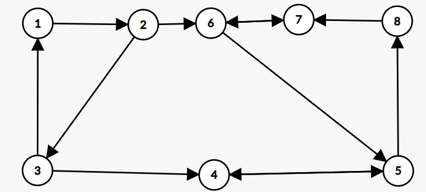

## Introducere

În cele ce urmează, vom prezenta componentele tare conexe, algoritmii principali și cum îi putem aplica.

!!! info "Definiție"

Într-un graf orientat, componentele tare conexe sunt submulțimi maximale de
noduri cu proprietatea că pentru oricare pereche de noduri $$(a, b)$$ care
aparțin unei astfel de componente, se poate ajunge și de la $$a$$ la $$b$$, și
de la $$b$$ la $$a$$ folosind muchiile existente.

!!! note "Observație"

Se poate observa că componentele tare conexe sunt versiunea componentelor
conexe pentru grafurile orientate. Deși definițiile sunt similare, se va
observa că aflarea lor va fi mai dificilă decât cea a componentelor conexe,
care constă într-o simplă parcurgere.

!!! example "Exemplu"

De exemplu, dacă avem următorul graf: $$n = 8$$, $$m = 12$$ și următoarele
muchii de tip $$(a, b)$$: $$(1, 2)$$,$$ (2, 6)$$,$$ (6, 7)$$,$$ (7, 6)$$,$$ (3, 1)$$,$$
(3, 4)$$,$$ (2, 3)$$,$$ (4, 5)$$,$$ (5, 4)$$,$$ (6, 5)$$,$$ (5, 8)$$,$$ (8, 7)$$,
componentele tare conexe sunt $$\{1, 2, 3}$$ și $$\{4, 5, 6, 7, 8}$$. Mai jos
găsiți un desen reprezentativ.



Pentru aflarea componentelor tare conexe, există doi algoritmi la fel de eficienți, algoritmul lui Tarjan și algoritmul lui Kosaraju, ambii fiind algoritmi ce rulează în timp liniar.

În general, deoarece nu există vreo diferență între ei în practică, se preferă folosirea algoritmului lui Kosaraju, deoarece este mai ușor de ținut minte și poate fi aplicat foarte ușor în aplicațiile viitoare.

## Algoritmul lui Kosaraju

Algoritmul lui Kosaraju este un algoritm care se va baza pe două parcurgeri de tip DFS, una pe graful inițial și cealaltă pe graful transpus pentru a afla componentele tare conexe.

!!! info "Graf transpus"

Într-un graf orientat, un graf transpus $$G'$$ este un graf care are
proprietatea că pentru fiecare muchie $$(a, b)$$ care se află în $$G$$, $$G'$$ va
conține muchia $$(b, a)$$. Cu alte cuvinte, muchiile sunt inversate. Pentru
mai multe informații, puteți accesa
[acest link](https://en.wikipedia.org/wiki/Transpose_graph).

Pe scurt, algoritmul va parcurge mai întâi nodurile într-o manieră similară cu cea de la algoritmul pentru aflarea componentelor conexe, singura diferență fiind aceea că la finalizarea pașilor efectuați în funcție pentru un nod dat, acesta va fi adăugat într-o stivă.

Ulterior, nodurile din stivă vor fi luate pe rând, iar pentru fiecare nod nevizitat la acest pas, vom avea o parcurgere similară cu cea de la primul pas, parcurgere efectuată pe graful transpus care ne va da componentele tare conexe, acelea fiind cele care sunt vizitate de nodul curent la pasul dat.

Acest algoritm are complexitate $$\mathcal{O}(n + m)$$ și implementarea lui, folosită la problema [Planets and Kingdoms](https://cses.fi/problemset/task/1683/) poate fi citită mai jos:

```cpp
#include <iostream>
#include <stack>
#include <vector>

using namespace std;

stack<int> s;

void dfs(int node, vector<vector<int>> &v, vector<int> &vis) {
    vis[node] = 1;
    for (int j = 0; j < (int)v[node].size(); ++j) {
        int nxt = v[node][j];
        if (!vis[nxt]) {
            dfs(nxt, v, vis);
        }
    }
    s.push(node);
}
void dfs2(int node, int cnt, vector<vector<int>> &tr, vector<int> &vis2,
          vector<int> &scc) {
    vis2[node] = 1;
    scc[node] = cnt;
    for (int j = 0; j < (int)tr[node].size(); ++j) {
        int nxt = tr[node][j];
        if (!vis2[nxt]) {
            dfs2(nxt, cnt, tr, vis2, scc);
        }
    }
}

int main() {
    int n, m;
    cin >> n >> m;

    vector<int> vis(n + 1), vis2(n + 1), scc(n + 1);
    vector<vector<int>> v(n + 1), tr(n + 1);

    for (int i = 1; i <= m; ++i) {
        int a, b;
        cin >> a >> b;
        v[a].push_back(b);
        tr[b].push_back(a);
    }
    for (int i = 1; i <= n; ++i) {
        if (!vis[i]) {
            dfs(i, v, vis);
        }
    }

    int cnt = 0;
    while (!s.empty()) {
        int node = s.top();
        s.pop();
        if (!vis2[node]) {
            ++cnt;
            dfs2(node, cnt, tr, vis2, scc);
        }
    }
    cout << cnt << '\n';
    for (int i = 1; i <= n; ++i) {
        cout << scc[i] << " ";
    }
    return 0;
}
```

## Algoritmul lui Tarjan

Ideea de bază a algoritmului este următoarea: Se începe cu o parcurgere DFS dintr-un nod oarecare (parcurgerile viitoare vor fi efectuate pe noduri care nu au fost vizitate încă). Aceste parcurgeri ne vor oferi niște arbori parțiali, construiți din muchiile care au fost folosite pentru a vizita nodurile în cauză.

Pentru a afla componentele tare conexe, ne vom folosi de arborii creați pentru a găsi subarbori care vor avea proprietatea că nivelul minim la care se poate ajunge folosind muchiile de întoarcere este egal cu nivelul nodului curent, unde nivelul nodului este numărul său de ordine din parcurgerea DFS. Un tutorial foarte bun poate fi accesat [aici](https://codeforces.com/blog/entry/131187).

Pentru cei familiarizați și cu componentele biconexe, se vor putea observa destule similarități între algoritmul acesta și cel de la componentele biconexe, ambii fiind inventați de Tarjan. Mai jos puteți găsi o soluție care rezolvă aceeași problemă de mai sus.

```cpp
#include <iostream>
#include <stack>
#include <vector>

using namespace std;

vector<vector<int>> graph;
vector<int> idx, lowlink, instack, scc;
int ptr, ncomp;

stack<int> stk;

void dfs(int node) {
    int aux;

    lowlink[node] = idx[node] = ++ptr;
    instack[node] = 1;
    stk.push(node);

    for (int i = 0; i < (int)graph[node].size(); i++) {
        int nxt = graph[node][i];
        if (idx[nxt] == 0) {
            dfs(nxt);
            lowlink[node] = min(lowlink[node], lowlink[nxt]);
        } else if (instack[graph[node][i]]) {
            lowlink[node] = min(lowlink[node], lowlink[nxt]);
        }
    }

    if (idx[node] == lowlink[node]) {
        do {
            aux = stk.top();
            stk.pop();
            instack[aux] = 0;
            scc[aux] = ncomp;
        } while (aux != node);
        ncomp++;
    }
}

int solve(int n) {
    idx.resize(n + 1, 0);
    instack.resize(n + 1, 0);
    lowlink.resize(n + 1, 0);
    scc.resize(n + 1, 0);

    for (int i = 1; i <= n; i++) {
        if (idx[i] == 0) {
            dfs(i);
        }
    }
    return ncomp;
}

int main() {
    int n, m;
    cin >> n >> m;

    graph.resize(n + 1);

    for (int i = 1; i <= m; i++) {
        int a, b;
        cin >> a >> b;
        graph[a].push_back(b);
    }

    cout << solve(n) << '\n';
    for (int i = 1; i <= n; i++) {
        cout << scc[i] + 1 << " ";
    }
    return 0;
}
```

## Aplicații

De regulă, componentele tare conexe apar destul de rar în probleme de sine stătătoare, din cauza faptului că cunoașterea lor ar face diferența dintre cei care ar lua punctajul maxim și cei care nu ar lua puncte. Totuși, se poate remarca prezența lucrului cu componentele tare conexe în unele dinamici pe grafuri, în care putem folosi o proprietate foarte importantă, pe care o vom enunța mai jos.

!!! info "Compresarea componentelor tare conexe"

Dacă compresăm componentele tari conexe într-un singur nod, noul graf
rezultat devine aciclic, fapt care ne ajută să aplicăm dinamicile specifice
grafurilor orientate aciclice.

!!! note "Observație"

Algoritmul lui Kosaraju ne oferă componentele tare conexe în ordinea
sortării topologice din graful rezultat.

## Problema [Coin Collector](https://cses.fi/problemset/task/1686/)

Pentru a rezolva această problemă, va trebui să aflăm componentele tare conexe, iar mai apoi, să le compresăm folosind unul din algoritmii descriși mai sus. Ulterior, vom construi noul graf și vom aplica o sortare topologică pe noul graf rezultat, ținând o dinamică, în care vom ști pentru fiecare componentă tare conexă, suma maximă a costurilor ce pot fi luate pe un asemenea drum.

Soluția va fi din nou, una liniară raportată la dimensiunile grafului.

```cpp
#include <iostream>
#include <queue>
#include <stack>
#include <vector>

using namespace std;

stack<int> s;

void dfs(int node, vector<vector<int>> &v, vector<int> &vis) {
    vis[node] = 1;
    for (int j = 0; j < (int)v[node].size(); ++j) {
        int nxt = v[node][j];
        if (!vis[nxt]) {
            dfs(nxt, v, vis);
        }
    }
    s.push(node);
}
void dfs2(int node, int cnt, vector<vector<int>> &tr, vector<int> &vis2,
          vector<int> &scc) {
    vis2[node] = 1;
    scc[node] = cnt;
    for (int j = 0; j < (int)tr[node].size(); ++j) {
        int nxt = tr[node][j];
        if (!vis2[nxt]) {
            dfs2(nxt, cnt, tr, vis2, scc);
        }
    }
}

int main() {
    int n, m;
    cin >> n >> m;

    vector<long long> vals(n + 1), sum(n + 1), dp(n + 1);
    for (int i = 1; i <= n; i++) {
        cin >> vals[i];
    }

    vector<int> vis(n + 1), vis2(n + 1), scc(n + 1);
    vector<vector<int>> v(n + 1), tr(n + 1);

    for (int i = 1; i <= m; ++i) {
        int a, b;
        cin >> a >> b;
        v[a].push_back(b);
        tr[b].push_back(a);
    }
    for (int i = 1; i <= n; ++i) {
        if (!vis[i]) {
            dfs(i, v, vis);
        }
    }

    int cnt = 0;
    while (!s.empty()) {
        int node = s.top();
        s.pop();
        if (!vis2[node]) {
            ++cnt;
            dfs2(node, cnt, tr, vis2, scc);
        }
    }

    long long ans = 0;

    for (int i = 1; i <= n; i++) {
        sum[scc[i]] += vals[i];
    }

    vector<vector<int>> sccgraph(n + 1);
    vector<int> degree(n + 1);
    for (int i = 1; i <= n; i++) {
        for (auto nxt : v[i]) {
            if (scc[i] != scc[nxt]) {
                sccgraph[scc[i]].push_back(scc[nxt]);
                degree[scc[nxt]]++;
            }
        }
    }

    queue<int> q;
    for (int i = 1; i <= cnt; i++) {
        if (degree[i] == 0) {
            q.push(i);
        }
    }

    while (!q.empty()) {
        int node = q.front();
        q.pop();
        dp[node] += sum[node];
        ans = max(ans, dp[node]);

        for (auto nxt : sccgraph[node]) {
            degree[nxt]--;
            if (degree[nxt] == 0) {
                q.push(nxt);
            }
            dp[nxt] = max(dp[nxt], dp[node]);
        }
    }

    cout << ans << '\n';
    return 0;
}
```

## Concluzii și alte aplicații

Componentele tare conexe sunt o noțiune fundamentală foarte importantă care apare în probleme la diverse competiții, dar în contextul olimpiadelor, se regăsesc mai ales în dinamicile pe grafuri orientate, precum și ulterior, atunci când veți studia 2-SAT, problemă ce se rezolvă cu ajutorul componentelor tare conexe generate de graful special creat din expresiile logice date.

Se recomandă implementarea clară a algoritmului ales (nu aveți nevoie să știți ambii algoritmi, dar cunoașterea ambilor e un plus) pentru a putea face rezolvarea problemelor ulterioare mai ușoară.

## Probleme suplimentare

- [ctc infoarena](https://infoarena.ro/problema/ctc)
- [Checkposts Codeforces](https://codeforces.com/problemset/problem/427/C)
- [Ralph and Mushrooms Codeforces](https://codeforces.com/contest/894/problem/E)
- [IIOT 2023-24 Dogtrick 2](https://kilonova.ro/problems/2288/)
- [Transitive Graph Codeforces](https://codeforces.com/contest/1900/problem/E)
- [Flight Routes Check CSES](https://cses.fi/problemset/task/1682)
- [Grass Cownoisseur USACO Gold](https://usaco.org/index.php?page=viewproblem2\&cpid=516)
- [obiective infoarena](https://infoarena.ro/problema/obiective)
- [dep Baraj Seniori 2008](https://kilonova.ro/problems/1787/)
- [network Baraj Seniori 2016](https://kilonova.ro/problems/278)
- [Probleme cu componente tare conexe de pe kilonova](https://kilonova.ro/tags/302)

## Lectură suplimentară

- [Strongly Connected Components - USACO Guide](https://usaco.guide/adv/SCC?lang=cpp)
- [Tare conexitate - pbinfo](https://www.pbinfo.ro/articole/6036/tare-conexitate)
- [Strongly Connected Components - CP-algorithms](https://cp-algorithms.com/graph/strongly-connected-components.html)
- [Algoritmul lui Kosaraju - Wikipedia](https://en.wikipedia.org/wiki/Kosaraju%27s_algorithm)
- [Algoritmul lui Tarjan - Codeforces](https://codeforces.com/blog/entry/131187)
- [Algoritmul lui Tarjan - Wikipedia](https://en.wikipedia.org/wiki/Tarjan%27s_strongly_connected_components_algorithm)
- [Graph (IV) - slides 61-83 - HKOI](https://assets.hkoi.org/training2023/g-iv.pdf)
- [Alt algoritm pentru componente tare conexe de la Radewoosh](https://codeforces.com/blog/entry/91608)
