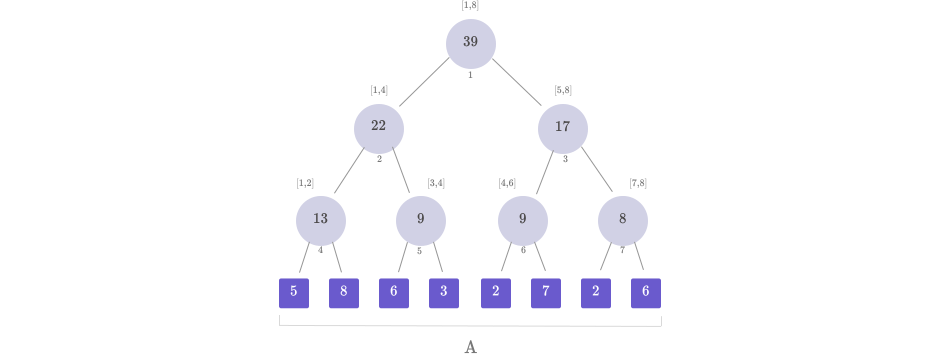
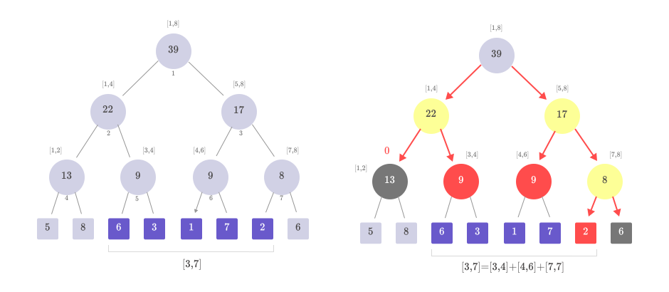
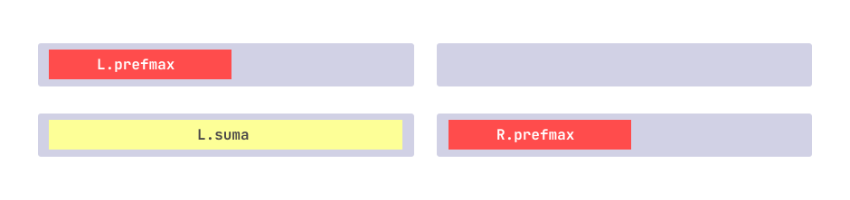

În competițiile de informatică și la olimpiadă se întâlnesc adesea probleme care implică operarea pe subsecvențele unui vector. Spre exemplu, cum putem calcula eficient suma, maximul sau minimul pe o subsecvență a unui vector, mai ales când acesta suferă **modificări în timp real**?

<Callout type="obs">
  Dacă vectorul este static (nu suferă modificări), putem utiliza tehnici simple precum vectori de [sume parțiale](../usor/partial-sums.mdx) sau [RMQ](./rmq.mdx) (Range Minimum Query). Totuși, în scenariile unde vectorul se modifică frecvent, aceste tehnici devin ineficiente. Operațiile de query au o complexitate de $\mathcal{O}(1)$ atât pentru sume parțiale, cât și pentru RMQ. Însă, pentru actualizări, trebuie reconstruit tot tabelul de valori, ceea ce duce la o complexitate de $\mathcal{O}(n)$ pentru sume parțiale și $\mathcal{O}(n \log n)$ pentru RMQ.
</Callout>

**Arborii de intervale** (cunoscuți și sub denumirea de segment trees sau aint în jargonul românesc) reprezintă o soluție elegantă și eficientă pentru acest tip de probleme, permițând efectuarea rapidă de interogări și actualizări în $\mathcal{O}(\log n)$ pentru ambele operații.

În acest articol, vom explora conceptele de bază ale arborilor de intervale, modul de construire și utilizare a acestora, și vom analiza câteva aplicații frecvente în problemele de olimpiadă. Vom începe prin a defini structura unui arbore de intervale și vom continua prin a explica operațiile de actualizare, interogare și implementările acestora. În final, vom discuta și câteva probleme apărute în concursurile de programare competitivă. Fără prea multă vorbărie, să începem!

## Problema clasică

<Callout type="example">
  Fie un vector $A$ cu $N$ elemente. Asupra lui se vor face $M$ operații de
  tipul:

  - `update(pos, val)` - actualizează valoarea de pe poziția `pos` în `val`
  - `query(x, y)` - aflați suma elementelor din intervalul $[x, y]$, $A_{st} - A_{st+1} + ... + A_{dr}$
</Callout>

## Structura unui arbore de intervale

Un arbore de intervale este un arbore binar care este folosit pentru a stoca informații despre intervalele unui vector. Fiecare nod din arbore reprezintă un interval și stochează o anumită valoare (de exemplu, suma, minimul sau maximul) pentru intervalul respectiv.

### Cum se formează un arbore de intervale?

Să considerăm un vector $A$ de dimensiune $N$. Arborele de intervale asociat acestui vector se construiește astfel:

- Rădăcina arborelui va fi nodul 1 și va avea asociat răspunsul pentru intervalul $[1,n]$.
- Un nod $k$ are asociat un interval $[st,dr]$, iar acesta are doi fii ce se vor afla pe pozițiile $2 \cdot k$ (fiul din stânga) și $2 \cdot k + 1$ (fiul din dreapta). Fiul din stânga va avea răspunsul pentru intervalul $[st, m]$, iar fiul din dreapta pentru $[m+1, dr]$, unde m este mijlocul intervalului.

<Callout type="info" title="Reprezentare în memorie">
  Deși conceptul de arbore de intervale este unul de tip arbore binar, în practică, structura este stocată în memorie sub forma unui vector. Astfel, fiecare nod din arbore corespunde unei poziții din acest vector, ceea ce ne permite să accesăm eficient nodurile arborelui folosind operații de indexare.
</Callout>

Să considerăm vectorul $A=[5,8,6,3,2,7,2,6]$, arborele de intervale asociat vectorului $A$ va arăta în felul următor:



### Care este memoria necesara stocarii ?

- Numărul de frunze: Arborele de intervale are N frunze, câte una pentru fiecare element din vectorul original. Aceste frunze sunt reprezentate în ultimul nivel al arborelui.
- Numărul de noduri interne: avem $N-1$ noduri interne.
- Înălțimea maximă a unui arbore binar complet cu $N$ frunze este $\lceil \log_2(N) \rceil$.

Astfel, în caz general, numărul total de noduri (frunze + noduri interne) dintr-un arbore binar complet de înălțime $h$ este:

$$
\begin{align*}
2^{h+1} - 1 &= 2 \cdot 2^{\lceil \log_2(N) \rceil} - 1 \\[0.2cm]
&\leq 2 \cdot 2^{\log_2(N) + 1} - 1 \\[0.2cm]
&\leq 4 \cdot 2^{\log_2(N)} - 1 \\[0.2cm]
&= 4 \cdot N - 1
\end{align*}
$$

<Callout type="obs">
  Dimensiunea $4 \cdot N$ asigură faptul că avem suficient spațiu pentru a construi un arbore de intervale complet, indiferent de dimensiunea vectorului original. Această alocare permite menținerea unui arbore echilibrat și eficient, permițând efectuarea de operații de actualizare și interogare într-un mod optim.
</Callout>

## Operații elementare

### Construirea arborelui

Construirea unui arbore de intervale se realizează într-un mod recursiv bottom-up, pornind de la frunzele arborelui (care corespund elementelor vectorului inițial) și mergând spre rădăcină. La fiecare nivel al arborelui, valorile nodurilor se determină pe baza fiilor săi.

Această operație se efectuează în $\mathcal{O}(n)$, unde $n$ este numărul de elemente din vectorul inițial. De reținut că există și o altă variantă de a construi arborele prin a actualiza fiecare poziție cu valoarea din vector, însă duce la o complexitate de $\mathcal{O}(n \log n)$.


În diagramele de mai sus, vedem că la fiecare pas, valorile din noduri sunt calculate pe baza sumelor subintervalelor din fiul stâng și fiul drept. Acest proces este realizat în codul de mai jos prin apeluri recursive, unde funcția `build` este apelată pentru fiecare subarbore (stâng și drept), iar valorile din noduri sunt apoi actualizate.

<Callout type="info" title="De reținut">
  Arborii de intervale funcționează eficient doar cu **operații asociative** (ex: suma, maximul, minimul, cmmdc). Asociativitatea permite combinarea rezultatelor din subintervale fără a afecta corectitudinea rezultatului final.
</Callout>

Mai jos sunt prezentate două modalități de implementare, atât recursivă, cât și iterativă:

<Tabs items={["Construcție recursivă", "Construcție iterativă"]} defaultIndex={0}>
  <Tab value="Construcție recursivă">
    ```cpp
    void build(int node, int st, int dr) {
        if (st == dr) {
            aint[node] = A[st];
            return;
        }
        int mid = (st + dr) / 2;

        build(2 * node, st, mid);          // Construim subarborele stâng
        build(2 * node + 1, mid + 1, dr);  // Construim subarborele drept

        // Actualizăm rezultatul nodului în funcție de rezultatele fiilor
        aint[node] = aint[2 * node] + aint[2 * node + 1];
    }
    ```
  </Tab>

  <Tab value="Construcție iterativă">
    ```cpp
    void build(int arr[]) {
        // Inserăm nodurile frunzelor în arbore
        for (int i = 0; i < n; i++) {
            tree[n + i] = arr[i];
        }

        // Construim arborele prin calcularea părinților
        for (int i = n - 1; i > 0; --i) {
            tree[i] = tree[i << 1] + tree[i << 1 | 1];
        }
    }
    ```
  </Tab>
</Tabs>

### Operația de update

Pentru a efectua un update, ne vom deplasa în arbore până la frunza care reprezintă elementul modificat.Odată ce am ajuns la frunză, înlocuim valoarea veche cu cea nouă.Pe măsură ce revenim din recursivitate, actualizăm fiecare nod din drum, recalculând valorile pe baza celor doi fii, pentru a ne asigura că arborele rămâne corect.

Această operație se efectuează în $\mathcal{O}(\log n)$, unde $n$ este numărul de elemente din vectorul inițial.Complexitatea este determinată de înălțimea arborelui, deoarece actualizarea trebuie propagată de la frunză până la rădăcină.

Mai jos este prezentată o diagramă care ilustrează cum se modifică structura arborelui de intervale după ce actualizăm valoarea elementului de pe poziția 5 din 2 în 1.


În diagramele de mai sus, putem observa cum se modifică structura arborelui de intervale după ce modificăm valoarea de pe poziția 5 din 2 în 7. Nodurile afectate de această modificare sunt evidențiate, iar valorile lor sunt actualizate pentru a reflecta noua configurație.

Iată un exemplu de implementare a acestei operații în C++:

```cpp
void update(int pos, int val, int node, int st, int dr) {
    if (st == dr) {
        aint[node] = val;  // Daca am ajuns la pozitia pos, schimbam valoarea
        return;
    }

    int mid = (st + dr) / 2;
    if (pos <= mid) {  // (1)
        update(pos, val, node * 2, st, mid);
    } else {
        update(pos, val, node * 2 + 1, mid + 1, dr);
    }

    // La intoarcerea din apelul recursiv, actualizam nodul
    aint[node] = aint[node * 2] + aint[node * 2 + 1];
}
```

1. Dacă nodul se află în intervalul din stânga

### Operatia de query

Când dorim să efectuăm o interogare pe un interval $[x, y]$, scopul este de a găsi rapid răspunsul pentru acest subinterval fără a fi nevoie să parcurgem toți termenii din vectorul inițial. Arborele de intervale face acest lucru prin împărțirea intervalului $[x, y]$ în subintervale mai mici, pe care le combină pentru a găsi răspunsul final.

Această descompunere se bazează pe faptul că, pentru orice interval $[st, dr]$ gestionat de un nod din arbore, avem trei cazuri:

1. **Interval complet în afara intervalului de interogare** (gri închis): Dacă intervalul $[st, dr]$ nu se suprapune cu intervalul $[x, y]$, atunci acel interval nu contribuie la răspuns și putem returna direct 0 sau altă valoare de identitate (pentru maxim, minim etc.).
2. **Interval complet inclus în intervalul de interogare** (portocaliu): Dacă intervalul $[st, dr]$ este complet inclus în intervalul $[x, y]$, returnăm valoarea stocată în nodul respectiv, deoarece aceasta reprezintă deja răspunsul pentru întregul interval.
3. **Interval parțial suprapus** (galben): În acest caz, descompunem intervalul în două subintervale, corespunzătoare fiilor nodului curent, și combinăm rezultatele interogărilor pentru aceste subintervale.



Iată un exemplu de implementare a operației de query în C++:

```cpp
int query(int x, int y, int node, int st, int dr) {
    if (dr < x || y < st) {  // Daca intervalul se afla complet in afara
        return 0;
    }
    if (x <= st && dr <= y) {  // Daca intervalul este complet inclus
        return aint[node];
    }

    int mid = (st + dr) / 2;
    int Q_st = query(x, y, node * 2, st, mid);          // (1)
    int Q_dr = query(x, y, node * 2 + 1, mid + 1, dr);  //(2)

    return Q_st + Q_dr;
}
```

1. Răspunsul pentru intervalul din stânga
2. Răspunsul pentru intervalul din dreapta

## Probleme rezolvate

<Callout type="tip">
  Înainte de a trece la problemele rezolvate, te încurajez să încerci să **implementezi** structura de date și **să rezolvi singur** câteva probleme de bază. Încearcă să implementezi arborele de intervale pentru a calcula suma și maximul pe un interval dat. În modul acesta vei vedea unde ai neclarități. După ce te-ai convains că ai înțeles tot ce s-a discutat până acum, te invit să discutăm câteva probleme mai interesante. **Un alt mic sfat ar fi să încerci problema înainte de a urmări rezolvarea completă.**
</Callout>

### 1. [Arbint](https://infoarena.ro/problema/arbint)

Fie un vector $A$ cu $N$ elemente naturale. Asupra lui se vor face $M$ operații, codificate astfel în fișierul de intrare:

- `0 a b` - Să se determine maximul din intervalul $[a, b]$.
- `1 a b` - Valoarea elementului de pe poziția $a$ va deveni $b$.

Problema de bază, identică cu cea pe care am rezolvat-o anterior, singura diferență este că acum trebuie să calculăm elementul maxim. Soluția mea o puteți vedea [aici](https://infoarena.ro/job_detail/3239964?action=view-source).

### 2. [Maxq - ONI 2007](https://kilonova.ro/problems/157)

Johnie a început să se joace cu un vector de numere. El dispune inițial de un vector $V$ cu $N$ numere întregi și poate efectua următoarele operații:

- Schimbarea elementului de pe poziția $p$ cu un alt număr întreg;
- Aflarea subsecvenței de sumă maximă din $V$ inclusă între indicii $a$ și $b$.

Pentru rezolvarea acestei probleme vom adopta aceeași strategie, vom analiza modul în care putem combina două segmente de lungime $L/2$ într-un singur segment de lungime $L$. În cazul acestei probleme vom avea nevoie de mai multe informații pentru fiecare nod:

```cpp
struct Node {
    int suma;     // Suma subsecventei
    int prefmax;  // Prefixul de suma maxima
    int suffmax;  // Sufixul de suma maxima
    int smax;     // Subsecventa de suma maxima
};
```

Să analizam puțin unde se poate află segmentul de sumă maximă după combinarea celor două subsegmente.

- Segmentul de sumă maximă se află în intervalul din stânga (L.smax)
- Segmentul de sumă maximă se află în intervalul din dreapta (R.smax)
- Segmentul de sumă maximă începe în intervalul stâng și se termină în cel drept. Aceasta este reprezentată prin combinația dintre L.suffmax și R.prefmax.


Pentru a calcula prefixul de sumă maximă pentru fiecare nod luăm maximul dintre prefixul găsit în stânga și întregul segment din stânga la care se adaugă prefixul de sumă maximă din dreapta.



Analog pentru sufixul de sumă maximă, doar că luăm maximul dintre sufixul găsit în dreapta și întregul segment care începe în dreapta și se continua în stânga.

```cpp
struct Node {
    int suma;     // Suma subsecventei
    int prefmax;  // Prefixul de suma maxima
    int suffmax;  // Sufixul de suma maxima
    int smax;     // Subsecventa de suma maxima
};

Node merge(Node L, Node R) {
    Node T;
    T.suma = L.suma + R.suma;
    T.prefmax = max(L.prefmax, L.suma + R.prefmax);
    T.suffmax = max(R.suffmax, R.suma + L.suffmax);
    T.smax = max(max(L.smax, R.smax), L.suffmax + R.prefmax);
}
```

Iată o posibila implementare a acestei probleme in C++:

```cpp
#include <algorithm>
#include <fstream>
#include <iostream>
using namespace std;

ifstream fin("maxq.in");
ofstream fout("maxq.out");

const int MAXN = 2e5 + 1;

struct Node {
    long long suma;     // Suma subsecventei
    long long prefmax;  // Prefixul de suma maxima
    long long sufmax;   // Sufixul de suma maxima
    long long smax;     // Subsecventa de suma maxima
} aint[MAXN * 4];

int n;

Node combine(Node L, Node R) {
    Node T;
    T.suma = L.suma + R.suma;
    T.prefmax = max(L.prefmax, L.suma + R.prefmax);
    T.sufmax = max(R.sufmax, R.suma + L.sufmax);
    T.smax = max(max(L.smax, R.smax), L.sufmax + R.prefmax);
    return T;
}

void update(int pos, int val, int node = 1, int st = 1, int dr = n) {
    if (st == dr) {
        if (val > 0) {
            aint[node] = {val, val, val, val};
        } else {
            aint[node] = {val, 0, 0, 0};
        }
        return;
    }

    int mid = (st + dr) / 2;
    if (pos <= mid) {
        update(pos, val, node * 2, st, mid);
    } else {
        update(pos, val, node * 2 + 1, mid + 1, dr);
    }
    aint[node] = combine(aint[node * 2], aint[node * 2 + 1]);
}

Node query(int x, int y, int node = 1, int st = 1, int dr = n) {
    if (y < st || dr < x) {
        return {0, 0, 0, 0};
    }
    if (x <= st && dr <= y) {
        return aint[node];
    }

    int mid = (st + dr) / 2;
    Node Q1 = query(x, y, node * 2, st, mid);
    Node Q2 = query(x, y, node * 2 + 1, mid + 1, dr);
    return combine(Q1, Q2);
}

int main() {
    int q;
    fin >> n;
    for (int i = 1; i <= n; i++) {
        int x;
        fin >> x;
        update(i, x);
    }

    fin >> q;
    while (q--) {
        int op, x, y;
        fin >> op >> x >> y;
        if (op == 0) {
            update(x + 1, y);
        } else {
            fout << query(x + 1, y + 1).smax << '\n';
        }
    }

    return 0;
}
```

### 3. [NrInversiuni](https://www.pbinfo.ro/probleme/3206/nrinversiuni)

În această problemă, trebuie să determinăm numărul de inversiuni dintr-o permutare dată a unui vector de lungime $n$. O inversiune este o pereche ordonată $(i, j)$ astfel încât $1 \leq i < j \leq n$ și $v[i] > v[j]$.

**Soluția naivă** ar presupune să verificăm pentru fiecare pereche de elemente $(i, j)$ dacă $v[i] > v[j]$. Acest lucru necesită două bucle imbricate, una pentru $i$ și alta pentru $j$, ceea ce duce la o complexitate de $O(n^2)$.

**Soluția optimă**. Această problemă poate fi rezolvată eficient cu ajutorul arborilor de intervale. Observația esențială este că fiecare element formează inversiuni cu toate elementele mai mari decât el care apar înaintea lui în vector. Pentru a implementa soluția, folosim un arbore de intervale care ne ajută să menținem numărul de elemente mai mare decât un anumit element pe măsură ce parcurgem vectorul.

**Notă:** Folosind această metodă, complexitatea algoritmului se reduce la $O(n \log n)$.

Iată cum se poate implementa soluția:

- Pentru fiecare element $x$, calculăm câte elemente mai mari decât $x$ se află deja în arbore. Altfel spus, câte elemente se află în intervalul $[x+1,n]$.
- Actualizăm arborele, marcând apariția elementului $x$.

## Probleme de antrenament

Pentru problemele de pe codeforces, este necesar un cont pentru a putea accesa acest curs din secțiunea EDU (ITMO Academy)

- [Dynamic Range Minimum Queries](https://cses.fi/problemset/task/1649)
- [Number of Minimums on a Segment](https://codeforces.com/edu/course/2/lesson/4/1/practice/contest/273169/problem/C)
- [Intervalxy](https://www.pbinfo.ro/probleme/1591/intervalxy)
- [Kth one](https://codeforces.com/edu/course/2/lesson/4/2/practice/contest/273278/problem/B)
- [First element at least X](https://codeforces.com/edu/course/2/lesson/4/2/practice/contest/273278/problem/C)
- [Sign Alternation](https://codeforces.com/edu/course/2/lesson/4/4/practice/contest/274684/problem/A)
- [Inversions](https://codeforces.com/edu/course/2/lesson/4/4/practice/contest/274684/problem/C)
- [Xenia and bit operations](https://codeforces.com/contest/339/problem/D)
- [Irrigation](https://codeforces.com/contest/1181/problem/D)
- [Distinct Value Queries](https://cses.fi/problemset/task/1734)
- [United Cows of Farmer John - USACO Gold](https://usaco.org/index.php?page=viewproblem2\&cpid=1137)
- [Increasing Subsequence II](https://cses.fi/problemset/task/1748)
- [Salary Queries](https://cses.fi/problemset/task/1144)
- [Kth - ONI 2023](https://kilonova.ro/problems/542/)
- [Intersecție segmente](https://www.pbinfo.ro/probleme/2103/intersectie-segmente) : baleiere

## Probleme dificile

- [Dulciuri - OJI 2021](https://kilonova.ro/problems/133)
- [Array Counting - IIOT 2021-2022](https://infoarena.ro/problema/arraycounting)
- [Panama Sum - IIOT 2022-2023](https://kilonova.ro/problems/304/)
- [Lucky Array](https://codeforces.com/contest/121/problem/E)

## Bibliografie + Resurse suplimentare

- [CPPI](https://cppi.sync.ro/materia/arbori_de_intervale.html)
- [USACO Guide](https://usaco.guide/gold/PURS?lang=cpp)
- [Codeforces EDU](https://codeforces.com/edu/course/2/lesson/4): curs complet pentru introducerea în arbori de intervale
- [CSAcademy](https://csacademy.com/lesson/segment_trees): articol care conține animații pentru operațiile elementare
- [CPAlgorithms](https://cp-algorithms.com/data_structures/segment_tree.html): articol mai avansat care prezintă mai multe tehnici
- [Efficient and easy segment trees](https://codeforces.com/blog/entry/18051)
- [Arbori de intervale si baleiere](https://www.infoarena.ro/arbori-de-intervale)
- [Template arbori de intervale](https://github.com/alextm0/Data-Structures-Algorithms/blob/main/Segment%20Tree/aint.cpp): o clasă flexibilă care permite modificarea rapidă a operațiilor.
