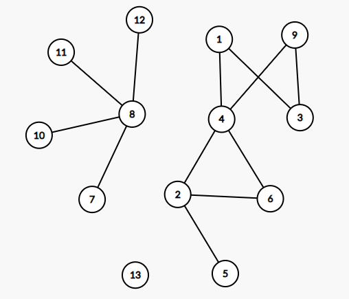

În cele ce urmează vom prezenta o structură de date cu foarte multe aplicații atât în algoritmică, cât și în viața de zi cu zi, acestea fiind grafurile. Problema aflării existenței unor conexiuni sau aflării distanței minime între două noduri reprezintă un punct de plecare pentru majoritatea algoritmilor pe grafuri, teoria folosită în algoritmică fiind una vastă și plină de abordări ce se dovedesc a fi esențiale în foarte multe situații, atât competiționale, cât și în aplicații practice. 

## Noțiuni introductive

**Definiție:** Un graf este o structură care corespunde unui grup de obiecte, în care unele perechi de obiecte sunt într-un anumit sens „legate” reciproc. Obiectele corespund unor abstracții matematice numite într-un graf noduri/vârfuri (numite și puncte) și fiecare legătură dintre perechile de obiecte asociate se numește muchie (numită și arc sau linie, prin care este și reprezentată). De obicei, un graf este reprezentat în formă schematică ca un set/grup de puncte pentru noduri, iar acestea sunt unite două câte două de drepte sau curbe pentru muchii. 

### Terminologie

Voi continua prin a defini termeni ce se dovedesc a fi esențiali pentru înțelegerea grafurilor.

**Definiție:** Definim un **graf neorientat** ca fiind un graf pentru care dacă avem o muchie $(A, B)$, o putem folosi pentru a ajunge atât de la $A$ la $B$, cât și de la $B$ la $A$.

**Definiție:** Definim un **graf orientat** ca fiind un graf pentru care dacă avem o muchie $(A, B)$, o putem folosi **doar** pentru a ajunge atât de la $A$ la $B$, nu și de la $B$ la $A$.

**Definiție:** Două noduri sunt **adiacente** atunci când există cel puțin o muchie care să le lege direct.

**Definiție:** Folosim noțiunea de **incidență** când spunem că un nod este extremitate a unei muchii. 

**Definiție:** Definim **gradul** unui nod ca fiind numărul de muchii incidente cu acel nod. 

**Observație:** Suma gradelor nodurilor într-un graf neorientat este mereu un număr par. Explicația este dată de faptul că pentru fiecare muchie adăugată, gradul a două noduri crește cu $1$.

**Definiție:** Numim **lanț** o secvență de noduri ce au proprietatea că oricare două vecine reprezintă capetele unei
muchii a grafului. Se disting noțiunile de **lanț elementar** (lanț cu nodurile distincte) și **lanț simplu** (lanț cu muchiile distincte).

**Definiție:** Un **ciclu** reprezintă o secvență de muchii ce nu se repetă, pleacă de la un nod $A$ și parcurgând în ordine acele muchii, se ajunge tot la nodul $A$. Din nou, se distinge noțiunea de **ciclu simplu** ca fiind un ciclu în care nu se repetă noduri.

**Definiție:** Definim **lungimea unui lanț** ca fiind numărul de muchii folosite pentru a ajunge de la un capăt al lanțului la celălalt. Uneori, lungimea se definește ca numărul de noduri prin care trecem, numărându-se un nod de câte ori s-a trecut prin el. 

**Observație:** În orice caz, lungimea exprimată prin numărul de noduri este cu $1$ mai mare decât lungimea exprimată prin numărul de muchii.

**Definiție:** Definim **graf parțial** al unui graf dat ca fiind ceea ce rămâne din graful dat păstrând toate nodurile și eliminând eventual unele muchii, fără a adăuga muchii noi.

**Definiție:** Definim **subgraf** al unui graf dat ca fiind ceea ce rămâne din graful dat eliminând unele noduri și doar muchiile incidente lor, deci nu și alte muchii și fără să adăugăm alte muchii.

**Observație:** Numărul de subgrafuri ale unui graf este $2^n$, iar numărul de grafuri parțiale este $2^m$, unde $n$ este numărul de noduri, iar $m$ este numărul de muchii al grafului. 

### Câteva tipuri speciale de grafuri

Se remarcă faptul că în funcție de tipul grafului, mai putem defini următoarele tipuri de grafuri, care se vor folosi în diferite aplicații. De notat ca pentru unele din aceste tipuri, vom avea probleme unde vom explica în detaliu noțiunile și aplicațiile unde folosim aceste concepte. 

**Definiție:** Definim un **graf complet** ca fiind un graf care are toate muchiile posibile, existând o legătură directă de la $(A, B)\ \forall{1 \leq A < B \leq n}$. Numărul de muchii ale unui graf complet cu $n$ noduri este $\frac{n(n-1)}{2}$. 

**Definiție:** Definim un **graf bipartit** ca fiind un graf care poate fi împărțit în două submulțimi disjuncte, $A$ și $B$, astfel încât nu există nicio muchie între două elemente din aceeași submulțime. 

**Definiție:** Definim un **graf planar** ca fiind un graf care are proprietatea că poate fi reprezentat grafic fără ca două muchii să se intersecteze. 

**Definiție:** Definim un **graf regulat** ca fiind un graf care are proprietatea că toate nodurile au același grad. 

## Lucrul cu grafuri. Moduri de reprezentare în memorie

Un concept foarte important în teoria grafurilor reprezintă modul în care parcurgem aceste structuri de date și cum putem verifica proprietățile de care avem nevoie, de la o problemă la alta. 

Să considerăm graful neorientat din figura următoare 



Acest graf are $13$ noduri și $12$ muchii, acestea fiind $(1, 4)$, $(1, 3)$, $(4, 9)$, $(9, 3)$, $(4, 2)$, $(4, 6)$, $(2, 6)$, $(2, 5)$, $(8, 12)$, $(8, 11)$, $(8, 10)$, $(8, 7)$.


Pentru a reprezenta un graf în memorie, există trei moduri principale de a o face, cu distincția că în practică se va folosi doar reprezentarea prin liste de vecini.

**Definiție:** Definim **matricea de adiacență a unui graf** ca fiind o matrice binară pentru care $a_{ij} = 1$ dacă și numai dacă avem muchie de la nodul $i$ la nodul $j$ și $a_{ij} = 0$ în caz contrar. 

**Observație:** Pentru un graf neorientat, matricea este mereu simetrică, adică $a_{ij} = a_{ji}\ \forall i, j$.

Pentru graful nostru de mai sus, aceasta este matricea de adiacență la care ajungem.

\begin{equation*}
    \small
    \begin{pmatrix}
    {\color{gray}0} & {\color{gray}0} & \textbf{1} & \textbf{1} & {\color{gray}0} & {\color{gray}0} & {\color{gray}0} & {\color{gray}0} & {\color{gray}0} & {\color{gray}0} & {\color{gray}0} & {\color{gray}0} & {\color{gray}0}\\
    {\color{gray}0} & {\color{gray}0} & {\color{gray}0} & \textbf{1} & \textbf{1} & \textbf{1} & {\color{gray}0} & {\color{gray}0} & {\color{gray}0} & {\color{gray}0} & {\color{gray}0} & {\color{gray}0} & {\color{gray}0}\\
    \textbf{1} & {\color{gray}0} & {\color{gray}0} & {\color{gray}0} & {\color{gray}0} & {\color{gray}0} & {\color{gray}0} & {\color{gray}0} & \textbf{1} & {\color{gray}0} & {\color{gray}0} & {\color{gray}0} & {\color{gray}0}\\
    \textbf{1} & \textbf{1} & {\color{gray}0} & {\color{gray}0} & {\color{gray}0} & \textbf{1} & {\color{gray}0} & {\color{gray}0} & \textbf{1} & {\color{gray}0} & {\color{gray}0} & {\color{gray}0} & {\color{gray}0}\\
    {\color{gray}0} & \textbf{1} & {\color{gray}0} & {\color{gray}0} & {\color{gray}0} & {\color{gray}0} & {\color{gray}0} & {\color{gray}0} & {\color{gray}0} & {\color{gray}0} & {\color{gray}0} & {\color{gray}0} & {\color{gray}0}\\
    {\color{gray}0} & \textbf{1} & {\color{gray}0} & \textbf{1} & {\color{gray}0} & {\color{gray}0} & {\color{gray}0} & {\color{gray}0} & {\color{gray}0} & {\color{gray}0} & {\color{gray}0} & {\color{gray}0} & {\color{gray}0}\\
    {\color{gray}0} & {\color{gray}0} & {\color{gray}0} & {\color{gray}0} & {\color{gray}0} & {\color{gray}0} & {\color{gray}0} & \textbf{1} & {\color{gray}0} & {\color{gray}0} & {\color{gray}0} & {\color{gray}0} & {\color{gray}0}\\
    {\color{gray}0} & {\color{gray}0} & {\color{gray}0} & {\color{gray}0} & {\color{gray}0} & {\color{gray}0} & \textbf{1} & {\color{gray}0} & {\color{gray}0} & \textbf{1} & \textbf{1} & \textbf{1} & {\color{gray}0}\\
    {\color{gray}0} & {\color{gray}0} & \textbf{1} & \textbf{1} & {\color{gray}0} & {\color{gray}0} & {\color{gray}0} & {\color{gray}0} & {\color{gray}0} & {\color{gray}0} & {\color{gray}0} & {\color{gray}0} & {\color{gray}0}\\
    {\color{gray}0} & {\color{gray}0} & {\color{gray}0} & {\color{gray}0} & {\color{gray}0} & {\color{gray}0} & {\color{gray}0} & \textbf{1} & {\color{gray}0} & {\color{gray}0} & {\color{gray}0} & {\color{gray}0} & {\color{gray}0}\\
    {\color{gray}0} & {\color{gray}0} & {\color{gray}0} & {\color{gray}0} & {\color{gray}0} & {\color{gray}0} & {\color{gray}0} & \textbf{1} & {\color{gray}0} & {\color{gray}0} & {\color{gray}0} & {\color{gray}0} & {\color{gray}0}\\
    {\color{gray}0} & {\color{gray}0} & {\color{gray}0} & {\color{gray}0} & {\color{gray}0} & {\color{gray}0} & {\color{gray}0} & \textbf{1} & {\color{gray}0} & {\color{gray}0} & {\color{gray}0} & {\color{gray}0} & {\color{gray}0}\\
    {\color{gray}0} & {\color{gray}0} & {\color{gray}0} & {\color{gray}0} & {\color{gray}0} & {\color{gray}0} & {\color{gray}0} & {\color{gray}0} & {\color{gray}0} & {\color{gray}0} & {\color{gray}0} & {\color{gray}0} & {\color{gray}0}
    \end{pmatrix}
\end{equation*}

**Definiție:** Definim o **listă de vecini** ca fiind o listă (de regulă, alocată dinamic) pe care o folosim pentru a ține în memorie pentru fiecare nod doar nodurile adiacente cu acesta, această metodă fiind cea mai eficientă din punct de vedere practic pentru a parcurge grafurile.

|Nod| Vecini |
| - | ------------|
|1|$\{3,4\}$|
|2|$\{4,5,6\}$|
|3 |$\{1,9\}$|
|4 | $\{1,2,9\}$|
|5 | $\{2\}$|
|6 | $\{2, 4\}$|
|7 | $\{8\}$|
|8 | $\{7,10,11,12\}$|
|9 | $\{3,4\}$|
|10 | $\{8\}$| 
|11 | $\{8\}$|
|12| $\{8\}$|
|13 | $\emptyset$|

Lista de vecini pentru graful neorientat din figura de mai sus.
  

**Definiție:** Definim o **listă de muchii** ca fiind o listă pe care o folosim pentru a ține toate muchiile în memorie. Deși nu este o variantă prea practică de a efectua parcurgerile, această metodă poate fi utilă pentru anumiți algoritmi ce se bazează în principal pe prelucrarea muchiilor, un astfel de exemplu fiind arborele parțial de cost minim. 

**Definiție:** În cazul nostru, lista de muchii este: $\{\{1, 4\}, \{1, 3\}, \{4,9\}, \{9,3\}, \{4,2\}, \{4,6\}, \{2,6\}, \{2,5\}, \{8,12\}, \{8,11\}, \{8,10\}, \{8,7\}\}$


## Conexitate. Parcurgerea DFS

Problema aflării conexității unui graf este una din problemele fundamentale ale teoriei grafurilor, fiind adesea folosită drept un exemplu esențial în explicarea și înțelegerea grafurilor. 

**Definiție:** Definim un **graf conex** ca fiind un graf neorientat care are proprietatea că pentru oricare două noduri $A$ și $B$ din graf, putem ajunge de la $A$ la $B$ folosind una sau mai multe muchii.

**Definiție:** Definim o **componentă conexă** ca fiind un subgraf **conex** al unui graf dat.

Pentru a rezolva problema aflării conexității unui graf, va trebui să parcurgem graful folosind unul din algoritmii consacrați pentru această problemă. În cazul de față, vom continua prin a explica parcurgerea în adâncime a grafului (DFS sau depth-first search), una din parcurgerile optime pentru această problemă. 

**Definiție:** Definim **parcurgerea în adâncime** (DFS, engl. depth-first search) a unui graf ca fiind o parcurgere recursivă ce pleacă de la un nod anume, iar la fiecare pas, dacă ne aflăm la un nod $x$, vom vizita vecinii nevizitați ai nodului $x$, apelând DFS pentru fiecare din ei. 

**Observație:** Complexitatea parcurgerii în adâncime (DFS) este $O(\lvert V \rvert + \lvert E \lvert)$, unde $\lvert V \rvert$ reprezintă numărul de noduri sau vârfuri și $\lvert E \rvert$ reprezintă numărul de muchii.

\footnote{În probleme se notează convențional $\lvert V \rvert$ cu $N$ de la noduri, respectiv $\lvert E \rvert$ cu $M$ de la muchii. \textit{n.red.}}.

**Observație:** Se remarcă faptul că un nod va fi vizitat la un moment dat doar o singură dată, deci dacă avem muchiile $(1, 2)$, $(1, 3)$ și $(2, 3)$, iar DFS-ul pleacă din $1$, $2$ va fi accesat din $1$, iar $3$ va fi accesat din $2$.

**Observație:** Se poate remarca faptul că ordinea în care vizităm nodurile în graf depinde de ordinea în care sunt adăugate muchiile în graf, acest lucru înseamnă că nu putem folosi DFS pentru anumite probleme, de exemplu cele la care trebuie aflată distanța minimă în graf.

## Problema [Connected components](https://kilonova.ro/problems/2036) de pe kilonova

Se dă un graf neorientat $G$ cu $N$ noduri și $M$ muchii. Să se afle câte componente conexe are graful dat.

Pentru a afla numărul de componente conexe ale unui graf, putem folosi parcurgerea DFS pentru a afla toate nodurile din care apelăm DFS din funcția \textit{main}, acesta fiind și răspunsul la problema noastră. 

```cpp
#include <iostream>
#include <vector>

using namespace std;

int n, m;
 
vector <vector<int> > v;
bool visited[100002];
int cc;
void dfs(int node)
{
	visited[node] = true;
	for(int i = 0; i < v[node].size(); ++i)
	{
		int nxt = v[node][i];
		if(visited[nxt] == false)
			dfs(nxt);
	}
}
int main()
{
	cin >> n >> m;
	v.resize(n+1);
	for(int i = 1; i <= m; ++i)
	{
		int a, b;
		cin >> a >> b;
		v[a].push_back(b);
		v[b].push_back(a);
	}
	for(int i = 1; i <= n; ++i)
		if(visited[i] == false)
		{
			++cc;
			dfs(i);
		}
	
	cout << cc << '\n';
    return 0;
}
```

## Drumuri minime. Parcurgerea BFS

Dacă în cazul parcurgerii DFS putem să o aplicăm fără mari probleme pentru o varietate destul de largă de probleme cu grafuri, totuși nu este suficientă pentru problemele ce țin de distanțe. Un exemplu fundamental este acela al aflării drumului minim între două sau mai multe noduri într-un graf dat.

**Definiție:** Definim un **drum minim** ca fiind lungimea minimă a unui lanț care leagă două noduri din graf.

Motivul pentru care nu putem afla drumul minim între două noduri folosind DFS este acela că ordinea în care nodurile sunt parcurse în DFS depinde de ordinea în care sunt date muchiile de la intrare, parcurgerea recursivă făcând aflarea distanțelor minime imposibilă. Astfel, vom introduce un alt mod de a parcurge graful nostru.

**Definiție:** Definim **parcurgerea în lățime** (BFS, engl. breadth-first search) a unui graf ca fiind o parcurgere iterativă ce pleacă de la unul sau mai multe noduri, iar la fiecare pas, dacă ne aflăm la un nod $x$, vom vizita vecinii nevizitați ai nodului $x$, adăugându-i într-o coadă, nodurile fiind parcurse în ordinea în care au fost adăugate în coadă. 

**Observație:** Complexitatea parcurgerii în lățime (DFS) este $O(\lvert V \rvert + \lvert E \lvert)$, unde $\lvert V \rvert$ reprezintă numărul de noduri sau vârfuri și $\lvert E \rvert$ reprezintă numărul de muchii.

**Observație:** Se poate remarca faptul că ordinea în care vizităm nodurile în graf va fi aceeași cu ordinea crescătoare a distanței minime față de nodul sau nodurile inițiale, datorită faptului că ele vor fi inserate în coadă în ordinea în care acestea au fost adăugate. 

## Problema [Simple Shortest Path](https://kilonova.ro/problems/2037) de pe kilonova

Se dă un graf neorientat $G$ cu $N$ noduri și $M$ muchii, precum și un nod $S$. Să se afle lungimea drumului minim dintre $S$ și fiecare nod din graf, inclusiv $S$.

Pentru a rezolva această problemă, vom pleca cu un BFS din nodul $S$ și vom afla pe parcurs, distanțele minime față de toate celelalte noduri. 

```cpp
#include <iostream>
#include <vector>
#include <queue>

using namespace std;

int n, m, s;

vector<vector<int> > graf;
queue<int> q;
vector<int> ans;

int main()
{
    cin >> n >> m >> s;
    graf.resize(n+1);
    ans.resize(n+1);
    for(int i = 1; i <= m; i++)
    {
        int a, b;
        cin >> a >> b;
        graf[a].push_back(b);
        graf[b].push_back(a);
    }
    for(int i = 1; i <= n; i++)
        ans[i] = -1;
    ans[s] = 0;
    
    q.push(s);
    while(!q.empty())
    {
        int nod = q.front();
        q.pop();
        for(auto x : graf[nod])
        {
            if(ans[x] == -1)
            {
                ans[x] = ans[nod] + 1;
                q.push(x);
            }
        }
    }
    
    for(int i = 1; i <= n; i++)
        cout << ans[i] << " ";
    cout << '\n';
    
    return 0;
}
```

## Problema [grarb](https://www.infoarena.ro/problema/grarb) de pe infoarena

Se dă un graf $G$ neorientat cu $N$ noduri numerotate de la $1$ la $N$ și $M$ muchii. Determinați numărul minim de muchii care trebuie eliminate și numărul minim de muchii care trebuie adăugate în graful $G$ astfel încât acesta sa devina arbore.

Această problemă se împarte în două subprobleme relativ ușor de identificat - aflarea componentelor conexe ale grafului (dacă avem $nr$ componente conexe, va fi nevoie de $nr - 1$ muchii pentru a transforma graful într-unul conex), precum și aflarea numărului de muchii care trebuie scoase pentru a transforma graful în arbore (la final, trebuie să ne rămână $N-1$ muchii). Astfel, vom avea nevoie de $nr - 1$ muchii noi și va trebui să scoatem $M + nr - 1 - (N - 1)$ muchii pentru a avea un arbore. 

```cpp
#include <fstream>
#include <vector>

using namespace std;

ifstream cin("grarb.in");
ofstream cout("grarb.out");

int n, m, nr = 0;
vector<vector<int> > v;
vector<int> viz;

void dfs(int nod)
{
    viz[nod] = 1;
    for(int i = 0; i < (int) v[nod].size(); i++)
    {
        int nxt = v[nod][i];
        if(!viz[nxt])
            dfs(nxt);
    }
}
int main()
{
    cin >> n >> m;
    v.resize(n+1);
    viz.resize(n+1);
    
    for(int i = 1; i <= m; i++)
    {
        int a, b;
        cin >> a >> b;
        v[a].push_back(b);
        v[b].push_back(a);
    }
    
    for(int i = 1; i <= n; i++)
        if(!viz[i])
        {
            dfs(i);
            nr++;
        }
    
    cout << m + nr - 1 - (n - 1) << '\n' << nr - 1 << '\n';
    return 0;
}
```

## Problema [Graf (OJI 2006)](https://kilonova.ro/problems/49) de pe kilonova

Se dă un graf neorientat conex cu $N$ noduri și două noduri $X$ și $Y$, să se afle nodurile ce aparțin tuturor lanțurilor optime între $X$ și $Y$.

Pentru a rezolva această problemă, va trebui mai întâi să aflăm folosind o parcurgere de tip BFS distanțele minime de la $X$ și $Y$ spre toate celelalte noduri. Apoi, pentru fiecare distanță $d$ de la $0$ la $\operatorname{dist}(X, Y)$, vrem să aflăm câte noduri se află pe unul din drumurile optime de la $X$ la $Y$ la o distanță $d$ față de $X$. În cele din urmă, vrem să afișăm nodurile situate la distanțele care apar o singură dată în mulțimea nodurilor ce fac parte din cel puțin un drum optim de la $X$ la $Y$.

Codul sursă se poate viziona mai jos. 

```cpp
#include <fstream>
#include <vector>
#include <queue>
using namespace std;

const int MAXN = 7500;

int distX[MAXN + 1], distY[MAXN + 1], solFreq[MAXN + 1];

vector<vector<int>> goFromTo(MAXN + 5);
vector<int> ans;
queue<int> q;

void bfs(int nod, int dist[]) 
{
    int first;
    q.push(nod);
    dist[nod] = 1;

    while(!q.empty())
	{
        first = q.front();
        q.pop();

        for(auto travelNod : goFromTo[first]) 
		{
            if(dist[travelNod] == 0)
			{
                dist[travelNod] = dist[first] + 1;
                q.push(travelNod);
            }
        }
    }
}

int main() 
{
    ifstream cin("graf.in");
    ofstream cout("graf.out");

    int n, m, x, y, i, a, b, ansN;
    cin >> n >> m >> x >> y;    
    for(i = 1; i <= m; i++)
	{
        cin >> a >> b;
        goFromTo[a].push_back(b);
        goFromTo[b].push_back(a);
    }

    bfs(x, distX);
    bfs(y, distY);

    for(i = 1; i <= n; i++)
	{
        // lungimea totala a drumului va fi egala cu distX[y];
        if(distX[i] + distY[i] == distX[y] + 1) 
            solFreq[distX[i]]++;
    }

    ansN = 0;
    for(i = 1; i <= n; i++)
        if(distX[i] + distY[i] == distX[y] + 1 && solFreq[distX[i]] == 1)
		{
            ansN++;
            ans.push_back(i);
        }

    cout << ansN << '\n';
    for(i = 0; i < ansN; i++)
        cout << ans[i] << ' ';
    return 0;
}
```

## Probleme și lectură suplimentară

* Aici mai trebuie puse probleme
* [Probleme cu grafuri de pe kilonova](https://kilonova.ro/tags/300)
* [Grafuri - noțiuni teoretice de bază](https://cppi.sync.ro/materia/grafuri_arbori_notiuni_teoretice_de_baza.html)
* [Articol introductiv de pe USACO Guide](https://usaco.guide/bronze/intro-graphs?lang=cpp)
* [Articol despre parcurgeri de pe USACO Guide](https://usaco.guide/silver/graph-traversal?lang=cpp)
* [Probleme cu grafuri de pe codeforces, ordonate după dificultate](https://codeforces.com/problemset?order=BY_RATING_ASC&tags=combine-tags-by-or%2Cgraphs%2Cdfs+and+similar)
