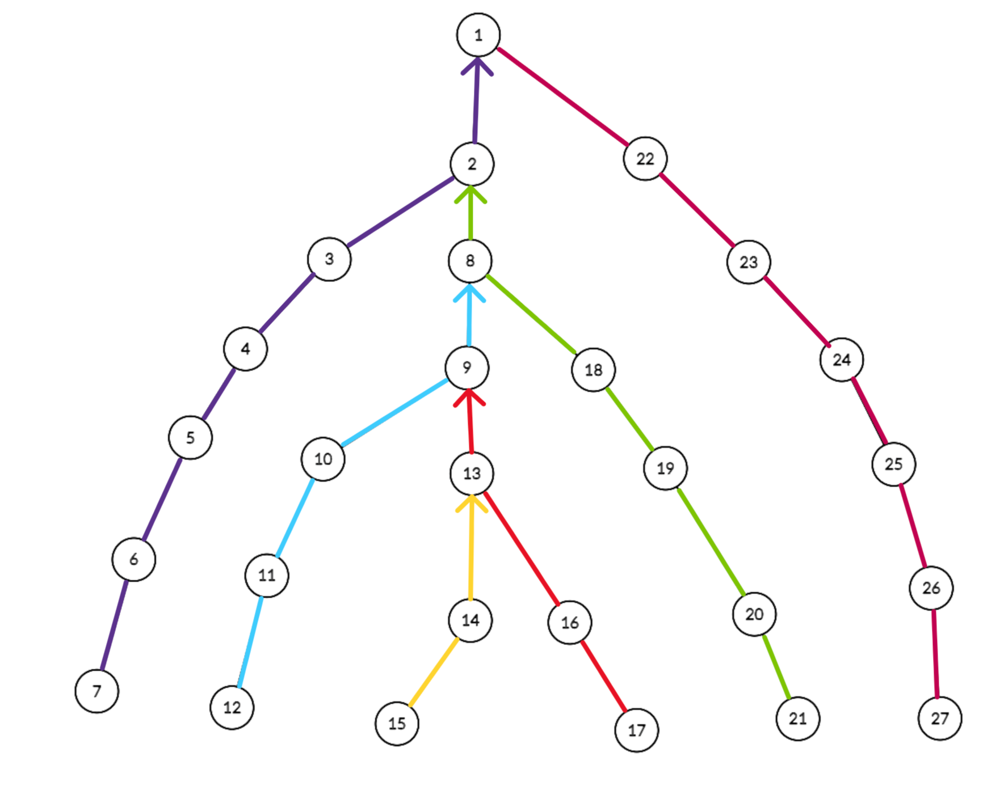

**Autor**: Raul Ardelean

**Heavy-light decomposition** este o tehnică ce ne ajută să efectuăm query-uri și update-uri într-un timp eficient pe un **arbore**.

## Introducere

Să zicem că avem un arbore $G$ cu $N$ noduri și implicit $N-1$ muchii, iar rădăcina acestuia să fie $1$.

Ideea din spatele algoritmului este de a **sparge arborele în mai multe lanțuri** pentru a atinge rădăcina din orice nod din arbore în timp **logaritmic**.

Evident, dacă efectuăm această descompunere pe arborele nostru, ne va permite să reducem anumite interogări sau update-uri unice de forma: "calculează ceva pe lanțul care leagă nodul $a$ pe nodul $b$" în mai multe interogări sau update-uri de forma: "calculează ceva pe segmentul $[l,r]$ din lanțul $K$". Pentru a calcula eficient pe segmentul $[l,r]$ din lanțul $K$, ne vom folosi de arbori de intervale.

## Construcția lanțurilor

Pentru început, vom presupune că pentru fiecare nod din $G$ se va efectua același pattern.

Știm că funcția logaritmică crește foarte lent, astfel încât este convenabil să construim lanțuri de lungimi cât mai mari, pentru a minimiza numărul de operații necesare pentru interogări și update-uri pe un număr cât mai mare de noduri din lanț. Așadar, pentru fiecare nod $x$, vom alege să continuăm crearea lanțului cu fiul care are cele mai multe noduri în subarborele său.

De ce nu am ales fiul care are cel mai lung lanț creat până la el? Când avem $\sqrt N$ lanțuri elementare, atunci vom avea o complexitate de $O(\sqrt N)$ pentru parcurgerea de la un nod $x$ până la rădăcină. În concluzie, vom avea o complexitate de $O(\sqrt N \cdot \log N)$ pentru fiecare interogare sau update.

<p align="center">

</p>

Dacă alegem fiul care are cele mai multe noduri în subarbore, constatăm că numărul de lanțuri pe care le vom parcurgem până la rădăcină se reduce la $\log N$.

Următoarea imagine ilustrează descompunerea arborelui cu tehnica descrisă anterior, cunoscută în termeni de specialitate sub denumirea de **heavy path decomposition**.

<p align="center">

</p>

Complexitatea finală pe fiecare interogare va fi $O(( \log N ) ^ 2)$, iar pentru update-ul unui singur nod în $O(\log N)$.

## Implementarea în C++

Există și alte tehnici de precalculare a lanțurilor, dar aceasta este cea mai ușor de înțeles.

```cpp
/// nodurile arborelui sunt inițializați de la 1

const int MAX=2e5+5; /// limita de noduri din arbore

bitset<MAX> viz; /// viz[i] - verificăm dacă am intrat în nodul i
int w[MAX]; /// w[i] - dimensiunea subarborelui cu root i
int nrL; /// numărul de lanțuri
int L[MAX]; /// L[i] - în ce lanț se află nodul i
int Lfather[MAX]; /// Lfather[L[i]] - primul nod al lanțului în care se află i
int Lniv[MAX]; /// Lniv[L[i]] - nivelul primului nod al lanțului în care se află i
vector<int> Lant[MAX]; /// Lant[i] - toate nodurile din lanțul i de la frunză până la nodul root al lanțului

void dfs(int node)
{
    viz[node] = 1;
    w[node] = 1;
    int leaf = 1, maxl = -1;

    for (auto x : G[node])
    {
        if (viz[x])
            continue;
        leaf = 0;
        niv[x] = niv[node] + 1;
        dfs(x);
        w[node] += w[x];

        /// actualizăm fiul care are cea mai mare dimensiune al subarborelui
        if (maxl == -1)
            maxl = x;
        else if (w[maxl] < w[x])
            maxl = x;
    }
    /// daca node este o frunză
    if (leaf){
        L[node] = ++nrL; /// se crează un nou lanț
        Lant[L[node]].push_back(node);
    }
    /// altfel o să legăm pe node de maxl
    else{
        L[node] = L[maxl];
        Lant[L[node]].push_back(node);

        /// aici vom fixa nodul de start pentru fii care au rămas, aceștia fiind primi în lanțul creat păna la ei
        for (auto x : G[node])
        {
            if (x == maxl or niv[x] < niv[node])
                continue;
            Lfather[L[x]] = node;
            Lniv[L[x]] = niv[node];
        }
    }
}
```

## Probleme rezolvate

### Problema [Heavy Path Decomposition](https://www.infoarena.ro/problema/heavypath)

Se dă un arbore cu $N$ noduri, fiecare având asociată o valoare $v_i$, $1 \leq i \leq N$. Se dau $M$ operații de forma $(t, x, y)$, cu următoarea semnificație:

* dacă $t$ este $0$, operația este de tipul update, iar valoarea $v_x$ asociata nodului cu indicele $x$ devine $y$;
* dacă $t$ este $1$, operația este de tipul query și se cere să se afișeze valoarea maximă asociată unui nod aflat pe lanțul elementar care unește nodurile $x$ și $y$.

Pentru a rezolva această problemă clasică, trebuie să implementăm arbori de intervale pentru lanțurile create de noi, iar apoi să efectuăm cele două tipuri de operații: query și update.

Pentru operația de tip update, putem opera doar pe lanțul unde se află nodul $x$.

Pentru operația de tip query, va trebuie să parcurgem mai multe lanțuri până când vom ajunge cu cele două noduri în același lanț. Această operațiune este chiar cea de la [Lowest common ancestor (LCA)](https://edu.roalgo.ro/dificil/lowest-common-ancestor/).

O implementare de $100$ de puncte se poate găsi [aici](https://www.infoarena.ro/job_detail/3250975?action=view-source).

### Problema [Struct arbore{}](https://kilonova.ro/problems/2844/)

Fetițele Powerpuff au întâmpinat o problemă de informatică la proba de la ONI. Ele nu sunt familiarizate cu struct arbori și de aceea îți cer ajutorul.
Ți se oferă $N$ noduri, fiecare nod având o literă mică specifică.
Pentru $Q$ query-uri, ai două tipuri de întrebări pe care le poți primi:


* $1 \ x \ y$. Aflați cel mai lung sufix ale celor $2$ noduri astfel încât cuvintele formate să fie identice. Un cuvânt se definește ca un lanț a $len$ noduri consecutive. Dacă vrem să formăm un cuvânt de la nodul $x$ la nodul $y$, $y$ trebuie să fie fiul nodului $x$.
* $2 \ x \ ch$. Nodul $x$ își va schimba valoarea caracterului în $ch$.


Fetițele Powerpuff vă roagă să le dați un cod cu cea mai bună complexitate posibilă astfel încât să obțină medalia de aur. Se garantează că cele $N$ noduri formează un arbore.

Această problemă necesită cunoștințe de la [string hashing](https://edu.roalgo.ro/mediu/hashing/), respectiv [Lowest common ancestor (LCA)](https://edu.roalgo.ro/dificil/lowest-common-ancestor/).

În primul rând, ne vom folosi de tehnica string hashing pentru a afla în $O(1)$ valoarea unui lanț. Pentru că problema ne cere să operăm și update-uri, va trebui să facem update pe fiecare lanț când schimbăm litera de la un nod. Astfel, complexitatea pentru update și query pe un lanț va rămâne tot $O(\log(N))$, datorită string hashing. Dacă vrem să aflăm valoarea hash pe un lanț care leagă două noduri, aceasta va intra în complexitate $O((\log N)^2)$, deoarece putem parcurge maxim $\log N$ lanțuri în tot arborele.

În al doilea rând, trebuie să aflăm în mod eficient strămoșul celor $2$ noduri, astfel încât acesta să fie la o distanță cât mai mare, iar cele $2$ stringuri formate să fie identice. Ne vom folosi de tehnica LCA pentru a afla în $O(\log N)$ al $K$ strămoș pentru nodul $x$, iar de căutarea binară pentru a afla valoarea $K$ în timp logaritmic. Astfel rezultă o complexitate finală de $O((\log N)^4)$ pentru fiecare query și $O(\log N)$ pentru update.

O implementare de $100$ de puncte se poate găsi [aici](https://kilonova.ro/pastes/dVpzXLJV0vkL).

## Probleme suplimentare

* [Path Queries II](https://cses.fi/problemset/task/2134/)
* [Company Queries II](https://cses.fi/problemset/task/1688)
* [confuzie](https://kilonova.ro/problems/217/)
* [Disconnect](https://www.infoarena.ro/problema/disconnect)
* [Sever](https://www.infoarena.ro/problema/sever)
* [Cow Land](https://usaco.org/index.php?page=viewproblem2&cpid=921)
* [QTREE3 - Query on a tree again!](https://www.spoj.com/problems/QTREE3/en/)
* [Milk Visits](https://usaco.org/index.php?page=viewproblem2&cpid=970)
* [Delay](https://infoarena.ro/problema/delay)
* [Aladdin and the Return Journey](https://lightoj.com/problem/aladdin-and-the-return-journe)
* [Disruption](https://usaco.org/index.php?page=viewproblem2&cpid=842)
* [Subtrees And Paths](https://usaco.guide/plat/hld?lang=cpp)
* [Grass Planting](https://usaco.org/index.php?page=viewproblem2&cpid=102)
* [Vertex Set Path Composite](https://judge.yosupo.jp/problem/vertex_set_path_composite)
* [Caves and Tunnels](https://acm.timus.ru/problem.aspx?space=1&num=1553)
* [Tree Queries](https://codeforces.com/contest/1254/problem/D)
* [The Tree](https://codeforces.com/contest/1017/problem/G)
* [Tree Game](https://tlx.toki.id/problems/troc-14/H/)
* [Synchronization](https://oj.uz/problem/view/JOI13_synchronization)
* [Cats or Dogs](https://oj.uz/problem/view/JOI18_catdog)
* [Probleme cu HLD de pe Kilonova](https://kilonova.ro/tags/295)

## Resurse suplimentare

* [HLD - CP Algorithms ](https://cp-algorithms.com/graph/hld.html)
* [HLD - USACO](https://usaco.guide/plat/hld)
* [Tree decompositions - Infoarena](https://infoarena.ro/tree-decompositions)
* [Easiest HLD with subtree queries - Codeforces adamant's blog](https://codeforces.com/blog/entry/53170)
* [Heavy path decomposition - Centrul InfO(1)](https://sites.google.com/site/centrulinfo1/materiale-video/algoritmi-video/heavy-path-decomposition?authuser=0)