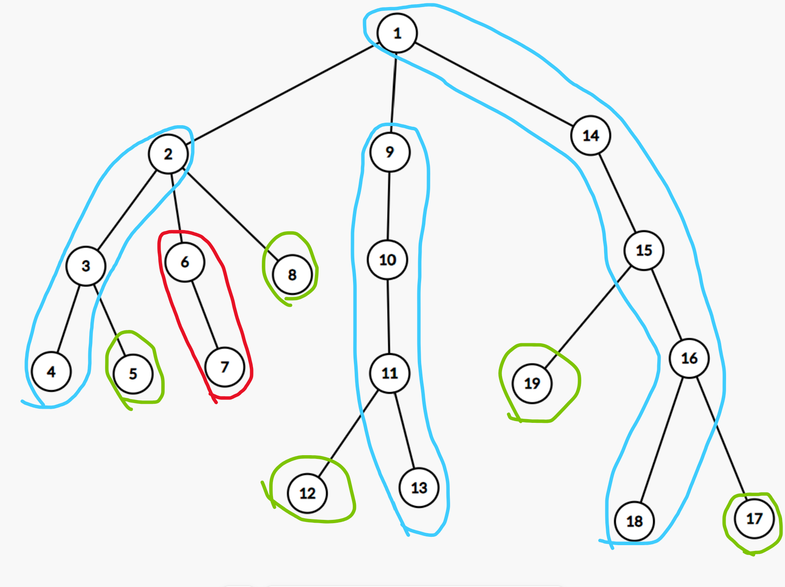

---
tags:
  - structuri de date
  - arbori
  - optimizare
---

**Heavy-light decomposition** este o tehnică ce ne ajută să efectuăm query-uri și update-uri într-un timp eficient pe un **arbore**.

## Introducere

Să zicem că avem un arbore $G$ cu $N$ noduri și implicit $N-1$ muchii, iar rădăcina acestuia să fie $1$.

Ideea din spatele algoritmului este de a **sparge arborele în mai multe lanțuri** pentru a atinge rădăcina din orice nod din arbore în timp **logaritmic**.

Evident, dacă efectuăm această descompunere pe arborele nostru, ne va permite să reducem anumite interogări sau update-uri unice de forma: "calculează ceva pe lanțul care leagă nodul a pe nodul b" în mai multe interogări sau update-uri de forma: "calculează ceva pe segmentul $[l,r]$ din lanțul $K$".

## Construcția lanțurilor

Pentru început, vom presupune că pentru fiecare nod din $G$ se va efectua același pattern.

Pentru un nod fixat $x$, vom afla pentru fiecare fiu al său dimensiunea subarborelui în care fiul este rădăcină. După ce aflăm dimensiunea fiecărui subarbore, ne gândim astfel: "oare în ce lanț să îl pun pe nodul $x$ astfel încât să beneficiez de timpul logaritmic?".

Știm că funcția logaritmică crește foarte lent, astfel ne este convenabil să construim lanțuri de lungimi cât mai mari, pentru a avea cât mai puține operații de făcut pentru interogări și update-uri. Așadar, pentru fiecare nod $x$, vom alege să continuăm crearea lanțului cu fiul care are cele mai multe noduri în subarbore.
Pentru ceilalți fii al nodului $x$, ei vor fi nodul de start pentru lanțul care o fost format până la aceștia.

Următoarea imagine ilustrează descompunerea unui arbore.



Iată un cod de precalculare a lanțurilor:

```cpp
/// nodurile arborelui sunt inițializați de la 1

const int MAX=2e5+5; /// limita de noduri din arbore

bitset<MAX> viz; /// viz[i] - verificăm dacă am intrat în nodul i
int w[MAX]; /// w[i] - dimensiunea subarborelui cu root i
int nrL; /// numărul de lanțuri
int L[MAX]; /// L[i] - în ce lanț se află nodul i
int Lfather[MAX]; /// Lfather[L[i]] - primul nod al lanțului în care se află i
int Lniv[MAX]; /// Lniv[L[i]] - nivelul primului nod al lanțului în care se află i
vector<int> Lant[MAX]; /// Lant[i] - toate nodurile din lanțul i de la frunză până la nodul root al lanțului, trebuie dat reverse() pentru fiecare lanț în parte

void dfs(int node)
{
    viz[node] = 1;
    w[node] = 1;
    int leaf = 1, maxl = -1;

    for (auto x : G[node])
    {
        if (viz[x])
            continue;
        leaf = 0;
        niv[x] = niv[node] + 1;
        dfs(x);
        w[node] += w[x];

        /// actualizăm fiul care are cea mai mare dimensiune al subarborelui
        if (maxl == -1)
            maxl = x;
        else if (w[maxl] < w[x])
            maxl = x;
    }
    /// daca node este o frunză
    if (leaf){
        L[node] = ++nrL; /// se crează un nou lanț
        Lant[L[node]].eb(node);
        return;
    }
    /// altfel o să legăm pe node de maxl
    else{
        L[node] = L[maxl];
        Lant[L[node]].eb(node);

        /// aici vom fixa nodul de start pentru fii care au rămas, aceștia fiind primi în lanțul creat păna la ei
        for (auto x : G[node])
        {
            if (x == maxl or niv[x] < niv[node])
                continue;
            Lfather[L[x]] = node;
            Lniv[L[x]] = niv[node];
        }
    }
}


```

## Problema exemplu

## Concluzii

## Probleme suplimentare

## Resurse suplimentare
