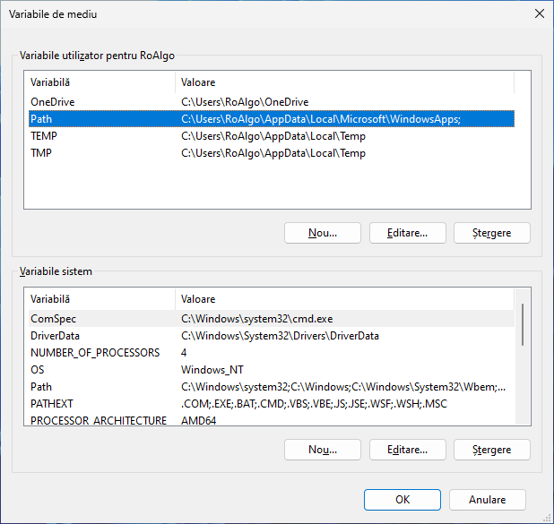

[Proiectul MinGW-w64](https://www.mingw-w64.org/) este continuarea proiectului
MinGW (Minimalist GNU for Windows), făcut ca să suporte compilatorul GCC pe
Windows, cu suport pentru 64 de biți (ceea ce este cel mai probabil ce folosești
acum). Acest compilator poate fi folosit inclusiv pe Linux pentru a compila
binare pentru Windows.

Pentru a instala MinGW-w64, avem următorii pași:

1. Deschide pagina <https://winlibs.com/>. Această pagină oferă binare
   executabile pre-compilate pentru GCC și optimizate pentru a crea executabile
   native pe Windows.

    [Deschide pagina :material-open-in-new:](https://winlibs.com/){ .md-button .md-button--primary }

2. Dă scroll până când o să vezi versiunile de GCC. Alegem varianta cu UCRT
   (Universal C Runtime) pentru că este făcută de la zero pentru Windows 10 și
   11 și este gândită să aibă suport mai bun pentru standardul de C și C++.

3. Dintre lista de opțiuni pe care o ai pentru UCRT runtime, ne interesează
   ultima versiune (la data scrierii, versiunea este GCC 14.1.0).

4. Selectează din prima opțiune (cea care scrie POSIX threads) fie Win64 (dacă
   ai un sistem pe 64 de biți, care este cam orice calculator lansat în ultimul
   deceniu și jumătate), fie Win32, în formatul tău de preferință (7-Zip are
   nevoie de programul cu același nume, dar are executabile mai mici, în timp ce
   Zip poate fi deschis din Explorer). La data scrierii, asta este arhiva
   potrivită:

    [Descarcă GCC 14.1.0 :material-download:](https://github.com/brechtsanders/winlibs_mingw/releases/download/14.1.0posix-18.1.8-12.0.0-ucrt-r3/winlibs-x86_64-posix-seh-gcc-14.1.0-llvm-18.1.8-mingw-w64ucrt-12.0.0-r3.zip){ .md-button .md-button--primary }

    <figure markdown="span">
    { loading=lazy }
    </figure>

5.  După ce s-a terminat de descărcat arhiva, deschide-o și extrage directorul
    `mingw64` într-un loc ușor accesibil (de preferință în `C:\`). Ține minte
    această locație! O să mă refer la această locație în text ca `$MINGW` (de pildă,
    dacă ai dezarhivat în `C:\`, atunci `$MINGW = C:\mingw64`). O să ia ceva timp să
    se dezarhiveze tot, deoarece are peste 1GB. Indiferent unde s-a dezarhivat,
    conținutul directorului `$MINGW` ar trebui să arate astfel:

    <figure markdown="span">

    { loading=lazy }

    { loading=lazy }

    </figure>
 
6.  Acum avem un compilator de C++ în sistem. Pentru a-l face disponibil global,
    trebuie să adăugăm în calea sistemului ca să poată recunoaște executabilele.
    Pentru acest lucru:
 
    1. Apasă ++win+r++ și scrie `sysdm.cpl` și apasă OK. Dacă totul a fost cu
       succes, o să vezi o fereastră de genul:
       <figure markdown="span">
       { loading=lazy }
       </figure>
    2. Navighează către tab-ul Complex și apasă pe ultimul buton (Environment
       variables sau Variabile de mediu):
       <figure markdown="span">
       { loading=lazy }
       </figure>
    3. Apasă dublu clic pe variabila `Path` de la secțiunea cu variabile de
       utilizator (partea de sus).
       { loading=lazy; width="49%" }
       { loading=lazy; width="49%" }
    4. Apasă pe "Navigare..." (atenție, fără să ai vreo cale selectată deja,
       apasă oriunde într-un spațiu gol din listă) și caută calea `$MINGW\bin`
       (unde `$MINGW` e locul unde ai instalat MinGW). În cazul meu, calea va fi
       `C:\mingw64\bin`. Dacă totul a decurs cum trebuie, ar trebui să fie o
       cale în plus în listă:
        { loading=lazy }
        
    5. Apasă OK până când se închid toate ferestrele.

7.  Pentru a face sistemul să recunoască noile noastre executabile,
    deconectează-te și conectează-te înapoi la utilizatorul curent. Felicitări!

Acum navighează aici pentru a vedea ce editoare ai la dispoziție:

[Vezi opțiuni de editoare :material-open-in-new:](../../editors/windows/optiuni-editoare.md){ .md-button .md-button--primary }