## Instalare

Pentru a instala Code::Blocks:

1. Mergi pe site-ul oficial, la secțiunea Downloads și apoi apasă "Download the
   binary release".

     [Link direct :material-open-in-new:](https://www.codeblocks.org/downloads/binaries/#imagesoswindows48pnglogo-microsoft-windows){ .md-button .md-button--primary }

2. Alege `codeblocks-20.03-setup.exe`. Ambele mirror-uri sunt bune, însă
   recomand Sourceforge. Dacă vrei să ai o instalare portabilă, alege
   `codeblocks-20.03-nosetup.zip`.

    [Descarcă Code::Blocks 20.03 :material-open-in-new:](https://sourceforge.net/projects/codeblocks/files/Binaries/20.03/Windows/codeblocks-20.03-setup.exe/download){ .md-button .md-button--primary }
  
    !!! warning "Atenție"
  
        Nu alege variantele cu MinGW. Acele installere vin cu o versiune
        învechită de MinGW (vin cu GCC 8.1, mai precis). Pentru cea mai bună
        experiență, avem nevoie de cel mai nou compilator.
         
        [Vezi instrucțiuni aici :material-open-in-new:](./../../compilers/windows/mingw64.md)
        pentru cum poți instala ultima versiune de GCC.
  
3. După ce s-a descărcat, rulează installerul (care ar trebui să fie numit
   `codeblocks-20.03-setup.exe`). Procesul nu durează mult, de cele mai multe
   ori este un minut. Setările implicite sunt bune, așa că poți apăsa Next până
   când s-a terminat de instalat.

## Configurare și utilizare

De fiecare dată când vei deschide Code::Blocks, vei vedea asta:

<figure markdown="span">
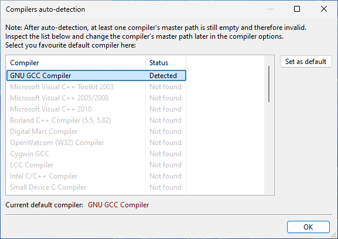{ loading=lazy }
</figure>

Selectează GNU GCC Compiler (care ar trebui să fie implicit), apasă pe Set as
default și apoi apasă OK.

Prima dată când deschizi acest editor, această fereastră va apărea:

<figure markdown="span">
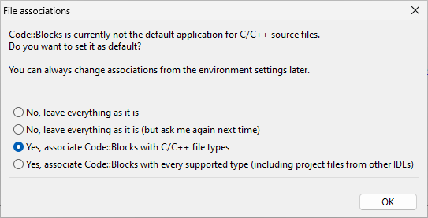{ loading=lazy }
</figure>

Selectează "Yes, associate Code::Blocks with C/C++ file types", care înseamnă
faptul că fiecare fișier C++ se va deschide în Code::Blocks. Apoi apasă OK.

Ești întâmpinat de această fereastră albă orbitoare:

<figure markdown="span">
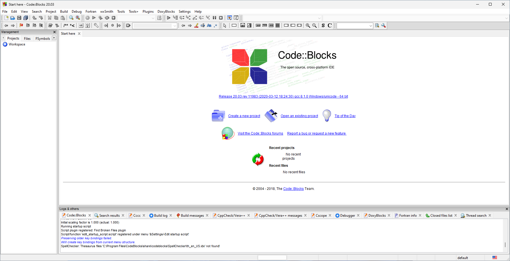{ loading=lazy }
</figure>

Pașii pentru a crea un proiect sunt:

1. Fie te poți duce în bara de meniu și să alegi File > New > Project, fie poți
    din Start here (prima fereastră care apare) și apoi apasă Create a new
    project.
2. Indiferent de metoda aleasă, ajungi la această fereastră:
    <figure markdown="span">
    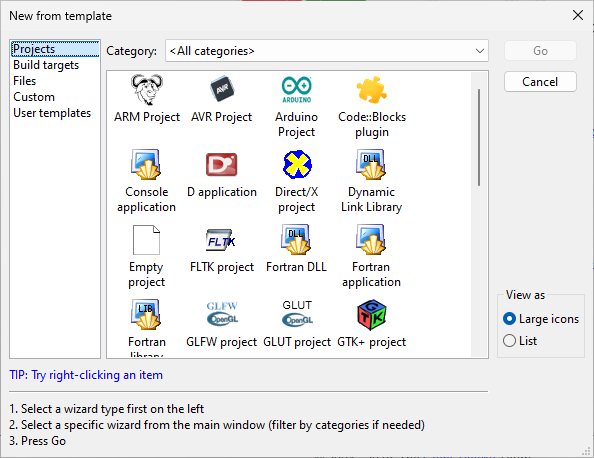{ loading=lazy }
    </figure>
    Alege prin dublu clic Console application (engl. Aplicație în consolă).
3. În acest stadiu, vei fi întâmpinat de "wizard". Acesta te va ghida în
    crearea unei aplicații noi. Așa arată:
    <figure markdown="span">
    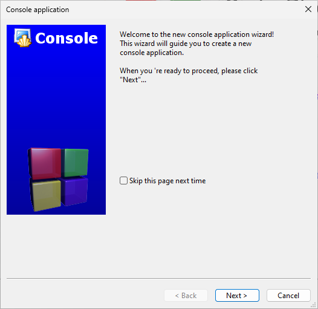{ loading=lazy }
    </figure>
    Apasă Next.
4. De aici, alege C++ (este o introducere de C++, la urma urmei) și apasă Next.
    <figure markdown="span">
    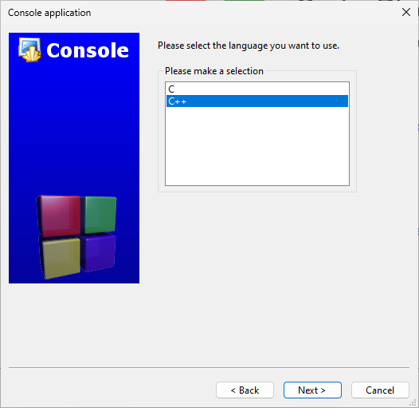{ loading=lazy }
    </figure>
5. Aici este pasul unde alegi titlul proiectului, precum și folderul
    proiectului.
    <figure markdown="span">
    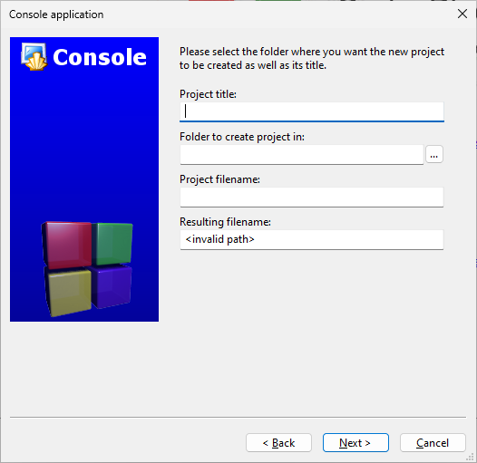{ loading=lazy }
    </figure>

    !!! tip "Sfat"

        Fă numele proiectului sugestiv, chiar numele problemei la care lucrezi
        acum, pentru că nu este prea drăguț să umpli printr-o mare de proiecte
        care au nume similare cu "fsdjkfdkjdfsjhsdaf".

        De asemenea, recomand să grupezi toate proiectele într-un folder special.
        Este mult mai ușor să găsești un proiect dacă se află într-un singur loc.
        Numele sugestive ajută și ele aici.

    În cazul meu, eu am completat astfel:
    <figure markdown="span">
    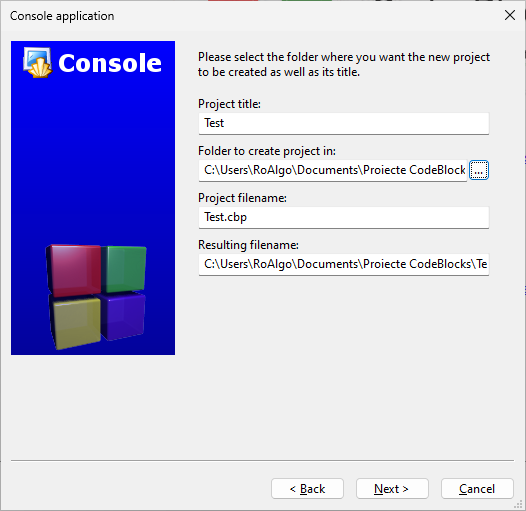{ loading=lazy }
    </figure>

6. Aici este pasul unde alegem compilatorul. Dacă ai instalat GCC și îl
recunoaște corespunzător, atunci prima opțiune va fi GNU GCC Compiler. Lasă tot
bifat așa cum e implicit și apasă Next și apoi Finish la următorul ecran.

<figure markdown="span">
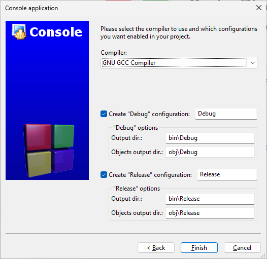{ loading=lazy }
</figure>

Dacă ai făcut totul corect, fereastra ta ar trebui să arate astfel:

<figure markdown="span">
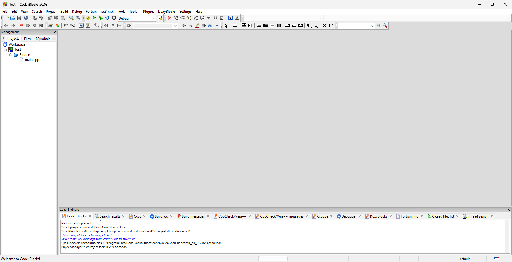{ loading=lazy }
</figure>

Pentru a vedea dacă totul merge, apasă pe `main.cpp` din bara laterală. Ar
trebui să vezi următorul cod în editor:

```cpp
#include <iostream>

using namespace std;

int main()
{
    cout << "Hello world!" << endl;
    return 0;
}
```

Apasă pe ++f9++ (sau Build > Build and Run din bara de meniu). Acest pas va
compila și rula programul tău, și este o tastă foarte folosită de către tine în
viitor. Dacă ai un compilator funcțional și nu ai erori, o să vezi următoarea
fereastră:

<figure markdown="span">
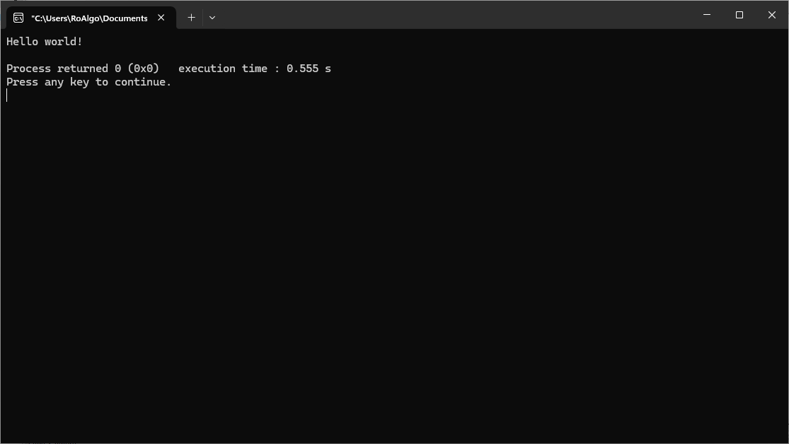{ loading=lazy }
</figure>

Felicitări! Compilatorul GCC funcționează și ai rulat primul tău program de C++.

Acum a venit timpul să configurăm Code::Blocks. În primul rând, vrem să facem
experiența de editat mai bună. Pentru acest lucru, mergem la Settings > Editor
din bara de mediu.

1. Courier New nu este un font prea legibil, așa că recomand să îl schimbi,
   apăsând pe butonul Choose, în Cascadia Mono, Cascadia Code (adaugă ligaturi,
   dar în rest este identic cu Cascadia Mono) sau Consolas. Poți seta de
   asemenea și mărimea implicită (10 este mult prea puțin, chiar și dacă ai pe
   un monitor mare, ar trebui 12 minim).

2. În același loc, la Indent Options bifează Show indentation guides. Setarea
   aceasta face ca fiecare nivel de indentare să fie marcat cu o linie gri
   verticală, deci este mai ușor să vezi unde începe și se termină o acoladă.

3. Bifează și "Ensure consistent EOLs", ca să nu se amestece sfârșiturile de
   linii.

   În total, așa ar trebui să arate momentan pagina:
    <figure markdown="span">
    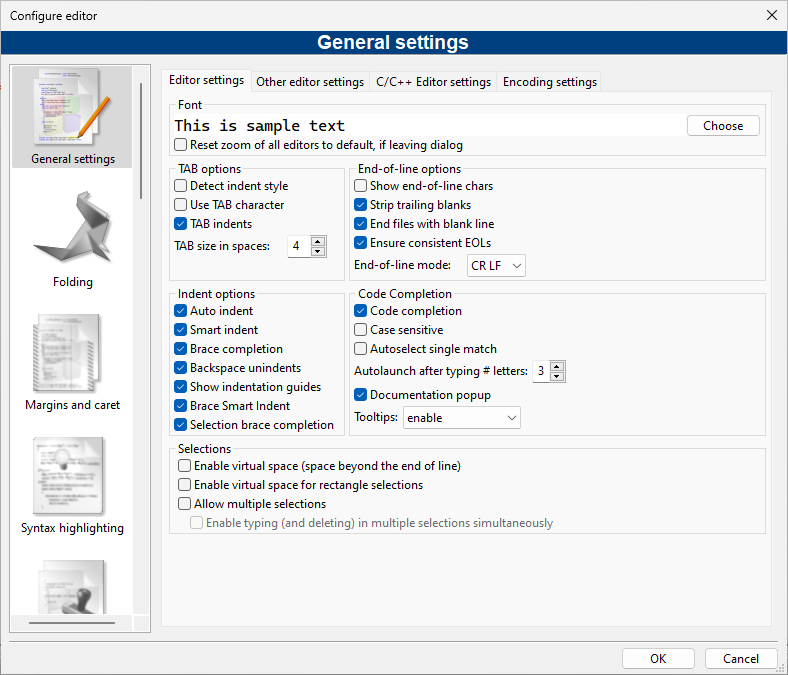{ loading=lazy }
    </figure>

Acum ne mutăm pe tab-ul cu **Other editor settings**. Aici vom configura
următoarele chestii:

1. Bifează Word Wrap. Această funcție încadrează textul automat în caz că este
   prea lung.
2. Este opțional, însă poți bifa Highlight line under caret, care evidențiază
   linia pe care ești în momentul de față.
3. Acest lucru este preferință personală, însă poți face fontul să se randeze
   mai bine pe ecran. La Technology alege DirectWrite, și la Font quality alege
   LCD optimized (mă îndoiesc că ai un monitor cu tub ca pe vremuri).

Acum mergem la **Margins and caret**, unde vom face două schimbări:

1. Activăm Dynamic setting, deoarece bara care arată numărul de linie este mult
   prea groasă.
2. La Right margin hint, selectează Visible line. La a 80-a coloană, arată o
   linie verticală. Dacă nu treci de acea linie, atunci codul tău va fi mai ușor
   de citit, pentru că nu vei avea linii kilometrice.

Un aspect foarte disputat la Code::Blocks este **tema sa implicită**, cu albul
orbitor. Din păcate, Code::Blocks nu vine cu o temă întunecată, mai prietenoasă
cu ochii noaptea (de fapt, nu vine cu alte teme în afară de cea standard). Din
motive tehnice care nu sunt în controlul proiectului Code::Blocks, nu o să avem
vreodată interfața cu temă întunecată (pe alte platforme însă se poate), dar
putem schimba tema editorului. Pentru a rezolva această problemă:

1. Mergi la
   [această pagină arhivată](http://web.archive.org/web/20200225073702/http://wiki.codeblocks.org/index.php?title=Syntax_highlighting_custom_colour_themes).
   Acolo o să vezi mai multe teme.
2. Descarcă următorul fișier de configurare (care este exact cel de pe site,
   însă prezervat pentru conveniența cititorului):

     [colour_themes.conf :material-download:](./codeblocks/colour_themes.conf){ .md-button .md-button--primary }

3. **Închide Code::Blocks**. Acest pas este critic, deci asigură-te că nu ai
   vreo fereastră ascunsă.
4. Caută locația unde este instalat Code::Blocks și deschide folderul
   corespunzător. Ar trebui să fie în `C:\Program Files\CodeBlocks`.
5. Ai un executabil numit `cb_share_config.exe`. Rulează-l.
6. În stânga (la sursă), selectează fișierul `colour_themes.conf` pe care l-ai
   descărcat mai înainte. În dreapta, alege fișierul implicit. Acesta se află la
   `C:\Users\{nume utilizator}\AppData\Roaming\CodeBlocks\default.conf`.
7. În partea stângă, bifează tot din listă. Asigură-te că fereastra ta arată
    așa:

    <figure markdown="span">
    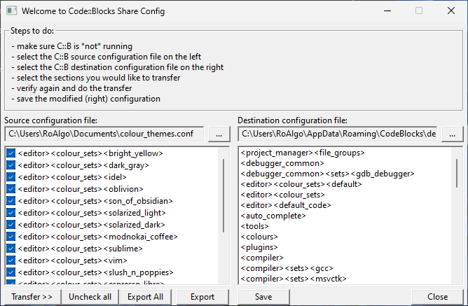{ loading=lazy }
    </figure>

8. Apasă Transfer și răspunde cu Yes când ți se cere.

9. Apasă pe Save.

10. Închide programul și deschide Code::Blocks înapoi.

11. Alege o temă din Settings > Editor > Syntax highlighting. Eu personal
    folosesc Son of Obsidian, dar asta rămâne la latitudinea ta.

După toți acești pași, așa arată editorul cu tema Son of Obsidian:

<figure markdown="span">
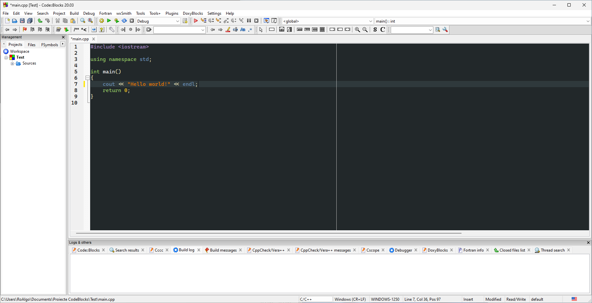{ loading=lazy }
</figure>

Este mai puțin alb, chiar dacă nu este temă întunecată peste tot.

Legat de scurtături, putem vedea scurtăturile curente pentru tot editorul, dacă
mergem la Settings > Editor > Keyboard Shortcuts. Unele din scurtăturile pe care
le vei folosi mai mult sau mai puțin sunt:

- La loc de cinste se află ++f9++, de care am mai zis, care compilează și
  rulează codul tău.
- Pentru a crea un fișier _gol_, apasă ++ctrl+shift+n++ (File > New > Empty
  file);
- ++ctrl+o++ pentru a deschide un fișier;
- ++ctrl+s++ pentru a salva fișierul curent, și ++ctrl+shift+s++ pentru a salva
  tot;
- ++ctrl+w++ pentru a închide fișierul curent și ++ctrl+shift+w++ pentru a
  închide toate fișierele;
- Clasicele ++ctrl+z++ pentru a reversa o schimbare și ++ctrl+shift+z++ pentru a
  face invers, precum și ++ctrl+c++ și ++ctrl+v++ care nu au nevoie de
  introducere;
- ++ctrl++ și rotița de la mouse măresc sau micșorează fontul, în funcție de
  mișcare;
- ++shift+enter++ ca să inserezi o linie nouă sub linia curentă (ceea ce este
  diferit de a apăsa ++enter++) și ++ctrl+enter++ pentru a te duce la capătul
  unei linii;
- ++ctrl+shift+c++ pentru a comenta și ++ctrl+shift+x++ pentru a decomenta;
- ++ctrl+space++ pentru a completa codul (ceva ce folosesc tot timpul);
- ++alt+n++ pentru a redenumi simboluri (nu subestima această scurtătură, căci
  va fi extrem de utilă dacă vrei să redenumești o variabilă sau o funcție);
- Dacă ai selectat un text, ++ctrl+e++ selectează următoarea apariție a
  selecției;
- ++f2++ pentru a ascunde log-urile (ce se află în partea de jos) și
  ++shift+f2++ pentru a ascunde managerul (bara laterală). Poți apăsa aceleași
  scurtături pentru a le aduce înapoi. Dacă nu știi unde s-a dus managerul,
  apasă ++shift+f2++;
- ++shift+f11++ dacă vrei să mărești pe tot ecranul și să reduci distragerile;
- Uneori, închizi un tab din greșeală. Nicio problemă, apasă ++ctrl+shift+t++ și
  revine ca prin magie la viață;
- ++ctrl+tab++ pentru a te plimba prin tab-uri;
- ++ctrl+f++ (și ++ctrl+shift+f++) pentru a căuta textul în fișierul curent,
  respectiv în toate fișierele;
- ++ctrl+r++ (și ++ctrl+shift+r++) pentru a înlocui textul în fișierul curent,
  respectiv în toate fișierele.

Totuși, există câteva scurtături pe care le vom seta noi:

- În Settings > Editor > Keyboard shortcuts, mergem la Edit, apoi la Toggle
  comment și adăugăm scurtătura ++ctrl+slash++. Practic ne scutește din a ține
  minte ++ctrl+shift+c++ și ++ctrl+shift+x++;
- Tot aici, mergem la Plugins > Source code formatter (AStyle) și punem
  scurtătura ++shift+alt+f5++ (sau ceva care îți este convenabil, dar care nu
  mai este folosit de altceva).

!!! warning "Atenție"

    Dacă există două scurtături pe care vreau să le ții minte, în afară de
    chestiile tipice pentru salvat, deschis fișiere etc., acestea sunt:

    - ++f9++ pentru a compila și rula codul;
    - ++shift+alt+f5++ (sau ce ți-ai setat) pentru a formata codul. Chiar insist
      pe această scurtătură, și ar trebui să o rulezi la fiecare schimbare. În
      majoritatea timpului tu vei ajunge să citești codul tău sau codul altora,
      deci este esențial să ai un stil consistent și ușor de citit. Nimeni nu
      stă să ajusteze acolade, deci poți lăsa Code::Blocks să își facă treaba.
      Nu pot sublinia destul importanța acestui lucru.

## Formatare

Ce urmează aici este strict părere personală, însă consider că oferă un stil
lizibil. Voi explica raționamentul pentru fiecare alegere. Mergem la Settings >
Editor > Source formatter.

La tab-ul Style, alegem 1TBS (One True Brace Style). Acest stil arată astfel:

```cpp
int Foo(bool isBar)
{
    if (isFoo) {
        bar();
        return 1;
    } else {
        return 0;
    }
}
```

Ca să nu zic prea multe (deoarece se intersectează cu lecția viitoare), motivul
pentru care aleg 1TBS este să evităm următoarea situație:

```cpp
if (isFoo)
  bar();
  return 1;
```

Acel `#!cpp return 1;` nu este asociat cu linia de dinaintea ei sau cu `if`,
deci este un dezastru care o să se întâmple la un moment dat. Prin adăugarea
acoladelor, suntem expliciți, și este mai ușor de extins codul.

Pentru consistență la acolade cu stilul nostru (1TBS), selectăm toate opțiunile
de la Brackets.

La Indentation, nu avem de schimbat multe. Setăm Indentation size la 4 (nu
recomand un număr sub 4, în mod special 2, și nici 8). Activăm doar Indent C++
comments beginning in column one. Este util pentru a alinia comentariile care se
află în prima coloană.

```cpp
void Foo()
{
// comentariu
    if (isFoo)
        bar();
}
```

devine

```cpp
void Foo()
{
    // comentariu
    if (isFoo) {
        bar();
    }
}
```

La Formatting schimbăm următoarele setări:

1. Selectăm "Break one-line headers". Un "header" în acest context este orice
   instrucțiune (`if`, `while`, `else` etc.). Cu această opțiune, și cele pe
   care le-am setat mai înainte, transformăm:

    ```cpp
    void Foo(bool isFoo)
    {
        if (isFoo1) bar1();

        if (isFoo2) { bar2(); }
    }
    ```

    în

    ```cpp
    void Foo(bool isFoo)
    {
        if (isFoo1) {
            bar1();
        }

        if (isFoo2) {
            bar2();
        }
    }
    ```

    Acoladele fac intenția noastră mai clară și ne permit să adăugăm mai multe
    instrucțiuni în viitor fără mult efort. În plus, este mai uniform.

2. Selectăm "Closes whitespace in the angle brackets of template definitions".
   Pe vremuri, din cauza unui defect în standard și în compilatoare, nu puteai
   scrie asta:

    ```cpp
    Stack<int, List<int>> stack1;
    ```

    și trebuia în schimb:

    ```cpp
    Stack< int, List<int> > stack1;
    ```

    Acum toate compilatoarele au evoluat, deci este sigur să activezi opțiunea
    asta. De asemenea, activează "Enable line breaking". Acest lucru garantează
    faptul că o linie va fi împărțită dacă trece de o lungime anume. Eu setez
    valoarea la 80 de obicei, însă 120 este acceptabil dacă ai mai mult spațiu
    orizontal.

La Padding selectăm:

1. Pad empty lines around header blocks (e.g. 'if', 'while'...). Ce face setarea
   pe scurt este că înconjoară cu o linie nouă înainte de și după fiecare
   header. Transformă:

    ```cpp
    isFoo = true;
    if (isFoo) {
        bar();
    } else {
        anotherBar();
    }
    isBar = false;
    ```

    în

    ```cpp
    isFoo = true;

    if (isFoo) {
        bar();
    } else {
        anotherBar();
    }

    isBar = false;
    ```

2. Insert space padding around operators. Așa cum zice și numele, pune spații în
   jurul operatorilor. În loc de `1+1`, devine `1 + 1`.
3. Insert space padding between a header and the following paren. Dacă activăm
   asta, "dezlipim" paranteza de `if`/`while`/...
4. Remove extra space padding around parentheses. Combinat cu ultima setare,
   avem un singur spațiu. Ele transformă:

    ```cpp
    if ( isFoo( ( a+2 ), b ) ) {
        bar ( a, b );
    }
    ```

    în

    ```cpp
    if (isFoo((a + 2), b)) {
        bar(a, b);
    }
    ```

    Această opțiune nu va șterge spațiile în plus în jurul operatorilor, din
    păcate. Există opțiunea în versiunile beta de Code::Blocks, însă nu sunt
    stabile.

5. Setăm Pointer alignment și Reference alignment la Name. S-au purtat războaie
   seculare pe această temă, însă le prefer pe cât posibil să fie la fel,
   indiferent de alinierea aleasă.

Acum că am făcut aceste setări, acest exemplu:

```cpp
#include <iostream>
#include <cmath>
int main(){
    int v[10];
    for(int i=0;i<10;++i) v[i]=i*sin(i);
     for(int i=0;i<10;++i) std::cout<<v[i]<<" "; std::cout<<"\n";
    bool sortat; do{
        sortat=true;
      for(int i=0;i<9;++i){
      if(v[i]>v[i+1]){
        int aux=v[i];
        v[i]=v[i+1];
        v[i+1]=aux;
        sortat=false;
      }}
    } while(!sortat);
    for(int i=0;i<10;++i) std::cout<<v[i]<<" ";  std::cout<<"\n";
    return 0;
}
```

se va transforma în:

```cpp
#include <iostream>
#include <cmath>
int main()
{
    int v[10];

    for (int i = 0; i < 10; ++i) {
        v[i] = i * sin(i);
    }

    for (int i = 0; i < 10; ++i) {
        std::cout << v[i] << " ";
    }

    std::cout << "\n";
    bool sortat;

    do {
        sortat = true;

        for (int i = 0; i < 9; ++i) {
            if (v[i] > v[i + 1]) {
                int aux = v[i];
                v[i] = v[i + 1];
                v[i + 1] = aux;
                sortat = false;
            }
        }
    } while (!sortat);

    for (int i = 0; i < 10; ++i) {
        std::cout << v[i] << " ";
    }

    std::cout << "\n";
    return 0;
}
```

## Alte configurări

În primul rând, recomand să activezi funcția de Autosave. Așa cum zice și
numele, salvează automat proiectele la un interval anume, ca să nu pierzi toată
munca depusă la o problemă. Pentru a activa asta, du-te la Settings, apoi la
Environment și la Autosave bifează ambele căsuțe. 1 minut este mai mult decât
suficient.

Pentru a adăuga opțiuni pentru compilator, mergem la Settings > Compiler > Other
compiler options (deoarece Code::Blocks 20.03 din motive tehnice dubioase nu
afișează toate opțiunile pe care GCC le suportă) și adăugăm următoarele opțiuni:

```text
-std=c++20 -Wall -Wextra -Wpedantic
```

Aceste opțiuni zic compilatorului să suporte o versiune mai nouă de C++ și
activăm majoritatea avertizărilor, pentru a prinde potențiale erori din timp.

Asta este tot cu configurarea. Poți acum să mergi către următorul articol:

[Mergi la introducere](./../../intro.md){ .md-button .md-button--primary }
