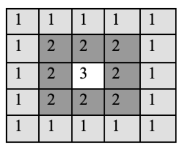

---
tags:
    - matrici
    - implementare
---
**Autor**: Ștefan-Cosmin Dăscălescu

## Introducere

După ce v-ați obișnuit cu [tablourile unidimensionale](https://edu.roalgo.ro/cppintro/arrays/), a venit timpul să generalizăm lucrurile și pentru tablourile bidimensionale (colocvial numite, matrici) și cele cu mai multe dimensiuni.

Cel mai simplu mod de a defini o matrice este acela că reprezintă un vector de vectori, acesta fiind și modul în care matricea este stocată în memorie (liniile sunt situate consecutiv în memorie).

De-a lungul acestui articol, vom discuta diferite moduri de a parcurge matricile, precum și elemente care apar des în exerciții probleme și cum să le identificați cu ușurință în diverse contexte. Ulterior, vom discuta și tehnici mai avansate, care pot fi utile atunci când aveți de lucrat în contexte mai dificile, precum și tablourile multidimensionale.

## Declararea, parcurgerea și umplerea matricilor statice

Pentru a declara matricile, putem folosi ambele variante (fie cea inspirată din limbajul C, fie cea bazată pe metodele din STL). În acest articol ne vom concentra pe varianta statică, păstrând metodele din STL pentru articolul corespunzător.

Pentru a citi și parcurge valorile din matrice, vom folosi de regulă o structură repetitivă, precum for sau while, citind valorile pe rând, la fel cum am proceda cu variabile obișnuite. Spre deosebire de vectori, vom avea nevoie (de regulă) de structuri repetitive imbricate. 

În mod similar cu declararea vectorilor, ne trebuie un tip de date pe
care acest tablou să-l stocheze, precum și dimensiunea pe care vrem să o
atribuim acestui tablou.

De exemplu, `#!cpp int v[101][101];` înseamnă ca am declarat un tablou bidimensional cu $101$ linii, fiecare tablou având $101$ elemente, pozițiile fiind numărate de la $0$ la $100$ (cu alte cuvinte, am declarat $101$ tablouri).

!!! note "Împărțirea tablourilor" 
    Colocvial, vom împărți aceste tablouri în linii și coloane, astfel, vom spune despre elementul de pe poziția $(2, 6)$ că se află pe linia $2$ și coloana $6$. De asemenea, liniile vor fi numerotate de sus în jos, iar coloanele de la stânga la dreapta, ceea ce este în contrast cu sistemul de coordonate xOy folosit în geometria analitică.

!!! note "Observație" 
    La fel ca la vectori, dacă vreți să lucrați cu valorile indexate de la $1$, va trebui să adăugați $1$ la dimensiunile pe care le declarați. 

Pentru a atribui o valoare unei anumite poziții, se va proceda similar ca la o variabilă obișnuită, de exemplu `#!cpp v[1][5] = 7;` înseamnă că pe linia $1$ și coloana $5$, vom avea acum valoarea $7$.

### Problemă exemplu - [sumapare2 de pe pbinfo](https://www.pbinfo.ro/probleme/767/sumapare2) 

Aici puteți observa cum citim valorile din matrice și apoi parcurgem matricea pentru a aduna valorile pare care apar în ea. 

```cpp
#include <iostream>
using namespace std;

int main() {
    int n, m;
    cin >> n >> m;
    
    int mat[n][m];
    for (int i = 0; i < n; i++) {
        for (int j = 0; j < m; j++) {
            cin >> mat[i][j];
        }
    }
    
    int sumpar = 0;
    for (int i = 0; i < n; i++) {
        for (int j = 0; j < m; j++) {
            if (mat[i][j] % 2 == 0) {
                sumpar += mat[i][j];
            }
        }
    }
    
    cout << sumpar << '\n';
    return 0;
}
```

### Genererări de matrice

Multe probleme cu matrici, în special cele date la examenele de bacalaureat și admitere, necesită diverse generări și construiri de matrice. Aici vom prezenta câteva exerciții și probleme rezolvate.

O listă foarte bună cu probleme suplimentare de acest tip se găsește [aici](https://www.pbinfo.ro/?pagina=probleme-lista&tag=48)

#### Exercițiu adaptat dintr-un model al examenului de bacalaureat

Să se genereze o matrice cu dimensiunea $7 \cdot 7$ cu următoarea formă:

```
2 2 2 2 2 2 2
2 2 2 2 2 2 2
2 2 2 2 2 2 2
2 2 2 2 2 2 2
2 2 2 4 2 2 2
2 2 4 4 4 2 2
2 4 4 4 4 4 2
```

Pentru a rezolva acest exercițiu, putem observa faptul că primele $4$ linii sunt pline de $2$, iar începând de la linia $5$, vom începe să avem valori egale cu $4$ începând de la mijloc, intervalul valorilor extinzându-se la stânga și dreapta cu câte $1$ pentru fiecare linie următoare. 

```cpp
for (int i = 1; i <= 7; i++) {
    for (int j = 1; j <= 7; j++) {
        if (i <= 4) {
            mat[i][j] = 2;
        }
        else {
            if (j >= 4 - (i - 5) && j <= 4 + (i + 5)) {
                mat[i][j] = 4;
            }
            else {
                mat[i][j] = 2;
            }
        }
    }
}
```

### Problemă exemplu - [genmat25 de pe pbinfo](https://www.pbinfo.ro/probleme/2822/genmat25) 

Pentru a rezolva această problemă, trebuie să urmăm cu atenție instrucțiunile din enunț, în ordinea în care sunt date. Ulterior, vom afișa matricea rezultată. 

```cpp
#include <iostream>
using namespace std;

int main() {
    int n;
    cin >> n;
    
    int grid[n+1][n+1];
    
    // prima coloana
    for (int i = 1; i <= n; i++) {
        grid[i][1] = i;
    }
    
    // ultima linie
    for (int i = 1; i <= n; i++) {
        grid[n][i] = n;
    }
    
    // restul matricii
    for (int i = n-1; i >= 1; i--) {
        for (int j = 2; j <= n; j++) {
            grid[i][j] = grid[i][j-1] + grid[i+1][j-1];
        }
    }
    
    // afisarea
    for (int i = 1; i <= n; i++) {
        for (int j = 1; j <= n; j++) {
            cout << grid[i][j] << " ";
        }
        cout << '\n';
    }
    
    return 0;
}
```

### Problemă exemplu - [genmat23 de pe pbinfo](https://www.pbinfo.ro/probleme/1585/genmat23) 

Pentru a rezolva această problemă, vom vrea să aflăm pentru fiecare poziție distanța față de marginea matricii și apoi vom colora pătratele cu $0$ sau $1$ după caz. 

```cpp
#include <iostream>
using namespace std;

int main() {
    int n;
    cin >> n;
    
    int mat[n+1][n+1];
    
    for (int i = 1; i <= n; i++) {
        for (int j = 1; j <= n; j++) {
            int dist = i - 1;
            if (n - i < dist) {
                dist = n - i;
            }
            if (j - 1 < dist) {
                dist = j - 1;
            }
            if (n - j < dist) {
                dist = n - j;
            }
            if (dist % 2 == 0) {
                mat[i][j] = 1;
            }
            else {
                mat[i][j] = 0;
            }
        }
    }
    
    for (int i = 1; i <= n; i++) {
        for (int j = 1; j <= n; j++) {
            cout << mat[i][j] << " ";
        }
        cout << '\n';
    }
    
    return 0;
}   
```   

## Matricile pătratice

### Împărțirea matricilor pătratice. Diagonale, zone și regiuni

## Alte parcurgeri și modificări în matrice

### Parcurgerea în spirală 

Parcurgerea matricii în spirală este un tip de cerință ce apare des în problemele de informatică și este de multe ori, un tip de cerință care pun mari dificultăți celor care vor să devină mai pricepuți la implementare. 


Există foarte multe moduri de a implementa corect algoritmul de parcurgere în spirală, dar aici ne vom concentra pe două dintre variante. 

#### Varianta 1 - acoperim fiecare zonă concentrică

O primă variantă constă în a simula cele $4$ mutări pentru fiecare zonă concentrică și să folosim foruri imbricate pentru a avea scrise parcurgerile.

Cu alte cuvinte, acoperim fiecare zonă colorată diferit în imaginea de mai jos și începem mereu de pe linia și coloana $i$. 



Aici puteți găsi implementarea din limbajul C++ a soluției pentru problema [spirala de pe pbinfo](https://www.pbinfo.ro/probleme/211/spirala) care folosește această tehnică.

```cpp
#include <fstream>
using namespace std;

ifstream fin("spirala.in");
ofstream fout("spirala.out");

int ox[4] = {0, 1, 0, -1};
int oy[4] = {1, 0, -1, 0};

int main() {
    int n;
    fin >> n;
    
    int grid[n+1][n+1];
    for (int i = 1; i <= n; i++) {
        for (int j = 1; j <= n; j++) {
            fin >> grid[i][j];
        }
    }
    
    for (int L = 1; L <= n/2 + n%2; L++) {
        for (int C = L; C <= n - L + 1; C++) {
            fout << grid[L][C] << " ";
        }
        for (int CC = L+1; CC <= n - L + 1; CC++) {
            fout << grid[CC][n - L + 1] << " ";
        }
        for (int C = n - L; C >= L; C--) {
            fout << grid[n - L + 1][C] << " ";
        }
        for (int CC = n - L; CC >= L+1; CC--) {
            fout << grid[CC][L] << " ";
        }
    }
        
    return 0;
}
```

#### Varianta 2 - folosind vectori de direcție 

O variantă alternativă este aceea de a observa modul în care se execută mișcările de către algoritmul explicat la primul pas. 

Vom lua drept exemplu $n = 4$.

* $4$ pași la dreapta
* $3$ pași în jos
* $3$ pași la stânga 
* $2$ pași în sus
* $2$ pași la dreapta
* $1$ pas în jos
* $1$ pas la stânga

Se poate observa faptul că după ce facem primul pas și avem $n$ mutări, lungimile mutărilor se repetă câte două, astfel putem folosi [vectorii de direcție](https://edu.roalgo.ro/mediu/lee/#vectorii-de-directie) pentru a implementa aceste mutări foarte ușor, fără mari probleme.

Aici puteți găsi implementarea din limbajul C++ a soluției pentru problema [spirala de pe pbinfo](https://www.pbinfo.ro/probleme/211/spirala) care folosește această tehnică.

```cpp
#include <fstream>
using namespace std;

ifstream fin("spirala.in");
ofstream fout("spirala.out");

// dreapta, jos, stanga, sus
int ox[4] = {0, 1, 0, -1};
int oy[4] = {1, 0, -1, 0};

int main() {
    int n;
    fin >> n;
    
    int grid[n+1][n+1];
    for (int i = 1; i <= n; i++) {
        for (int j = 1; j <= n; j++) {
            fin >> grid[i][j];
        }
    }
    
    int L = 1;
    int C = 0;
    int dir = 0; // directia curenta
    int cnt = n; // numarul de mutari
    int rem = 1; // cate serii cu acest numar de mutari mai avem
    while (cnt > 0) {
        for (int i = 1; i <= cnt; i++) {
            L += ox[dir];
            C += oy[dir];
            fout << grid[L][C] << " ";
        }
        dir = (dir + 1) % 4;
        rem--;
        if (rem == 0) {
            rem = 2;
            cnt--;
        }
    }
        
    return 0;
}
```

### Transpunerea elementelor în matrice

### Bordarea unei matrici

Pentru a borda o matrice, putem să marcăm cu o valoare care să ne marcheze faptul că nu vrem să trecem prin acele poziții (de exemplu, $-1$).

```cpp
for (int i = 0; i <= m+1; i++) {
    mat[0][i] = mat[n+1][i] = -1; // bordarea liniilor 0 si n+1
}
for (int i = 0; i <= n+1; i++) {
    mat[i][0] = mat[i][m+1] = -1; // bordarea coloanelor 0 si m+1
}
```

### Căutarea unor elemente în matrici

## Tablouri multidimensionale

## Concluzii

Lucrul cu matrici și tablouri multidimensionale este un pas înainte pentru aprofundarea principiilor programării în oricare limbaj de programare. Foarte mulți algoritmi pe matrici sunt aplicați în diverse moduri și așa cum se poate vedea în metodele de mai sus, aplicațiile sunt foarte răspândite.

## Probleme suplimentare

* [spirala1 pbinfo](https://www.pbinfo.ro/probleme/1008/spirala1)
* [spirala2 pbinfo](https://www.pbinfo.ro/probleme/1584/spirala2)

## Resurse suplimentare

* [Tablouri bidimensionale - pbinfo](https://www.pbinfo.ro/articole/5620/tablouri-bidimensionale)
* [Tablouri bidimensionale (matrice) - CPPI Sync](https://cppi.sync.ro/materia/tablouri_bidimensionale_matrice.html)
* [Tablouri pătratice - pbinfo](https://www.pbinfo.ro/articole/5626/tablouri-patratice)