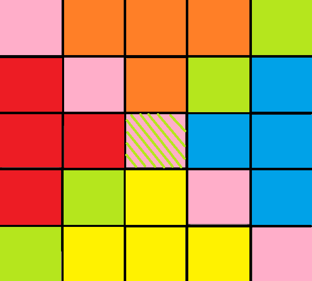
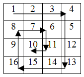

---
tags:
    - matrici
    - implementare
---
**Autor**: Ștefan-Cosmin Dăscălescu

!!! example "Cunoștințe necesare"
    - [Vectori (tablouri unidimensionale)](https://edu.roalgo.ro/cppintro/arrays/)

## Introducere

După ce v-ați obișnuit cu [tablourile
unidimensionale](https://edu.roalgo.ro/cppintro/arrays/), a venit timpul să
generalizăm lucrurile și pentru tablourile bidimensionale (colocvial numite,
matrici) și cele cu mai multe dimensiuni.

Cel mai simplu mod de a defini o matrice este acela că reprezintă un vector de
vectori, acesta fiind și modul în care matricea este stocată în memorie (liniile
sunt situate consecutiv în memorie).

De-a lungul acestui articol, vom discuta diferite moduri de a parcurge
matricile, precum și elemente care apar des în exerciții probleme și cum să le
identificați cu ușurință în diverse contexte. Ulterior, vom discuta și tehnici
mai avansate, care pot fi utile atunci când aveți de lucrat în contexte mai
dificile, precum și tablourile multidimensionale.

## Declararea, parcurgerea și umplerea matricilor statice

Pentru a declara matricile, putem folosi ambele variante (fie cea inspirată din
limbajul C, fie cea bazată pe metodele din STL). În acest articol ne vom
concentra pe varianta statică, păstrând metodele din STL pentru articolul
corespunzător.

Pentru a citi și parcurge valorile din matrice, vom folosi de regulă o structură
repetitivă, precum for sau while, citind valorile pe rând, la fel cum am proceda
cu variabile obișnuite. Spre deosebire de vectori, vom avea nevoie (de regulă)
de structuri repetitive imbricate.

În mod similar cu declararea vectorilor, ne trebuie un tip de date pe care acest
tablou să-l stocheze, precum și dimensiunea pe care vrem să o atribuim acestui
tablou.

De exemplu, `#!cpp int v[101][101];` înseamnă ca am declarat un tablou
bidimensional cu 101 linii, fiecare tablou având 101 elemente, pozițiile fiind
numărate de la 0 la 100 (cu alte cuvinte, am declarat 101 tablouri).

!!! note "Împărțirea tablourilor"

    Colocvial, vom împărți aceste tablouri în linii și coloane, astfel, vom spune
    despre elementul de pe poziția (2, 6) că se află pe linia 2 și coloana 6. De
    asemenea, liniile vor fi numerotate de sus în jos, iar coloanele de la 
    stânga la dreapta, ceea ce este în contrast cu sistemul de coordonate xOy 
    folosit în geometria analitică.

!!! note "Observație"

    La fel ca la vectori, dacă vreți să lucrați cu valorile indexate de la 1, va
    trebui să adăugați 1 la dimensiunile pe care le declarați.

Pentru a atribui o valoare unei anumite poziții, se va proceda similar ca la o
variabilă obișnuită, de exemplu `#!cpp v[1][5] = 7;` înseamnă că pe linia 1 și
coloana 5, vom avea acum valoarea 7.

### Problemă exemplu - [sumapare2 de pe pbinfo](https://www.pbinfo.ro/probleme/767/sumapare2)

Aici puteți observa cum citim valorile din matrice și apoi parcurgem matricea
pentru a aduna valorile pare care apar în ea.

```cpp
#include <iostream>
using namespace std;

int main() {
    int n, m;
    cin >> n >> m;

    int mat[n][m];
    for (int i = 0; i < n; i++) {
        for (int j = 0; j < m; j++) {
            cin >> mat[i][j];
        }
    }

    int sumpar = 0;
    for (int i = 0; i < n; i++) {
        for (int j = 0; j < m; j++) {
            if (mat[i][j] % 2 == 0) {
                sumpar += mat[i][j];
            }
        }
    }

    cout << sumpar << '\n';
    return 0;
}
```

### Genererări de matrice

Multe probleme cu matrici, în special cele date la examenele de bacalaureat și
admitere, necesită diverse generări și construiri de matrice. Aici vom prezenta
câteva exerciții și probleme rezolvate.

O listă foarte bună cu probleme suplimentare de acest tip se găsește
[aici](https://www.pbinfo.ro/?pagina=probleme-lista&tag=48).

#### Exercițiu adaptat dintr-un model al examenului de bacalaureat

Să se genereze o matrice cu dimensiunea 7 × 7 cu următoarea formă:

```
2 2 2 2 2 2 2
2 2 2 2 2 2 2
2 2 2 2 2 2 2
2 2 2 2 2 2 2
2 2 2 4 2 2 2
2 2 4 4 4 2 2
2 4 4 4 4 4 2
```

Pentru a rezolva acest exercițiu, putem observa faptul că primele 4 linii sunt
pline de 2, iar începând de la linia 5, vom începe să avem valori egale cu
4 începând de la mijloc, intervalul valorilor extinzându-se la stânga și
dreapta cu câte 1 pentru fiecare linie următoare.

```cpp
for (int i = 1; i <= 7; i++) {
    for (int j = 1; j <= 7; j++) {
        if (i <= 4) {
            mat[i][j] = 2;
        } else {
            if (j >= 4 - (i - 5) && j <= 4 + (i + 5)) {
                mat[i][j] = 4;
            } else {
                mat[i][j] = 2;
            }
        }
    }
}
```

### Problemă exemplu - [genmat25 de pe pbinfo](https://www.pbinfo.ro/probleme/2822/genmat25)

Pentru a rezolva această problemă, trebuie să urmăm cu atenție instrucțiunile
din enunț, în ordinea în care sunt date. Ulterior, vom afișa matricea rezultată.

```cpp
#include <iostream>
using namespace std;

int main() {
    int n;
    cin >> n;

    int grid[n + 1][n + 1];

    // prima coloana
    for (int i = 1; i <= n; i++) {
        grid[i][1] = i;
    }

    // ultima linie
    for (int i = 1; i <= n; i++) {
        grid[n][i] = n;
    }

    // restul matricii
    for (int i = n - 1; i >= 1; i--) {
        for (int j = 2; j <= n; j++) {
            grid[i][j] = grid[i][j - 1] + grid[i + 1][j - 1];
        }
    }

    // afisarea
    for (int i = 1; i <= n; i++) {
        for (int j = 1; j <= n; j++) {
            cout << grid[i][j] << " ";
        }
        cout << '\n';
    }

    return 0;
}
```

### Problemă exemplu - [genmat23 de pe pbinfo](https://www.pbinfo.ro/probleme/1585/genmat23)

Pentru a rezolva această problemă, vom vrea să aflăm pentru fiecare poziție
distanța față de marginea matricii și apoi vom colora pătratele cu 0 sau 1
după caz.

```cpp
#include <iostream>
using namespace std;

int main() {
    int n;
    cin >> n;

    int mat[n + 1][n + 1];

    for (int i = 1; i <= n; i++) {
        for (int j = 1; j <= n; j++) {
            int dist = i - 1;
            if (n - i < dist) {
                dist = n - i;
            }
            if (j - 1 < dist) {
                dist = j - 1;
            }
            if (n - j < dist) {
                dist = n - j;
            }
            if (dist % 2 == 0) {
                mat[i][j] = 1;
            } else {
                mat[i][j] = 0;
            }
        }
    }

    for (int i = 1; i <= n; i++) {
        for (int j = 1; j <= n; j++) {
            cout << mat[i][j] << " ";
        }
        cout << '\n';
    }

    return 0;
} 
```

## Matricile pătratice

!!! info "Definiție"
    O matrice pătratică este o matrice care are un număr egal de linii și coloane.

Deși în mod structural, aceste matrici nu sunt diferite față de matricile
"dreptunghiulare", această structură simetrică ne permită să operăm mult mai
multe tipuri de operații.

În cele ce urmează, vom defini diverse noțiuni întâlnite frecvent în aceste
tipuri de probleme.

### Împărțirea matricilor pătratice. Diagonale, zone și regiuni

Mai întâi, deoarece matricea este pătratică, putem să ne gândim la diagonalele
matricii drept granițe pentru împărțirea matricii pe zone, astfel creându-se 4
regiuni.

!!! info "Diagonala principală"

    Definim diagonala principală a unei matrici pătratice segmentul care unește
    punctele situate în pozițiile (1, 1) și (n, n), astfel încât această linie
    acoperă toate punctele cu coordonatele de forma (i, i).

!!! info "Diagonala secundară"

    Definim diagonala secundară a unei matrici pătratice segmentul care unește
    punctele situate în pozițiile (1, n) și (n, 1), astfel încât această linie
    acoperă toate punctele cu coordonatele de forma (i, n - i + 1).

!!! note "Observație"

    Dacă indexăm matricea de la 0, diagonala secundară unește pozițiile (0, n-1)
    și (n-1, 0), punctele acoperite având coordonatele (i, n - i - 1).

O consecință a prezenței acestor diagonale reprezintă împărțirea matricii pe
zone, în funcție de orientarea raportată la diagonale, zonele fiind definite
presupunând indexarea matricii de la 1.

Astfel, putem defini 4 zone, după cum urmează:

- zona de nord: Pozițiile situate deasupra ambelor diagonale (cu portocaliu pe
  desen). Pentru ca un punct să fie în zona de nord, i < j și i + j < n + 1.
- zona de vest: Pozițiile situate deasupra diagonalei secundare (cu roșu pe
  desen). Pentru ca un punct să fie în zona de vest, i > j și i + j < n + 1.
- zona de est: Pozițiile situate deasupra diagonalei principale (cu albastru pe
  desen). Pentru ca un punct să fie în zona de est, i < j și i + j > n + 1.
- zona de sud: Pozițiile situate dedesubtul ambelor diagonale (cu galben pe
  desen). Pentru ca un punct să fie în zona de sud, i > j și i + j > n + 1.

!!! note "Observație"

    Pentru valori impare ale lui n, diagonalele se intersectează în punctul din
    mijlocul matricii.

- În desen, diagonala principală reprezintă zonele cu roz pe desen, iar diagonala secundară, zonele cu verde pe desen. (punctul din mijloc este hașurat cu verde).



#### Problemă exemplu - [zona1 de pe pbinfo](https://www.pbinfo.ro/probleme/782/zona1)

Această problemă se concentrează pe zona de sud a matricii. După ce parcurgem
elementele matricii, le vom adăuga într-un vector de frecvență pentru a obține
răspunsul cerut.

```cpp
#include <iostream>
using namespace std;

int main() {
    int n;
    cin >> n;

    int fr[1000] = {0};
    for (int i = 1; i <= n; i++) {
        for (int j = 1; j <= n; j++) {
            int x;
            cin >> x;
            if (i > j && i + j > n + 1) {
                fr[x]++;
            }
        }
    }

    for (int i = 0; i < 1000; i++) {
        if (fr[i] >= 2) {
            cout << i << " ";
        }
    }

    return 0;
}
```

#### Problemă exemplu - [diagonal de pe nerdarena](https://www.nerdarena.ro/problema/diagonal)

Aici, vrem să ne folosim de structura matricii pentru a procesa diagonalele, de
jos în sus și de la stânga la dreapta. Mai întâi, mergem prin punctele de pe
prima coloană și apoi cele de pe prima linie, iar pentru diagonala secundară,
punctele de pe prima linie și apoi cele de pe ultima coloană. Indiferent de
parcurgere, vom merge în jos ulterior.

```cpp
#include <fstream>
#include <iostream>

using namespace std;

int main() {
    ifstream cin("diagonal.in");
    ofstream cout("diagonal.out");

    char grid[100][100];

    int n = 0;
    while (cin >> grid[n]) {
        n++;
    }

    // diagonala principala

    for (int L = n - 1; L >= 0; L--) {
        int L2 = L;
        for (int C = 0; L2 < n && C < n; L2++, C++) {
            cout << grid[L2][C];
        }
    }
    for (int C = 1; C < n; C++) {
        int C2 = C;
        for (int L = 0; L < n && C2 < n; L++, C2++) {
            cout << grid[L][C2];
        }
    }

    cout << '\n';

    // diagonala secundara

    for (int C = 0; C < n; C++) {
        int C2 = C;
        for (int L = 0; L < n && C2 >= 0; L++, C2--) {
            cout << grid[L][C2];
        }
    }

    for (int L = 1; L < n; L++) {
        int L2 = L;
        for (int C = n - 1; L2 < n && C >= 0; L2++, C--) {
            cout << grid[L2][C];
        }
    }
    return 0;
}
```

## Alte parcurgeri și modificări în matrice

### Parcurgerea în spirală

Parcurgerea matricii în spirală este un tip de cerință ce apare des în
problemele de informatică și este de multe ori, un tip de cerință care pun mari
dificultăți celor care vor să devină mai pricepuți la implementare.



Există foarte multe moduri de a implementa corect algoritmul de parcurgere în
spirală, dar aici ne vom concentra pe două dintre variante.

#### Varianta 1 - acoperim fiecare zonă concentrică

O primă variantă constă în a simula cele 4 mutări pentru fiecare zonă
concentrică și să folosim foruri imbricate pentru a avea scrise parcurgerile.

Cu alte cuvinte, acoperim fiecare zonă colorată diferit în imaginea de mai jos
și începem mereu de pe linia și coloana i.


Aici puteți găsi implementarea din limbajul C++ a soluției pentru problema
[spirala de pe pbinfo](https://www.pbinfo.ro/probleme/211/spirala) care
folosește această tehnică.

```cpp
#include <fstream>
using namespace std;

ifstream fin("spirala.in");
ofstream fout("spirala.out");

int ox[4] = {0, 1, 0, -1};
int oy[4] = {1, 0, -1, 0};

int main() {
    int n;
    fin >> n;

    int grid[n + 1][n + 1];
    for (int i = 1; i <= n; i++) {
        for (int j = 1; j <= n; j++) {
            fin >> grid[i][j];
        }
    }

    for (int L = 1; L <= n / 2 + n % 2; L++) {
        for (int C = L; C <= n - L + 1; C++) {
            fout << grid[L][C] << " ";
        }
        for (int CC = L + 1; CC <= n - L + 1; CC++) {
            fout << grid[CC][n - L + 1] << " ";
        }
        for (int C = n - L; C >= L; C--) {
            fout << grid[n - L + 1][C] << " ";
        }
        for (int CC = n - L; CC >= L + 1; CC--) {
            fout << grid[CC][L] << " ";
        }
    }

    return 0;
}
```

#### Varianta 2 - folosind vectori de direcție

O variantă alternativă este aceea de a observa modul în care se execută
mișcările de către algoritmul explicat la primul pas.

Vom lua drept exemplu n = 4.

- 4 pași la dreapta
- 3 pași în jos
- 3 pași la stânga
- 2 pași în sus
- 2 pași la dreapta
- 1 pas în jos
- 1 pas la stânga

Se poate observa faptul că după ce facem primul pas și avem n mutări,
lungimile mutărilor se repetă câte două, astfel putem folosi [vectorii de
direcție](https://edu.roalgo.ro/mediu/lee/#vectorii-de-directie) pentru a
implementa aceste mutări foarte ușor, fără mari probleme.

Aici puteți găsi implementarea din limbajul C++ a soluției pentru problema
[spirala de pe pbinfo](https://www.pbinfo.ro/probleme/211/spirala) care
folosește această tehnică.

```cpp
#include <fstream>
using namespace std;

ifstream fin("spirala.in");
ofstream fout("spirala.out");

// dreapta, jos, stanga, sus
int ox[4] = {0, 1, 0, -1};
int oy[4] = {1, 0, -1, 0};

int main() {
    int n;
    fin >> n;

    int grid[n + 1][n + 1];
    for (int i = 1; i <= n; i++) {
        for (int j = 1; j <= n; j++) {
            fin >> grid[i][j];
        }
    }

    int L = 1;
    int C = 0;
    int dir = 0;  // directia curenta
    int cnt = n;  // numarul de mutari
    int rem = 1;  // cate serii cu acest numar de mutari mai avem
    while (cnt > 0) {
        for (int i = 1; i <= cnt; i++) {
            L += ox[dir];
            C += oy[dir];
            fout << grid[L][C] << " ";
        }
        dir = (dir + 1) % 4;
        rem--;
        if (rem == 0) {
            rem = 2;
            cnt--;
        }
    }

    return 0;
}
```

### Transpunerea elementelor în matrice

În unele probleme, suntem nevoiți să rotim matricea pentru a lucra mai ușor cu
ea.

De obicei, cele mai frecvente rotații sunt cele la stânga sau la dreapta, dar
avem de-a face și cu alte tipuri de mișcări, precum transpozițiile sau
oglindirea valorilor.

Se poate observa faptul că după o rotire a matricii cu 90°, prima linie va
deveni prima coloană scrisă invers, a doua coloană va deveni a doua coloană
scrisă invers ș.a.m.d.

!!! note "Rotații mai mari"

    Dacă vrem să rotim matricea cu valori mai mari de 90°, putem simula rotirile
    de 90° de mai multe ori, ajungând la același rezultat.

!!! note "Rotații la dreapta"

    Dacă vrem să rotim matricea la dreapta, vom folosi aceeași logică, unde prima
    linie va deveni ultima coloană, a doua linie va deveni penultima coloană
    ș.a.m.d.

Aici se poate găsi soluția problemei [rotire de pe
pbinfo](https://www.pbinfo.ro/probleme/224/rotire), unde trebuie să rotim
matricea la stânga cu 90°.

```cpp
#include <fstream>
using namespace std;

int main() {
    ifstream cin("rotire.in");
    ofstream cout("rotire.out");

    int n, m;
    cin >> n >> m;

    int grid[11][11], grid2[11][11];

    for (int i = 1; i <= n; i++) {
        for (int j = 1; j <= m; j++) {
            cin >> grid[i][j];
        }
    }

    for (int i = 1; i <= n; i++) {
        for (int j = 1; j <= m; j++) {
            grid2[m - j + 1][i] = grid[i][j];
        }
    }

    for (int i = 1; i <= m; i++) {
        for (int j = 1; j <= n; j++) {
            cout << grid2[i][j] << " ";
        }
        cout << '\n';
    }
    return 0;
}
```

### Bordarea unei matrici

Pentru a borda o matrice, putem să marcăm cu o valoare care să ne marcheze
faptul că nu vrem să trecem prin acele poziții (de exemplu, -1).

```cpp
for (int i = 0; i <= m + 1; i++) {
    mat[0][i] = mat[n + 1][i] = -1;  // bordarea liniilor 0 si n+1
}
for (int i = 0; i <= n + 1; i++) {
    mat[i][0] = mat[i][m + 1] = -1;  // bordarea coloanelor 0 si m+1
}
```

### Căutarea unor elemente și secvențe în matrici

Pentru a căuta elementele în matrici, vom procesa mai mult sau mai puțin ca la
vectori, putând aplica algoritmii învățați la vectori și pentru matrici.

O tehnică care merită știută este aceea că în cazul multor probleme, dacă vrem
să alegem o submatrice cu o anumită proprietate, de multe ori este optim să
fixăm linia de început și de final, iar mai apoi să procesăm valorile dintre
cele două linii presupunând că acestea formează un vector, ulterior aplicând
tehnicile și algoritmii învățați la vectori.

Un astfel de exemplu de problemă este [Submatrix
SumMax](https://www.pbinfo.ro/probleme/3410/submatrixsummax), discutată în
articolul cu secvențe.

## Tablouri multidimensionale

În general, când vine vorba de tablouri cu mai multe dimensiuni, putem să le
declarăm fie la fel cum declarăm matricile, fie folosind variantele din STL,
care vor fi detaliate în articolul corespunzător.

De exemplu, `#!cpp int v[101][101][101];` reprezintă un "cub" de dimensiuni 101
× 101 × 101. La fel ca la celelalte tablouri, cu cât avem mai multe
dimensiuni, cu atât cantitatea de memorie crește, iar în cele mai multe cazuri,
nu vom avea nevoie de mai mult de 3–4 dimensiuni.

## Concluzii

Lucrul cu matrici și tablouri multidimensionale este un pas înainte pentru
aprofundarea principiilor programării în oricare limbaj de programare. Foarte
mulți algoritmi pe matrici sunt aplicați în diverse moduri și așa cum se poate
vedea în metodele de mai sus, aplicațiile sunt foarte răspândite.

## Probleme suplimentare

- [cntlinii pbinfo](https://www.pbinfo.ro/probleme/776/cntlinii)
- [ordlin pbinfo](https://www.pbinfo.ro/probleme/771/ordlin)
- [lincol pbinfo](https://www.pbinfo.ro/probleme/669/lincol)
- [chenar pbinfo](https://www.pbinfo.ro/probleme/210/chenar)
- [zone1 pbinfo](https://www.pbinfo.ro/probleme/781/zone1)
- [serpuire pbinfo](https://www.pbinfo.ro/probleme/794/serpuire)
- [spirala1 pbinfo](https://www.pbinfo.ro/probleme/1008/spirala1)
- [spirala2 pbinfo](https://www.pbinfo.ro/probleme/1584/spirala2)
- [eroziune pbinfo](https://www.pbinfo.ro/probleme/594/eroziune)
- [memory001 pbinfo](https://www.pbinfo.ro/probleme/1444/memory001)
- [OJI 2007 cartele](https://kilonova.ro/problems/759)
- [infoarena mostenire2](https://infoarena.ro/problema/mostenire2)
- [infoarena marmote](https://www.infoarena.ro/problema/marmote)
- [Problemele recomandate în cele 4 articole de
  aici](https://cppi.sync.ro/materia/tablouri_bidimensionale_matrice.html)
- [Probleme de la parcurgerea matricelor oarecare -
  pbinfo](https://www.pbinfo.ro/probleme/categorii/47/tablouri-bidimensionale-matrice-parcurgerea-matricelor-oarecare)
- [Probleme de la parcurgerea matricelor pătratice -
  pbinfo](https://www.pbinfo.ro/probleme/categorii/80/tablouri-bidimensionale-matrice-parcurgerea-matricelor-patratice)
- [Probleme diverse cu matrici -
  pbinfo](https://www.pbinfo.ro/probleme/categorii/58/tablouri-bidimensionale-matrice-probleme-diverse)

## Resurse suplimentare

- [Tablouri bidimensionale -
  pbinfo](https://www.pbinfo.ro/articole/5620/tablouri-bidimensionale)
- [Articolele din secțiunea tablouri bidimensionale (matrice) - CPPI
  Sync](https://cppi.sync.ro/materia/tablouri_bidimensionale_matrice.html)
- [Matrici -
  InfoGym](https://events.info.uaic.ro/infogim/2021/lectii/6/12%20matrici.pdf)
- [Tablouri pătratice -
  pbinfo](https://www.pbinfo.ro/articole/5626/tablouri-patratice)
