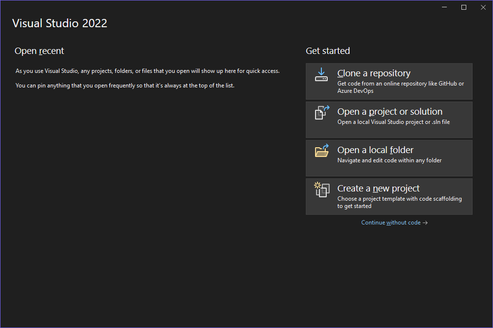
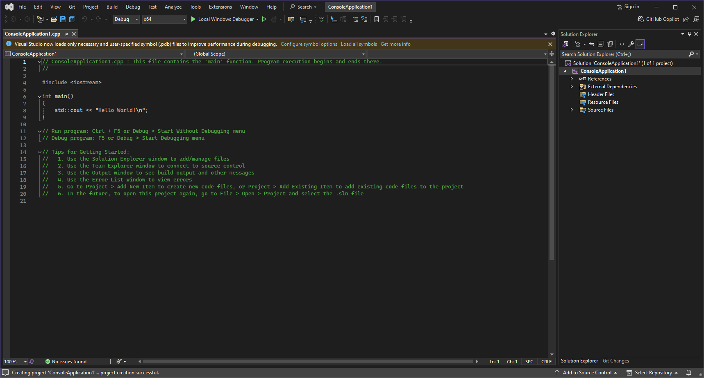
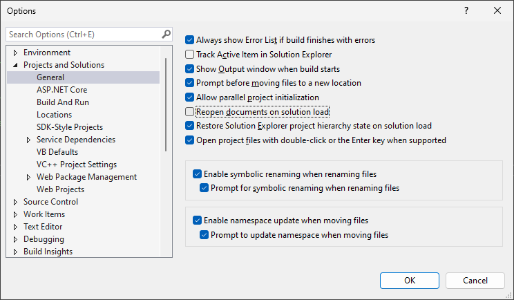

**Autor**: Ștefan-Iulian Alecu

Bine ai venit!

Înainte de a ne îmbarca în această aventură, trebuie să fim pregătiți de drum.
Programarea se face cu degetul pe tastatura, nu prin citit cod, așadar o să
înveți cum să îți configurezi un editor/IDE.

Există două tipuri de editoare folosite pentru a scrie cod (nu doar în C++):

<div class="grid cards" markdown>

- :octicons-file-code-24:{ .lg .middle } **Editoare de text**

    ---

    Un editor de text este un program simplu folosit pentru scrierea și editarea
    codului sursă C++. Exemple de astfel de editoare includ Vim, Emacs,
    Notepad++, Geany, Kate, Sublime Text, și Visual Studio Code, printre altele.
    Acestea sunt ideale pentru editarea de fișiere de cod C++ simple, oferind
    funcționalități de bază precum evidențierea sintaxei și completarea
    automată.

    Editoarele de text consumă mai puțină memorie decât un IDE, însă trebuie să
    fie configurate pentru a putea suporta C++ la un nivel satisfăcător.

- :octicons-device-desktop-24:{ .lg .middle } **IDE**

    ---

    Un mediu de dezvoltare integrat (IDE) pentru C++ este un software complex
    care oferă dezvoltatorilor un set complet de instrumente pentru scrierea,
    compilarea, testarea și depanarea codului C++. Exemple de IDE-uri pentru C++
    includ Visual Studio, Xcode, Dev-C++, NetBeans, și Code::Blocks. Acestea
    includ funcționalități avansate precum depanare interactivă, integrare cu
    sisteme de control al versiunilor, instrumente de profilare și optimizare a
    codului, și multe alte instrumente care facilitează dezvoltarea de aplicații
    complexe în C++.

    Pe scurt, un IDE este un editor de text mult mai puternic și cu mai multe
    facilități pentru a dezvolta cod C++. Din această pricină, ele consumă mai
    multă memorie și mai mult spațiu, însă oferă toate uneltele necesare.

</div>

Prima dată, ce sistem de operare folosești?

<div class="grid cards" markdown>

- :material-microsoft-windows:{ .lg .middle } **Windows**

    ---

    Dacă folosești Windows 10 sau 11, atunci aceasta este secțiunea ta.

    [:octicons-arrow-right-24: Vezi instrucțiuni](#windows)

<!-- macOS -->

<!-- Linux -->

<!-- BSD -->

</div>

## Windows

Înainte de a instala un editor/IDE, avem nevoie de un compilator. Există
următoarele opțiuni:

<div class="grid cards" markdown>

- :material-microsoft-windows:{ .lg .middle } **MSVC**

    ---

    MSVC (Microsoft Visual C++) este un compilator proprietar făcut de Microsoft
    și este parte din IDE-ul Visual Studio.

    [:octicons-arrow-right-24: Vezi instrucțiuni pentru Visual Studio](#visual-studio-2022)

- :material-sheep:{ .lg .middle } **GCC (MinGW)**

    ---

    GCC (GNU Compiler Collection) este o suită de compilatoare libere și
    gratuite creat de către Proiectul GNU și FSF (Free Software Foundation). Cel
    mai folosit compilator din această suită este GCC (GNU C Compiler) și G++
    (GNU C++ Compiler).

    Pe Windows, cea mai ușoară metodă de a instala compilatorul GCC este
    folosind MinGW-w64.

    [:octicons-arrow-right-24: Vezi instrucțiuni pentru MinGW](#gcc-mingw-w64)

</div>

<h3 id="gcc-mingw-w64">Compilatorul GCC (MinGW-64)</h3>

[Proiectul MinGW-w64](https://www.mingw-w64.org/) este continuarea proiectului
MinGW (Minimalist GNU for Windows), făcut ca să suporte compilatorul GCC pe
Windows, cu suport pentru 64 de biți (ceea ce este cel mai probabil ce folosești
acum). Acest compilator poate fi folosit inclusiv pe Linux pentru a compila
binare pentru Windows.

Pentru a instala MinGW-w64, avem următorii pași:

1. Deschide pagina <https://winlibs.com/>. Această pagină oferă binare
   executabile pre-compilate pentru GCC și optimizate pentru a crea executabile
   native pe Windows.

    [Deschide pagina :material-open-in-new:](https://winlibs.com/){ .md-button .md-button--primary }

2. Dă scroll până când o să vezi versiunile de GCC. Alegem varianta cu UCRT
   (Universal C Runtime) pentru că este făcută de la zero pentru Windows 10 și
   11 și este gândită să aibă suport mai bun pentru standardul de C și C++.

3. Dintre lista de opțiuni pe care o ai pentru UCRT runtime, ne interesează
   ultima versiune (la data scrierii, versiunea este GCC 14.1.0).

4. Selectează din prima opțiune (cea care scrie POSIX threads) fie Win64 (dacă
   ai un sistem pe 64 de biți, care este cam orice calculator lansat în ultimul
   deceniu și jumătate), fie Win32, în formatul tău de preferință (7-Zip are
   nevoie de programul cu același nume, dar are executabile mai mici, în timp ce
   Zip poate fi deschis din Explorer). La data scrierii, asta este arhiva
   potrivită:

    [Descarcă GCC 14.1.0 :material-download:](https://github.com/brechtsanders/winlibs_mingw/releases/download/14.1.0posix-18.1.8-12.0.0-ucrt-r3/winlibs-x86_64-posix-seh-gcc-14.1.0-llvm-18.1.8-mingw-w64ucrt-12.0.0-r3.zip){ .md-button .md-button--primary }

    <figure markdown="span">
    { loading=lazy }
    </figure>

5. După ce s-a terminat de descărcat arhiva, deschide-o și extrage directorul
`mingw64` într-un loc ușor accesibil (de preferință în `C:\`). Ține minte
această locație! O să mă refer la această locație în text ca `$MINGW` (de pildă,
dacă ai dezarhivat în `C:\`, atunci `$MINGW = C:\mingw64`). O să ia ceva timp să
se dezarhiveze tot, deoarece are peste 1GB. Indiferent unde s-a dezarhivat,
conținutul directorului `$MINGW` ar trebui să arate astfel:

    <figure markdown="span">

    { loading=lazy }

    { loading=lazy }

    </figure>

6. Acum avem un compilator de C++ în sistem. Pentru a-l face disponibil global,
   trebuie să adăugăm în calea sistemului ca să poată recunoaște executabilele.
   Pentru acest lucru:

    1. Apasă ++win+r++ și scrie `sysdm.cpl` și apasă OK. Dacă totul a fost cu
       succes, o să vezi o fereastră de genul:

       <figure markdown="span">
       { loading=lazy }
       </figure>
    2. Navighează către tab-ul Complex și apasă pe ultimul buton (Environment
       variables sau Variabile de mediu):

       <figure markdown="span">
       { loading=lazy }
       </figure>
    3. Apasă dublu clic pe variabila `Path` de la secțiunea cu variabile de
       utilizator (partea de sus).

       { loading=lazy; width="49%" }
       { loading=lazy; width="49%" }

    4. Apasă pe "Navigare..." (atenție, fără să ai vreo cale selectată deja,
       apasă oriunde într-un spațiu gol din listă) și caută calea `$MINGW\bin`
       (unde `$MINGW` e locul unde ai instalat MinGW). În cazul meu, calea va fi
       `C:\mingw64\bin`. Dacă totul a decurs cum trebuie, ar trebui să fie o
       cale în plus în listă:

        <figure markdown="span">
        { loading=lazy }
        </figure>
    5. Apasă OK până când se închid toate ferestrele.

7. Pentru a face sistemul să recunoască noile noastre executabile,
   deconectează-te și conectează-te înapoi la utilizatorul curent. Felicitări!

Acum că avem un compilator, ce fel de editor dorești?

<div class="grid cards" markdown>

- :octicons-file-code-24:{ .lg .middle } **Vreau un editor de text**

    ---

    [:octicons-arrow-right-24: Vezi opțiunile](#optiuni-editoare-windows)

- :octicons-device-desktop-24:{ .lg .middle } **Vreau un IDE**

    ---

    [:octicons-arrow-right-24: Vezi opțiunile](#optiuni-ide-windows)

</div>

<h3 id="optiuni-editoare-windows">Opțiuni pentru editoare de text</h3>

La capitolul editoare de text, există multe opțiuni. Totuși, dorim următoarele
calități de la un editor de text pentru C++:

- Syntax highlighting (evidențierea sintaxei), pentru a putea distinge ușor
  cuvintele cheie și a putea citi codul mai ușor;
- Completare automată (și sugestii) pentru a putea completa rapid și
  eficient codul;
- Indentare automată (și formatare), pentru a păstra un stil
  consistent;
- Funcții de căutare și înlocuire;
- Numărarea liniilor și coloanelor;
- Suport pentru extensii;
- Să fie ușor de folosit și să consume puține resurse.

Următoarele editoare îndeplinesc criteriile de mai sus:

<div class="grid cards" markdown>

- **Visual Studio Code**

    ---

    Visual Studio Code este un editor de cod gratuit și open-source, dezvoltat
    de Microsoft. Este extrem de popular datorită integrării sale cu multe
    instrumente de dezvoltare și suportului pentru extensii, oferind o
    experiență de codare puternică și flexibilă.

    [:octicons-arrow-right-24: Instalare și configurare](#visual-studio-code)

- **Sublime Text 4**

    ---

    Sublime Text 4 este un editor de text rapid și versatil, cunoscut pentru
    interfața sa curată și performanța excelentă. Este ideal pentru dezvoltatori
    datorită funcțiilor avansate precum evidențierea sintaxei și completarea
    automată, alături de un sistem robust de plugin-uri.

     [:octicons-arrow-right-24: Instalare și configurare](#sublime-text-4)

- **Notepad++**

    ---

    Notepad++ este un editor de text gratuit și open-source, renumit pentru
    viteza și ușurința sa de utilizare. Oferă evidențierea sintaxei pentru o
    gamă largă de limbaje de programare și suport pentru plugin-uri, fiind o
    alegere excelentă pentru dezvoltatorii care au nevoie de un editor eficient
    și ușor de folosit.

     [:octicons-arrow-right-24: Instalare și configurare](#notepad)

</div>

!!! note "Notă"

    În afară de aceste editoare, mai există și altele, precum Netbeans și eternele
    Vim/Neovim și Emacs. Deși autorul le folosește pe ultimele două (Emacs
    îndeosebi), procesul de a le configura este mai anevoios și nu sunt cele mai
    bune pe Windows și sunt în afara scopului acestui articol introductiv. De
    asemenea, există Kate și Geany, ambele cu suport bun pentru C++ și alternative
    solide pentru Notepad++, pe care autorul le recomandă.

<h3 id="optiuni-ide-windows">Opțiuni pentru IDE</h3>

La capitolul IDE-uri, nu avem așa de multe opțiuni, pentru că un IDE este
fundamental mai complex. Totuși, cele mai bune opțiuni sunt:

<div class="grid cards" markdown>

- **Visual Studio**

    ---

    Visual Studio este un mediu de dezvoltare integrat (IDE) puternic și
    extensibil, dezvoltat de Microsoft. Acesta suportă o gamă largă de limbaje
    de programare și tehnologii, fiind folosit pe scară largă pentru dezvoltarea
    aplicațiilor desktop, web și mobile. Printre caracteristicile sale se numără
    un editor de cod avansat, debuger integrat, suport pentru controlul
    versiunilor și multe altele. Rulează doar pe Windows.

    [:octicons-arrow-right-24: Instalare și configurare](#visual-studio-2022)

- **Code::Blocks**

    ---

    Code::Blocks este un IDE gratuit și open-source, dedicat dezvoltării de
    aplicații în limbajul C și C++. Este cunoscut pentru flexibilitatea sa,
    fiind extensibil prin plugin-uri și suportând diverse compilatoare.
    Interfața sa prietenoasă și ușurința de utilizare îl fac o alegere populară
    printre programatorii C/C++. În plus, acesta este editorul implicit pentru
    olimpiadă. Rulează pe Windows, macOS, Linux, FreeBSD și OpenBSD.

    [:octicons-arrow-right-24: Instalare și configurare](#codeblocks)

- **Qt Creator**

    ---

    Qt Creator este un IDE cross-platform dezvoltat de Qt Company, perfect
    pentru dezvoltarea în C++. Acesta oferă integrare completă cu Qt Framework,
    un designer vizual pentru interfețe grafice și suport pentru sistemele de
    build CMake și QMake. Qt Creator vine cu instrumente avansate de navigare și
    refactorizare a codului, un debugger integrat și instrumente de profilare
    pentru identificarea și rezolvarea problemelor de performanță. De asemenea,
    este foarte flexibil și poate fi extins prin plugin-uri, făcându-l potrivit
    pentru diverse nevoi ale dezvoltatorilor. Rulează pe Windows, macOS, Linux,
    FreeBSD, OpenBSD și NetBSD.

    [:octicons-arrow-right-24: Instalare și configurare](#qt-creator)

- **CLion**

    ---

    CLion este un IDE dezvoltat de JetBrains, specializat în dezvoltarea de
    aplicații în C și C++. Acesta oferă o gamă largă de funcționalități
    avansate, cum ar fi refactorizarea codului, navigarea inteligentă și
    suportul pentru CMake. CLion include un debugger integrat și instrumente de
    analiză a codului care ajută la menținerea unui cod curat și eficient. Este
    apreciat pentru productivitatea pe care o oferă dezvoltatorilor, datorită
    instrumentelor sale avansate și integrării cu diverse sisteme de control al
    versiunilor. Rulează pe Windows, macOS și Linux.

    [:octicons-arrow-right-24: Instalare și configurare](#clion)

</div>

!!! warning "Atenție"

    CLion, spre deosebire de celelalte opțiuni, nu este gratis. Totuși, dacă
    ești eligibil, poți avea un cont de student ceea ce îți oferă acces la
    CLion, precum și la alte produse marca JetBrains.

## Editoare și IDE-uri

### Editoare de text

#### Visual Studio Code

#### Notepad++

#### Sublime Text 4

<!-- #### BBEdit -->

<!-- Add more... or maybe...? -->

### IDE-uri

#### Visual Studio 2022

Pentru a instala:

1. Descarcă executabilul de setup de aici (Visual Studio 2022 Community, este
   varianta gratuită și arhisuficientă pentru nevoile tale):

    [Descarcă Visual Studio 2022 Community :material-download:](https://c2rsetup.officeapps.live.com/c2r/downloadVS.aspx?sku=community&channel=Release&version=VS2022&source=VSLandingPage){ .md-button .md-button--primary }

2. Rulează executabilul. La prima fereastră cu titlul Visual Studio Installer,
   apasă pe butonul Continue. După ce se descarcă installer-ul oficial, o să ai
   o fereastră similară cu asta:

    { loading=lazy }

3. Visual Studio 2022 are conceptul de _workload_. Fiecare workload este
   specializat pe un anumit domeniu sau limbaj și instalează un set anume de
   componente. Majoritatea workload-urilor sunt țintate către cei pe C#, însă pe
   noi ne interesează workload-ul **Desktop development with C++**. Așa ar
   trebui să arate fereastra ta după ce ai selectat opțiunea asta:

    <figure markdown="span">
    { loading=lazy }
    </figure>

4. Apasă butonul de install și așteaptă să se instaleze. După cum se poate vedea
   în ultima poză, este destul de mare Visual Studio. Totuși, după ce se termină
   de instalat, se deschide singur. La această fereastră, ori te poți loga cu
   contul de GitHub sau Microsoft, ori poți să dai skip, nu e necesar să ai un
   cont pentru a putea folosi Visual Studio.

    <figure markdown="span"> { loading=lazy }
    </figure>

5. La următoarea fereastră, poți să lași setările implicite sau să schimbi tema.
   Tot ce mai rămâne să faci este să apeși pe "Start Visual Studio" și să
   aștepți puțin în timp ce se configurează. Dacă tot procesul a mers cum
   trebuie, se va deschide această fereastră:

    <figure markdown="span">
    { loading=lazy }
    </figure>

Felicitări! Ai instalat Visual Studio 2022. Acum vremea să îl configurăm și
folosim.

Pentru a crea un proiect C++, facem următorii pași:

1. La fereastra de mai sus (care apare în momentul în care deschizi Visual
   Studio 2022), apasă pe "Create a new project".
2. O să fii întâmpinat de mai multe șabloane pe care le poți folosi:

    <figure markdown="span">
    { loading=lazy }
    </figure>

3. Avem două șabloane care ni-s utile:
    1. Console App, care gestionează proiectul folosind MSBuild și este specific
       Visual Studio;
    2. CMake Project, care poate rula pe mai multe platforme (oriutrimnde este
       suportat CMake, inclusiv Linux și *BSD) și nu este limitat de Visual
       Studio.

    Dacă nu ai nevoie să editezi proiectul și cu alte editoare/IDE-uri sau pe
    alte platforme, Console App este suficient, așa că asta vom folosi și noi
    acum. Dă dublu click pe Console App (sau selectează-l, apoi apasă Next).

4. Ajungem la această fereastră:

    <figure markdown="span">
    { loading=lazy }
    </figure>

    În primul rând, avem numele proiectului.

    !!! tip "Sfat"

        Fă numele proiectului sugestiv, chiar numele problemei la care lucrezi
        acum, pentru că nu este prea drăguț să umpli printr-o mare de proiecte
        care încep cu ConsoleApplication.

    Apoi avem locația acestuia. Calea implicită este `$USER\source\repos`, dar
    poți să-l pui undeva separat (recomand acest lucru). După locație avem
    numele soluției. O soluție este un container pentru unul sau mai multe
    proiecte. Poți selecta și dacă vrei să fie soluția și proiectul în același
    director (caz în care numele proiectului este același cu cel al soluției).

    !!! warning "Atenție"

        Nu există soluții dacă alegi șablonul cu CMake. Există moduri prin
        care poți emula acest lucru, dar cea mai simplă cale (fără integrarea
        de care ai parte cu Console App) este să pui în directoare separate
        (de fapt, asta face și o soluție).

    !!! tip "Sfat"

        Nu este obligatoriu, însă dacă lucrezi de pe un site (e.g. Kilonova)
        sau faci probleme de la un concurs, recomand să le grupezi într-o
        soluție. Zece soluții sunt mult mai ușor de gestionat decât 40 de
        proiecte, dacă este nevoie să cauți pe viitor rezolvările la o
        problemă.

    De dragul exemplului, voi numi proiectul "ConsoleApplication1" sub locația
    implicită și pun proiectul în același loc cu soluția. Dacă totul a mers cum
    trebuie, vei vedea o fereastră similară cu asta:

    <figure markdown="span">
    { loading=lazy }
    </figure>

Poți acum să apeși ++ctrl+f5++ (Start without Debugging) și vei vedea că rulează
programul și afișează Hello World. Asta înseamnă și că ai compilatorul MSVC
funcțional.

!!! tip "Sfat"

    Obișnuiește-te cu această scurtătură (++ctrl+f5++), o să o folosești
    _foarte des_. În timp, uită-te prin meniuri și învață niște scurtături
    comune pentru acțiunile pe care le faci cele mai des, așa vei deveni
    mai rapid și mai fluid la a folosi Visual Studio. [Vezi această
    pagină](https://visualstudio.microsoft.com/keyboard-shortcuts.pdf)
    care este cheatsheet de la Microsoft cu cele mai comune scurtături
    specifice VS. Scurtăturile generale gen ++ctrl+c++, ++ctrl+v++,
    ++ctrl+s++ etc. le poți găsi și din VS și sunt în mare parte general
    valabile.

Acum, timpul pentru niște chestii pe care le poți face ca să îmbunătățești
performanța (VS este un program mare și ia multă
memorie, deci poate fi uneori încet):

1. Visual Studio deschide automat fișierele care au fost deschise în vechea
   sesiune. Din această pricină, o soluție poate lua mai mult să se deschidă,
   pentru că toate fișierele sunt analizate în paralel. Pentru a dezactiva acest
   comportament:

    1. Apasă în meniu pe Tools, apoi Options (ultima din dropdown, cea cu o
       rotiță zimțată);
    2. Du-te la Projects and Solutions, apoi la General și dezactivează "Reopen
       documents on solution load". În final, ar trebui să arate similar cu
       asta:

        <figure markdown="span">
        { loading=lazy }
        </figure>

    În schimb, putem să ne folosim de ce se află la Edit > Go To. Aici se află
    toate opțiunile:

    <figure markdown="span">
    { loading=lazy }
    </figure>

    Cea mai importantă din ele este ++ctrl+t++ care funcționează ca un Go To
    generalizat. Pentru fișiere recente avem ++ctrl+1++, ++ctrl+r++, și pentru
    fișiere în general avem ++ctrl+shift+t++. Ocazional folosesc și ++ctrl+1++,
    ++ctrl+s++ ca să caut un simbol (o funcție, o variabilă etc.), ceea ce se
    poate dovedi util la fișiere mari.

2. Dacă instalezi extensii, acestea sunt activate când este nevoie. Problema la
   această abordare este că dacă ai una sau mai multe extensii care rulează
   imediat la pornire, atunci programul se va încetini. Poți folosi Help >
   Visual Studio Performance Manager pentru a inspecta de ce VS este încet.
3. Visual Studio își ajustează efectele bazat pe performanța clientului, însă
   acest lucru de cele mai multe ori încetinește tot. Pentru a rezolva acest
   lucru, mergem la Tools > Options și apoi la Environment > General. Opțiunea
   pe care vrem să o dezactivăm se cheamă "Automatically adjust visual
   experience based on client performance", împreună cu "Enable rich client
   visual experience". Ultima opțiune, cea cu accelerarea hardware, trebuie să
   rămână activă, pentru a nu randa software Visual Studio (excepție fiind dacă
   ai un calculator cu o placă video _foarte_ slabă sau dacă ești pe mașină
   virtuală). După ce ai terminat, fereastra trebuie să fie similară cu asta:

    <figure markdown="span">
    { loading=lazy }
    </figure>

4. Windows Defender rulează constant în fundal pentru a ne proteja de viruși.
   Totuși, asta impactează negativ performanța pentru că scanează toate
   directoarele din sistem, inclusiv cele ale lui Visual Studio și cele ale
   proiectelor noastre. Pentru acest lucru, trebuie să facem excepții. Am creat
   un script de PowerShell care să automatizeze acest proces. Acesta poate fi
   descărcat de aici:

    [Descarcă script :material-download:](./codes/ImproveVS2022.ps1){ .md-button .md-button--primary }

    <details><summary>Scriptul complet (salvat în ImproveVS2022.ps1)</summary>
    ```powershell
    if (-not ([Security.Principal.WindowsPrincipal] [Security.Principal.WindowsIdentity]::GetCurrent()).IsInRole([Security.Principal.WindowsBuiltInRole] "Administrator"))
    {
        Write-Host "Ruleaza acest script ca Administrator." -ForegroundColor Red
        exit
    }

    $userPath = $env:USERPROFILE
    $appdataLocal = "$userPath\AppData\Local"
    $appdataRoaming = "$userPath\AppData\Roaming"
    $programData = "C:\ProgramData"
    $programFiles = "C:\Program Files"
    $programFilesX86 = "$programFiles (x86)"

    $pathExclusions = @(
        'C:\Windows\Microsoft.NET',
        'C:\Windows\assembly',
        "$userPath\.dotnet",
        "$userPath\.librarymanager",
        "$appdataLocal\Microsoft\VisualStudio",
        "$appdataLocal\Microsoft\VisualStudio Services",
        "$appdataLocal\GitCredentialManager",
        "$appdataLocal\GitHubVisualStudio",
        "$appdataLocal\Microsoft\dotnet",
        "$appdataLocal\Microsoft\VSApplicationInsights",
        "$appdataLocal\Microsoft\VSCommon",
        "$appdataLocal\Temp\VSFeedbackIntelliCodeLogs",
        "$appdataRoaming\Microsoft\VisualStudio",
        "$appdataRoaming\NuGet",
        "$appdataRoaming\Visual Studio Setup",
        "$appdataRoaming\vstelemetry",
        "$programData\Microsoft\VisualStudio",
        "$programData\Microsoft\NetFramework",
        "$programData\Microsoft Visual Studio",
        "$programFiles\Microsoft Visual Studio",
        "$programFiles\dotnet",
        "$programFiles\Microsoft SDKs",
        "$programFiles\Microsoft SQL Server",
        "$programFiles\IIS",
        "$programFiles\IIS Express",
        "$programFilesX86\Microsoft Visual Studio",
        "$programFilesX86\dotnet",
        "$programFilesX86\Microsoft SDKs",
        "$programFilesX86\Microsoft SQL Server",
        "$programFilesX86\IIS",
        "$programFilesX86\IIS Express"
    )

    $processExclusions = @(
        'ServiceHub.SettingsHost.exe',
        'ServiceHub.IdentityHost.exe',
        'ServiceHub.VSDetouredHost.exe',
        'ServiceHub.Host.CLR.x86.exe',
        'Microsoft.ServiceHub.Controller.exe',
        'PerfWatson2.exe',
        'sqlwriter.exe'
    )

    Write-Host "Acest script va crea excluderi pentru Windows Defender pentru folderele și procesele comune ale Visual Studio 2022."
    Write-Host ""
    $projectsFolder = Read-Host "Care este calea către folderul proiectelor tale? (exemplu: $userPath\source\repos)"

    if (-not (Test-Path $projectsFolder))
    {
        Write-Host "Calea specificată pentru folderul proiectelor nu există. Ieșire din script." -ForegroundColor Red
        exit
    }

    Write-Host ""
    Write-Host "Adăugare excludere cale: $projectsFolder"
    Add-MpPreference -ExclusionPath $projectsFolder

    foreach ($exclusion in $pathExclusions)
    {
        Write-Host "Adăugare excludere cale: $exclusion"
        try
        {
            Add-MpPreference -ExclusionPath $exclusion
        }
        catch
        {
            Write-Host "Nu s-a reușit adăugarea excluderii pentru calea: $exclusion - $_" -ForegroundColor Yellow
        }
    }

    foreach ($exclusion in $processExclusions)
    {
        Write-Host "Adăugare excludere proces: $exclusion"
        try
        {
            Add-MpPreference -ExclusionProcess $exclusion
        }
        catch
        {
            Write-Host "Nu s-a reușit adăugarea excluderii pentru procesul: $exclusion - $_" -ForegroundColor Yellow
        }
    }

    Write-Host ""
    Write-Host "Excluderile tale:"
    $prefs = Get-MpPreference

    Write-Host "Căile excluse:"
    $prefs.ExclusionPath
    Write-Host ""

    Write-Host "Procesele excluse:"
    $prefs.ExclusionProcess

    ```
    </details>

    Pentru a-l folosi, trebuie făcuți următorii pași (presupun că ai descărcat
    scriptul în `C:\Users\<nume>\Downloads` (adică în folderul de Descărcări)):

    1. Deschide o fereastră de PowerShell ca administrator. Pentru a face acest
       lucru, fie poți apăsa incantația ++win+x++, ++a++ și apoi ++enter++, fie
       poți să cauți Windows Powershell (sau doar Terminal, dacă ești pe Windows
       11) în meniu, apoi selectezi Executare ca administrator.

    2. Navighează până la calea unde ai descărcat cu `cd C:\Users\<cale>`. În
       cazul meu, va fi `cd C:\Users\RoAlgo\Downloads`.

    3. Scrie `.\ImproveVS2022.ps1` (presupunând că așa ai numit fișierul).

    4. Trebuie doar să furnizezi calea unde îți stochezi proiectele de obicei.
       Dacă ești cu setările implicite, atunci poți scrie exact ce îți zice
       exemplul (adică `C:\Users\<nume>\source\repos`). Dacă nu există calea,
       atunci programul iese.

    5. Apeși ++enter++ și aștepți să își facă treabă (termină repede).

Asta este tot cu configurarea. Poți acum să mergi către următorul articol:

[Mergi la introducere](./intro.md){ .md-button }

#### Xcode

#### Code::Blocks

#### Qt Creator

#### CLion
