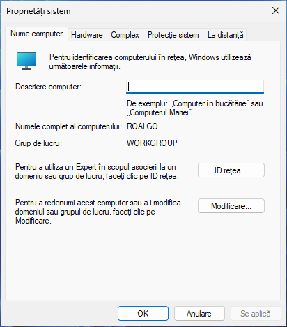
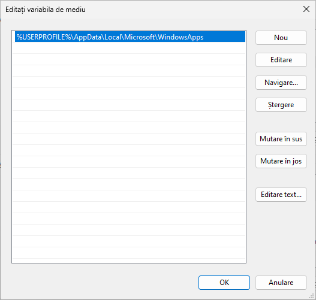

**Autor**: Ștefan-Iulian Alecu

Bine ai venit!

Înainte de a ne îmbarca în această aventură, trebuie să fim pregătiți de drum.
Programarea se face cu degetul pe tastatura, nu prin citit cod, așadar o să
înveți cum să îți configurezi un editor/IDE.

Există două tipuri de editoare folosite pentru a scrie cod (nu doar în C++):

- :octicons-file-code-24:{ .lg .middle } **Editoare de text**

    ---

    Un editor de text este un program simplu folosit pentru scrierea și editarea
    codului sursă C++. Exemple de astfel de editoare includ Vim, Emacs,
    Notepad++, Geany, Kate, Sublime Text, și Visual Studio Code, printre altele.
    Acestea sunt ideale pentru editarea de fișiere de cod C++ simple, oferind
    funcționalități de bază precum evidențierea sintaxei și completarea
    automată.

    Editoarele de text consumă mai puțină memorie decât un IDE, însă trebuie să
    fie configurate pentru a putea suporta C++ la un nivel satisfăcător.

- :octicons-device-desktop-24:{ .lg .middle } **IDE**

    ---

    Un mediu de dezvoltare integrat (IDE) pentru C++ este un software complex
    care oferă dezvoltatorilor un set complet de instrumente pentru scrierea,
    compilarea, testarea și depanarea codului C++. Exemple de IDE-uri pentru C++
    includ Visual Studio, Xcode, Dev-C++, NetBeans, și Code::Blocks. Acestea
    includ funcționalități avansate precum depanare interactivă, integrare cu
    sisteme de control al versiunilor, instrumente de profilare și optimizare a
    codului, și multe alte instrumente care facilitează dezvoltarea de aplicații
    complexe în C++.

    Pe scurt, un IDE este un editor de text mult mai puternic și cu mai multe
    facilități pentru a dezvolta cod C++. Din această pricină, ele consumă mai
    multă memorie și mai mult spațiu, însă oferă toate uneltele necesare.

Prima dată, ce sistem de operare folosești?

- :material-microsoft-windows:{ .lg .middle } **Windows**

    ---

    Dacă folosești Windows 10 sau 11, atunci aceasta este secțiunea ta.

    [:octicons-arrow-right-24: Vezi instrucțiuni](#windows)

<!-- macOS -->

<!-- Linux -->

<!-- BSD -->

## Windows

Înainte de a instala un editor/IDE, avem nevoie de un compilator. Există
următoarele opțiuni:

- :material-microsoft-windows:{ .lg .middle } **MSVC**

    ---

    MSVC (Microsoft Visual C++) este un compilator proprietar făcut de Microsoft
    și este parte din IDE-ul Visual Studio.

    [:octicons-arrow-right-24: Vezi instrucțiuni pentru Visual Studio](#)

- :material-sheep:{ .lg .middle } **GCC (MinGW)**

    ---

    GCC (GNU Compiler Collection) este o suită de compilatoare libere și
    gratuite creat de către Proiectul GNU și FSF (Free Software Foundation). Cel
    mai folosit compilator din această suită este GCC (GNU C Compiler) și G++
    (GNU C++ Compiler).

    Pe Windows, cea mai ușoară metodă de a instala compilatorul GCC este
    folosind MinGW-w64.

    [:octicons-arrow-right-24: Vezi instrucțiuni pentru MinGW](#gcc-mingw-w64)

<h3 id="gcc-mingw-w64">Compilatorul GCC (MinGW-64)</h3>

[Proiectul MinGW-w64](https://www.mingw-w64.org/) este continuarea proiectului
MinGW (Minimalist GNU for Windows), făcut ca să suporte compilatorul GCC pe
Windows, cu suport pentru 64 de biți (ceea ce este cel mai probabil ce folosești
acum). Acest compilator poate fi folosit inclusiv pe Linux pentru a compila
binare pentru Windows.

Pentru a instala MinGW-w64, avem următorii pași:

1. Deschide pagina <https://winlibs.com/>. Această pagină oferă binare
   executabile pre-compilate pentru GCC și optimizate pentru a crea executabile
   native pe Windows.

    [Deschide pagina :material-open-in-new:](https://winlibs.com/){ .md-button .md-button--primary }

2. Dă scroll până când o să vezi versiunile de GCC. Alegem varianta cu UCRT
   (Universal C Runtime) pentru că este făcută de la zero pentru Windows 10 și
   11 și este gândită să aibă suport mai bun pentru standardul de C și C++.

3. Dintre lista de opțiuni pe care o ai pentru UCRT runtime, ne interesează
   ultima versiune (la data scrierii, versiunea este GCC 14.1.0).

4. Selectează din prima opțiune (cea care scrie POSIX threads) fie Win64 (dacă
   ai un sistem pe 64 de biți, care este cam orice calculator lansat în ultimul
   deceniu și jumătate), fie Win32, în formatul tău de preferință (7-Zip are
   nevoie de programul cu același nume, dar are executabile mai mici, în timp ce
   Zip poate fi deschis din Explorer). La data scrierii, asta este arhiva
   potrivită:

    [Descarcă GCC 14.1.0 :material-download:](https://github.com/brechtsanders/winlibs_mingw/releases/download/14.1.0posix-18.1.8-12.0.0-ucrt-r3/winlibs-x86_64-posix-seh-gcc-14.1.0-llvm-18.1.8-mingw-w64ucrt-12.0.0-r3.zip){ .md-button .md-button--primary }

    <figure markdown="span">
    { loading=lazy }
    </figure>

5. După ce s-a terminat de descărcat arhiva, deschide-o și extrage directorul
`mingw64` într-un loc ușor accesibil (de preferință în `C:\`). Ține minte
această locație! O să mă refer la această locație în text ca `$MINGW` (de pildă,
dacă ai dezarhivat în `C:\`, atunci `$MINGW = C:\mingw64`). O să ia ceva timp să
se dezarhiveze tot, deoarece are peste 1GB. Indiferent unde s-a dezarhivat,
conținutul directorului `$MINGW` ar trebui să arate astfel:

    <figure markdown="span">

    { loading=lazy }

    { loading=lazy }

    </figure>

6. Acum avem un compilator de C++ în sistem. Pentru a-l face disponibil global,
   trebuie să adăugăm în calea sistemului ca să poată recunoaște executabilele.
   Pentru acest lucru:

    1. Apasă ++win+r++ și scrie `sysdm.cpl` și apasă OK. Dacă totul a fost cu
       succes, o să vezi o fereastră de genul:

       <figure markdown="span">
       { loading=lazy }
       </figure>
    2. Navighează către tab-ul Complex și apasă pe ultimul buton (Environment
       variables sau Variabile de mediu):

       <figure markdown="span">
       { loading=lazy }
       </figure>
    3. Apasă dublu clic pe variabila `Path` de la secțiunea cu variabile de
       utilizator (partea de sus).

       { loading=lazy; width="49%" }
       { loading=lazy; width="49%" }

    4. Apasă pe "Navigare..." (atenție, fără să ai vreo cale selectată deja,
       apasă oriunde într-un spațiu gol din listă) și caută calea `$MINGW\bin`
       (unde `$MINGW` e locul unde ai instalat MinGW). În cazul meu, calea va fi
       `C:\mingw64\bin`. Dacă totul a decurs cum trebuie, ar trebui să fie o
       cale în plus în listă:

        <figure markdown="span">
        { loading=lazy }
        </figure>
    5. Apasă OK până când se închid toate ferestrele.

7. Pentru a face sistemul să recunoască noile noastre executabile,
   deconectează-te și conectează-te înapoi la utilizatorul curent. Felicitări!

Acum că avem un compilator, ce fel de editor dorești?

- :octicons-file-code-24:{ .lg .middle } **Vreau un editor de text**

    ---

    [:octicons-arrow-right-24: Vezi opțiunile](#optiuni-editoare-windows)

- :octicons-device-desktop-24:{ .lg .middle } **Vreau un IDE**

    ---

    [:octicons-arrow-right-24: Vezi opțiunile](#optiuni-ide-windows)

<h3 id="optiuni-editoare-windows">Opțiuni pentru editoare de text</h3>

La capitolul editoare de text, există multe opțiuni. Totuși, dorim următoarele
calități de la un editor de text pentru C++:

- Syntax highlighting (evidențierea sintaxei), pentru a putea distinge ușor
  cuvintele cheie și a putea citi codul mai ușor;
- Completare automată (și sugestii) pentru a putea completa rapid și
  eficient codul;
- Indentare automată (și formatare), pentru a păstra un stil
  consistent;
- Funcții de căutare și înlocuire;
- Numărarea liniilor și coloanelor;
- Suport pentru extensii;
- Să fie ușor de folosit și să consume puține resurse.

Următoarele editoare îndeplinesc criteriile de mai sus:

- **Visual Studio Code**

    ---

    Visual Studio Code este un editor de cod gratuit și open-source, dezvoltat
    de Microsoft. Este extrem de popular datorită integrării sale cu multe
    instrumente de dezvoltare și suportului pentru extensii, oferind o
    experiență de codare puternică și flexibilă.

    [:octicons-arrow-right-24: Instalare și configurare](#)

- **Sublime Text 4**

    ---

    Sublime Text 4 este un editor de text rapid și versatil, cunoscut pentru
    interfața sa curată și performanța excelentă. Este ideal pentru dezvoltatori
    datorită funcțiilor avansate precum evidențierea sintaxei și completarea
    automată, alături de un sistem robust de plugin-uri.

     [:octicons-arrow-right-24: Instalare și configurare](#)

- **Notepad++**

    ---

    Notepad++ este un editor de text gratuit și open-source, renumit pentru
    viteza și ușurința sa de utilizare. Oferă evidențierea sintaxei pentru o
    gamă largă de limbaje de programare și suport pentru plugin-uri, fiind o
    alegere excelentă pentru dezvoltatorii care au nevoie de un editor eficient
    și ușor de folosit.

     [:octicons-arrow-right-24: Instalare și configurare](#)

!!! note "Notă"

    În afară de aceste editoare, mai există și altele, precum Netbeans și eternele
    Vim/Neovim și Emacs. Deși autorul le folosește pe ultimele două (Emacs
    îndeosebi), procesul de a le configura este mai anevoios și nu sunt cele mai
    bune pe Windows și sunt în afara scopului acestui articol introductiv. De
    asemenea, există Kate și Geany, ambele cu suport bun pentru C++ și alternative
    solide pentru Notepad++, pe care autorul le recomandă.

<h3 id="optiuni-ide-windows">Opțiuni pentru IDE</h3>

La capitolul IDE-uri, nu avem așa de multe opțiuni, pentru că un IDE este
fundamental mai complex. Totuși, cele mai bune opțiuni sunt:

- **Visual Studio**

    ---

    Visual Studio este un mediu de dezvoltare integrat (IDE) puternic și
    extensibil, dezvoltat de Microsoft. Acesta suportă o gamă largă de limbaje
    de programare și tehnologii, fiind folosit pe scară largă pentru dezvoltarea
    aplicațiilor desktop, web și mobile. Printre caracteristicile sale se numără
    un editor de cod avansat, debuger integrat, suport pentru controlul
    versiunilor și multe altele. Rulează doar pe Windows.

    [:octicons-arrow-right-24: Instalare și configurare](#)

- **Code::Blocks**

    ---

    Code::Blocks este un IDE gratuit și open-source, dedicat dezvoltării de
    aplicații în limbajul C și C++. Este cunoscut pentru flexibilitatea sa,
    fiind extensibil prin plugin-uri și suportând diverse compilatoare.
    Interfața sa prietenoasă și ușurința de utilizare îl fac o alegere populară
    printre programatorii C/C++. În plus, acesta este editorul implicit pentru
    olimpiadă. Rulează pe Windows, macOS, Linux, FreeBSD și OpenBSD.

    [:octicons-arrow-right-24: Instalare și configurare](#)

- **Qt Creator**

    ---

    Qt Creator este un IDE cross-platform dezvoltat de Qt Company, perfect
    pentru dezvoltarea în C++. Acesta oferă integrare completă cu Qt Framework,
    un designer vizual pentru interfețe grafice și suport pentru sistemele de
    build CMake și QMake. Qt Creator vine cu instrumente avansate de navigare și
    refactorizare a codului, un debugger integrat și instrumente de profilare
    pentru identificarea și rezolvarea problemelor de performanță. De asemenea,
    este foarte flexibil și poate fi extins prin plugin-uri, făcându-l potrivit
    pentru diverse nevoi ale dezvoltatorilor. Rulează pe Windows, macOS, Linux,
    FreeBSD, OpenBSD și NetBSD.

    [:octicons-arrow-right-24: Instalare și configurare](#)

- **CLion**

    ---

    CLion este un IDE dezvoltat de JetBrains, specializat în dezvoltarea de
    aplicații în C și C++. Acesta oferă o gamă largă de funcționalități
    avansate, cum ar fi refactorizarea codului, navigarea inteligentă și
    suportul pentru CMake. CLion include un debugger integrat și instrumente de
    analiză a codului care ajută la menținerea unui cod curat și eficient. Este
    apreciat pentru productivitatea pe care o oferă dezvoltatorilor, datorită
    instrumentelor sale avansate și integrării cu diverse sisteme de control al
    versiunilor. Rulează pe Windows, macOS și Linux.

    [:octicons-arrow-right-24: Instalare și configurare](#)

!!! warning "Atenție"

    CLion, spre deosebire de celelalte opțiuni, nu este gratis. Totuși, dacă
    ești eligibil, poți avea un cont de student ceea ce îți oferă acces la
    CLion, precum și la alte produse marca JetBrains.
