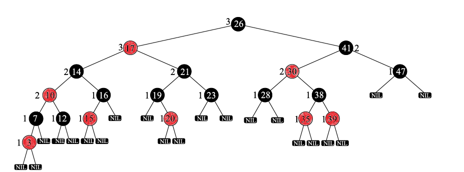
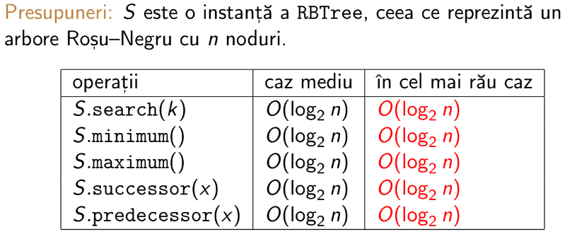
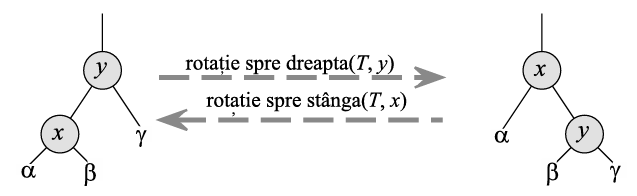
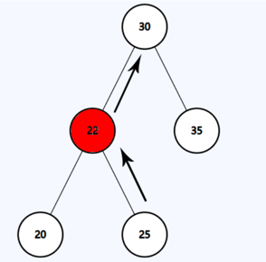
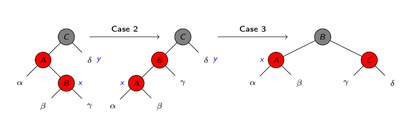
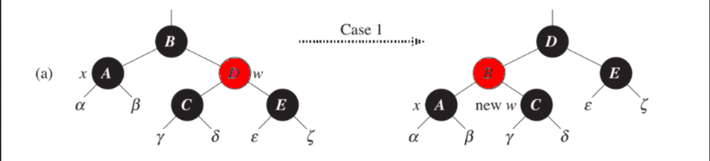
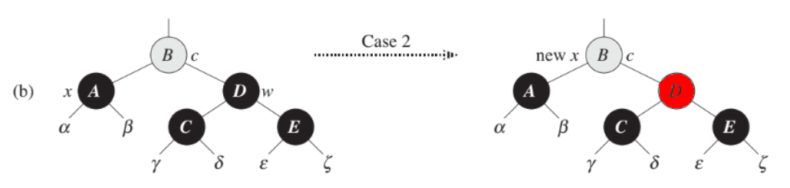
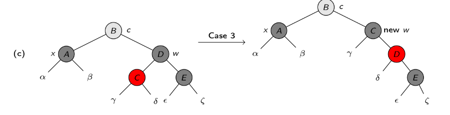
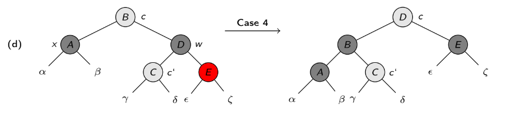

---
tags:
    - structuri de date
    - arbori
    - optimizari BST
---
**Autor**: Gaspar Andrei

**Arborii Red-Black** reprezintă o structură de date avansată, o alternativă mult mai rapidă a arborilor binari de căutare(BST) ce ne permit realizarea operațiilor de tipul **insert** și **delete** în timp logaritmic.

## Proprietăți
1) Nodurile conțin un identificator, aceea fiind culoarea (${\color{red}Red}$ sau ${\color{grey}Black}$)
2) Radăcina este tot timpul ${\color{grey}Black}$.
3) Niciun nod ce conține informație nu este frunză. Frunzele sunt reprezentate de un nod "santinelă" care este de culoare ${\color{grey}Black}$ (Nodul NIL).
4) Nu pot exista 2 noduri ${\color{red}Red}$ consecutive.
5) Fiecare cale dintre un nod și o frunză descendentă conține același număr de noduri de culoare ${\color{grey}Black}$.
6) Un Arbore Red-Black cu N noduri are înălțimea maximă $2 \cdot \log N$ .

<br>

## Reprezentare

 <br>
**Pentru o înțelegere mai bună nodul NIL apare sub fiecare nod de final însă pentru o implementare mai eficientă acesta poate fi declarat o singură dată și toate nodurile nou create, legate de acel nod.**

## Complexitatea operațiilor

 <br>
**Spre deosebire de **Binary Search Tree**, Red-Black Tree are timp constant de execuție a operațiilor si query-urilor.**

## Implementarea Node-ului și a RBTree-ului
```cpp
struct RBNode{

    int key;        // poate reține mai multe informații.
    RBNode *parent; // pointer spre părinte
    RBNode *left;   // pointer spre stânga
    RBNode *right;  // pointer spre dreapta
    enum color { RED, BLACK }; /// culoarea
    color col;

    static RBNode* Nil; // nodul NIL

    RBNode(int k, RBNode *l = Nil, RBNode *r = Nil, RBNode *p = Nil, color c = RBNode::BLACK) :
        key(k), parent(p), left(l), right(r), col(c) { }

    string toString(){ /// Metoda pentru afișare.
        ostringstream os;
        os << key << ((col == RBNode::RED) ? ":r" : ":b");
        return os.str();
    }

    ~RBNode(){ /// Destructor 
        if(this != Nil){
            if(left != Nil)
                delete left;
            if(right != Nil)
                delete right;
        }
    }
};
struct RBTree{

/// Implementare de bază cu funcții ajutătoare pentru RBTree.
    RBNode* root;

    RBTree(){ /// Constructor
        root = RBNode::Nil;
    }
    ~RBTree(){ /// Destructor
        delete root;
    }

    RBNode* createNode(int key){ /// Alocam un nou nod
        return new RBNode(key);
    }

    bool isNil(RBNode* n){ /// Verificare daca suntem într-un nod NIL.
        return (n == RBNode::Nil);
    }

/// Aici se vor implementa restul functiilor (min, max, insert, delete, succesor, etc.)

}
```

## Operații elementare
- Operațiile **insert** și **delete** pentru arborii binari de căutare pot fi aplicate și pe arborii Red-Black cu N chei.
- Acestea pot distruge proprietățile Red-Black ale arborelui.
- Operația de **insert** va introduce tot timpul un nod ${\color{red}Red}$ deoarece astfel se încalcă doar propietatea (4).
- Operația **delete** este mai delicată și are nevoie de atenție sporită la implementare în momentul în care stergem un nod ${\color{grey}Black}$. Aceasta poate încălca propietatea (2), (4) și (5).
- Auto balansarea arborelui se realizează prin rotații și recolorări ale anumitor noduri.

## Operația LeftRotate


```cpp
///Pentru RightRotate inversam Right cu Left.
void LeftRotate(RBNode* x){
        RBNode* y = x->right; /// In dreapta se află nodul ce trebuie urcat în locul celui curent
        x->right = y->left; /// Legăm pe B de x->right (vezi poza)

        if (y->left != RBNode::Nil) /// Nodul "santinela" precizat anterior
            y->left->parent = x; /// Daca avem nod cu informație îi precizăm noul parinte. (Adică X)
        /// Dacă este santinela nu este relevant și corect să-i atribuim un parinte (Are părinte orice nod terminal)

        y->parent = x->parent; /// Legăm pe Y (cel ridicat) de părintele celui coborât (X->parent)

        if (x->parent == RBNode::Nil) /// Daca X nu avea pârinte inseamnă că X era root. 
            root = y;
        else if (x == x->parent->left) /// Altfel, verificăm pe ce parte era aflat X.
            x->parent->left = y;
        else
            x->parent->right = y;
        
        y->left = x; /// Dupa ce Y este urcat (vezi poza in partea stânga) îl legăm pe X la stânga lui.
        x->parent = y; /// Reactualizăm parintele lui X
    }

```
## Find Succesor
- Operația ne ajută să găsim următorul nod ca și valoare (cea mai mică cheie mai mare decât cea curentă)
- Este folosită pentru funcția delete explicată mai jos.
- Basically căutam elementul minim în subarborele drept.
- Daca nu putem coborî in dreapta, succesor se poate afla deasupra. Urcăm până când suntem cu X pe partea dreaptă.
- In momentul în care X nu mai este nod de dreapta, returnăm părintele (Acesta se află la stânga deci este mai mare).
```cpp
RBNode* successor(RBNode* w){

        if(isNil(w)) 
            return w;

        RBNode* x = w;

        if (!isNil(x->right)) 
            return minimum(x->right); /// Minimul in subarborele drept

        /// Functia minimum este tema :)

        RBNode* y = x->parent; 
        while (!isNil(y) && x == y->right){ 
            x = y;
            y = x->parent;
        }
       
        return y;
    }
```
- In exemplul propus, succesorul lui 25 este 30 dar nu îl vom găsi in subarborele drept, deci va trebui sa urcăm.
  
 

## Operația Insert
- Inserarea se realizează in 2 etape.
- Prima constă în inserarea default, ca într-un BST și colorarea nodului în ${\color{red}Red}$
- Apoi apelăm RBInsert_Fixup(), ce va recolora și va efectua rotații pentru a menține proprietățiile Red-Black Tree-ului 

```cpp
void RBInsert(RBNode* z){
        // Înserăm normal, ca în BST
        RBNode *y = RBNode::Nil;
        RBNode *x = root;
        while (!isNil(x)){
            y = x;
            x = (z->key < x->key) ? x->left : x->right;
        }
        z->parent = y;
        if (isNil(y))
            root = z;
        else if (z->key < y->key)
            y->left = z;
        else
            y->right = z;
        z->left = z->right = RBNode::Nil;
        z->col = RBNode::RED;
        RBInsertFixup(z);
    }
```
```cpp
void RBInsertFixup(RBNode* z){
        RBNode* y;
        while(z->parent->col == RBNode::RED){
            if(z->parent == z->parent->parent->left){ /// Stanga
                y = z->parent->parent->right; /// Unchiul
                if(y->col == RBNode::RED){
                    z->parent->col = RBNode::BLACK;         /// Cazul 1
                    y->col = RBNode::BLACK;                 /// Cazul 1
                    z->parent->parent->col = RBNode::RED;   /// Cazul 1 
                    z = z->parent->parent;                  /// Cazul 1
                }
                else if(z == z->parent->right){             /// Cazul 2
                    z = z->parent;
                    LeftRotate(z);
                    z->parent->col = RBNode::BLACK;
                    z->parent->parent->col = RBNode::RED;
                    RightRotate(z->parent->parent);
                }
                else if(z == z->parent->left){              /// Cazul 3
                    z->parent->col = RBNode::BLACK;
                    z->parent->parent->col = RBNode::RED;
                    RightRotate(z->parent->parent);
                }

            }
            else{ /// Partea Dreaptă - Identic cu stânga.
                y = z->parent->parent->left; /// Unchiul
                if(y->col == RBNode::RED){
                    z->parent->col = RBNode::BLACK;            
                    y->col = RBNode::BLACK;                 
                    z->parent->parent->col = RBNode::RED;   
                    z = z->parent->parent; 
                }
                else if(z == z->parent->left){
                    z = z->parent;
                    RightRotate(z);
                    z->parent->col = RBNode::BLACK;
                    z->parent->parent->col = RBNode::RED;
                    LeftRotate(z->parent->parent);
                }
                else if(z == z->parent->right){
                    z->parent->col = RBNode::BLACK;
                    z->parent->parent->col = RBNode::RED;
                    LeftRotate(z->parent->parent);
                }
            }
        }
        root->col = RBNode::BLACK;
    }
```
!!! info "De reținut"
    Cazurile vor fi discutate pentru partea stângă, adică prima parte din implementare. Pentru partea dreapta se inversează Right cu Left.
    La finalul metodei colorăm radăcina cu negru forțat pentru a restabili proprietatea (2)

### Cazul 1
- În momentul în care părintele nodului și unchiul acestuia sunt amândoi roșii îî putem recolora pe amândoi în ${\color{grey}Black}$.
- Recolorăm bunicul nodului nou inserat în ${\color{red}Red}$ pentru a da fix-up până la radăcină.
- Recolorând părintele si bunicul rezolvăm problema a două noduri ${\color{red}Red}$ consecutive.
- Proprietatea (5) rămâne intactă deoarece colorăm bunicul ${\color{red}Red}$ (adică reducem Black Path Length cu 1) iar apoi colorăm cu ${\color{grey}Black}$ cei 2 fii ai bunicului (Se readaugă +1 la cele 2 path-uri)
  
### Cazul 2
- Acest caz este unul intermediar, ce doar pregătește layout-ul arborelui pentru Cazul 3.
- Unchiul este ${\color{grey}Black}$ și nodul nou introdus este fiu de dreapta a părintelui său.
- Efectuând un LeftRotate pe pârintele noului nod ajungem în Cazul 3.
  
### Cazul 3
- Recolorăm bunicul cu ${\color{red}Red}$ iar apoi efectuăm un RightRotate pe el.
- Recolorăm părintele nodului introdus în negru iar prin efectuarea RightRotate-ului acesta menține proprietatea (5) deoarece vine la "mijlocul" celor 2 path-uri.
- Pentru o întelegere mai bună :
  


- Complexitatea operației de insert în Worst Case $O(log(N)$ + $\frac{log(N)}{2}$) dar al doilea termen este tratat ca o constantă și nu se ia in calcul.
- Basically, acel $\frac{log(N)}{2}$ vine de la faptul că urcăm în sus pe arbore pentru a rebalansa, urcând câte 2 nivele la fiecare iterație (Doar dacă intrăm pe Cazul 1 apare aceasta "constantă". Cazurile 2 și 3 opresc loop-ul prin colorarea nodului în care urcăm în ${\color{grey}Black}$).

## Operația Delete
- Se realizează în 2 pași, asemeni operației de **insert**.
- Prima constă în operația de **delete** default, de la Binary Search Tree.
- Apoi prin metoda RBDeleteFixup() rebalansăm arborele pentru a nu strica proprietățile Red-Black.
```cpp
RBNode* del(RBNode* z){

        RBNode *y = (isNil(z->left) || isNil(z->right)) ? z : successor(z); /// Verificam ce stergem
        /// Daca avem 1 fiu sau niciunul atunci stergem direct Y (Stergem Y dar mutam informatiile in Z)
        /// Daca are 2 copii, trebuie adus succesorul în locul său și apoi sters.

        RBNode *x = !isNil(y->left) ? y->left : y->right; /// Fiul lui Y daca acesta exista (Sau NIL cand Y are 0 fii)

        x->parent = y->parent; 

        if(isNil(y->parent)){ /// Caz in care stergem root
            root = x;
        }

        else{
            if (y == y->parent->left) /// Dupa ce stergem Y, X vine in locul său
                y->parent->left = x;
            else
                y->parent->right = x;
        }
        
        if(y != z){ /// Mutam informatiile în Z
            z->key = y->key;
        }

        if (y->col == RBNode::BLACK) /// Daca am șters un nod negru atunci putem încâlca una din proprietățile mentionate 
            RBDeleteFixup(x);

        return y; /// Returnăm pentru a se dealoca Y.
    }
```
```cpp
void RBDeleteFixup(RBNode* x){
        RBNode* w;
        while(x != root && x->col == RBNode::BLACK){
            if(x == x->parent->left){ /// stanga
                w = x->parent->right; /// Fratele
                if(w->col = RBNode::RED){             /// Cazul 1
                    w->col = RBNode::BLACK;           
                    x->parent->col = RBNode::RED;    
                    LeftRotate(x->parent);            
                    w = x->parent->right;             
                }
                if(w->left->col == RBNode::BLACK && w->right->col == RBNode::BLACK){ /// Cazul 2
                    w->col = RBNode::RED;                                            
                    x = x->parent;                                                   
                }
                else if(w->right->col == RBNode::BLACK){             /// Cazul 3
                    w->left->col = RBNode::BLACK;                    /// Cazul 3
                    w->col = RBNode::RED;                            /// Cazul 3
                    RightRotate(w);                                  /// Cazul 3
                    w = x->parent->right;                            /// Cazul 3
                    w->col = x->parent->col;                         /// Cazul 4
                    x->parent->col = RBNode::BLACK;                  /// Cazul 4
                    w->right->col = RBNode::BLACK;                   /// Cazul 4
                    LeftRotate(x->parent);                           /// Cazul 4
                    x = root;
                }
                else{                                               /// Cazul 4
                    w->col = x->parent->col;                         
                    x->parent->col = RBNode::BLACK;
                    w->right->col = RBNode::BLACK;
                    LeftRotate(x->parent);
                    x = root;
                }
            }

            else{ // dreapta
                w = x->parent->left;
                if(w->col = RBNode::RED){
                    w->col = RBNode::BLACK;
                    x->parent->col = RBNode::RED;
                    LeftRotate(x->parent);
                    w = x->parent->left;
                }
                if(w->left->col == RBNode::BLACK && w->right->col == RBNode::BLACK){
                    w->col = RBNode::RED;
                    x = x->parent;
                }
                else if(w->left->col == RBNode::BLACK){
                    w->right->col = RBNode::BLACK;
                    w->col = RBNode::RED;
                    LeftRotate(w);
                    w = x->parent->left;
                    w->col = x->parent->col;
                    x->parent->col = RBNode::BLACK;
                    w->left->col = RBNode::BLACK;
                    RightRotate(x->parent);
                    x = root;
                }
                else{
                    w->col = x->parent->col;
                    x->parent->col = RBNode::BLACK;
                    w->left->col = RBNode::BLACK;
                    RightRotate(x->parent);
                    x = root;
                }

            }
        }
    }

```
!!! info "De reținut"
    Cazurile vor fi discutate pentru partea stângă, adică prima parte din implementare. Pentru partea dreapta se inversează Right cu Left.F
    
### Cazul 1
- Daca fratele nodului este  ${\color{red}Red}$ îl recolorăm în ${\color{grey}Black}$, părintele lui X în ${\color{red}Red}$ iar apoi rotim fratele în locul părintelui lui X. Apoi W devine din nou fratele lui X în formația noua a arborelui.
- Acest caz pregătește cazurile 2, 3 și 4.
  


### Cazul 2
- Dacă ambii fii ai fratelui sunt ${\color{grey}Black}$ atunci îl recolorăm și urcăm în părintele lui X.
- Daca am accesat cazul 2 din cazul 1, atunci loop-ul se oprește deoarece părintele lui X este ${\color{red}Red}$. La pasul următor vom fi în el.
- In poza de deasupra X va pointa spre X->parent adică nodul B care este roșu.
- In cazul în care nu venim din cazul 1, B poate fi orice culoare și ne vom ocupa de el în momentul în care se repetă loop-ul.
- Pentru o înțelegere mai bună (Nu intrăm pe cazul 1 inainte) :
  


### Cazul 3
- Acest caz pregătește cazul 4.
- Fratele lui X este ${\color{grey}Black}$ și doar 1 copil al acestuia, mai exact cel de stânga este ${\color{red}Red}$.
- Vom face un RightRotate pe fratele lui X, adică W după ce îl colorăm pe el ${\color{red}Red}$ și pe fiul ${\color{red}Red}$ în ${\color{grey}Black}$.
- Acum avem înlănțuite nodurile și vom intra pe cazul 4.
  


### Cazul 4
- Acest caz rebalansează arborele facând un LeftRotate și recolorări pentru a scăpa de nodul ${\color{grey}Black}$ în plus.
- Aici nu contează neaparat culoarea nodului din stânga, ci doar cel de dreapta să fie ${\color{red}Red}$.
- Setăm forțat x ca fiind root pentru a opri execuția, rebalansarea fiind realizată cu succes.
- Pentru a înțelege mai bine propun ilustrația :
  


- Complexitatea operației de delete în Worst Case $O(2 \cdot \log N)$  dar constanta o putem anula.
- Basically, acea constantă **2** vine de la faptul că urcăm în sus pe arbore pentru a rebalansa. (Doar dacă intrăm pe cazul 2 fara a intra pe cazul 1 apare aceasta "constantă". Cazurile 1, 3 și 4 opresc loop-ul prin colorarea nodului în care urcăm în ${\color{red}Red}$ si prin a-l face pe X să pointeze spre root).

## Finding K-th min / max in $O(k * log(N))$
- O aplicație destul de interesantă, care pe un array normal ar dura $O(N * log(N))$. (Presupunem că sortăm în timp logaritmic și apoi returnăm elementul de pe acea pozitie)
- Pentru găsirea k-th min putem coborî în nodul minim iar apoi să rulăm funcția succesor de k - 1 ori pe fiecare succesor găsit.
- Pentru găsire  k-th max putem coborî în nodul maxim iar apoi să rulăm funcția predecesor de k - 1 ori pe fiecare predecesor găsit.
- Daca K este considerabil mai mic decât N atunci putem câștiga timp la execuție.
```cpp
/// kth_min este identic, dar coborâm pe partea opusă și folosim succesorul.
int kth_max(int k){

        if(isNil(root)) /// Nu avem
            return -1000;

        RBNode* x = root;

        while(!isNil(x->right)){ /// Mergem în nodul maxim
            x = x->right;
        }
        RBNode* y;
        if(k == 1)
            return x->key;
        else{
            k--;
            y = predecessor(x);
            while(!isNIL(y) && k > 1){
                y = predecessor(y);
                k--;
            }
        }
    return y->key;
}
```
## Probleme rezolvate

### 1. [Subarray Sums I](https://cses.fi/problemset/task/1660)

Fie un vector cu N elemente și un număr S. Ni se cere să afisăm numărul de secvențe din vector care au suma egală cu S.

Problema se poate rezolva foarte simplu folosind un map din STL, dar ne propunem să-l implementăm manual folosind Red-Black Trees.

Va trebui să numărăm aparițiile valorii $sum - s$ unde **sum** reprezintă suma până la poziția curentă.

Voi prezenta doar secvențele relevante deoarece codul sursă este destul de mare.

```cpp
void RBInsert(RBNode* z){
    RBNode *y = RBNode::Nil;
    RBNode *x = root;
    while (!isNil(x)){
        y = x;
        if(x->key == z->key){
            z->fr++; /// Dacă elementul apare de mai multe ori, doar contorizăm aparițiile
            return;
        }
 
        x = (z->key < x->key) ? x->left : x->right;
    }
    z->fr = 1; /// Daca apare prima dată, îl marcăm.
    z->parent = y;
    if (isNil(y))
        root = z;
    else if (z->key < y->key)
        y->left = z;
    else
        y->right = z;

    z->left = z->right = RBNode::Nil;
    z->col = RBNode::RED;
    RBInsertFixup(z);
}
```
Parametrul **fr** trebuie adăugat în struct-ul arborelui, în constructor dar și în metoda createNode().

Parametrul **key** trebuie setat ca și ```long long``` pentru a primi punctaj maxim.

=== "Implementare cu Red-Black Tree"

```cpp
///Functia main
RBTree* RB = new RBTree();
 
long long n,s;
long long x;
 
int main(){
 
    cin >> n >> s;
    RB->RBInsert(RB->createNode(0)); /// marcăm elementul 0.
 
    long long sum = 0,rez = 0;
    for(int i = 1 ; i <= n ; ++i){
        cin >> x;
        sum += x; /// Suma la fiecare pas

        /// Căutăm daca valoarea respectivă a apărut în arbore la pașii anteriori
        RBNode* caut = RB->search(RB->root,sum - s); 
        if(!RB->isNil(caut)){
            rez += caut->fr; /// Adunăm nr de apariții.
        }
        RB->RBInsert(RB->createNode(sum)); /// Marcăm suma curentă
 
    }
    cout << rez;

    return 0;
}
```
=== "Implementare cu Map"

```cpp
long long n,s;
long long x,sum;
map<long long,long long> m;
long long rez;
 
int main(){
    
    cin >> n >> s;
    m[0] = 1;
    for(int i = 1 ; i <= n ; ++i){
 
        cin >> x;
        sum += x;
 
        if(m.find(sum - s) != m.end())
            rez += m[sum - s];
 
        m[sum]++;
 
    }
    cout << rez;
    
    
    return 0;
}
```
### 2. [Subarray Divisibility](https://cses.fi/problemset/task/1662)

Propun și această problemă spre rezolvare, soluția fiind aproximativ identică cu cea anterioară, fiind bună pentru antrenament.

Problema ne cere să numărăm secvențele ce au suma divizibilă cu N - Cod Sursă [github](https://github.com/sSlepa/Invers-Hash-si-altele/blob/main/Subarray_Divisibility.cpp)

## Probleme suplimentare / propuse
-
-
-

## Bibliografie și Resurse
-
-
-
