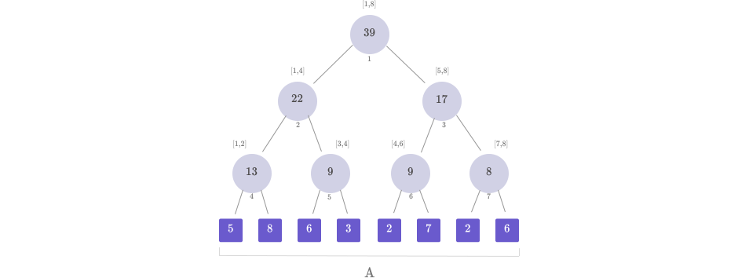
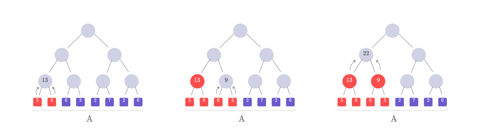
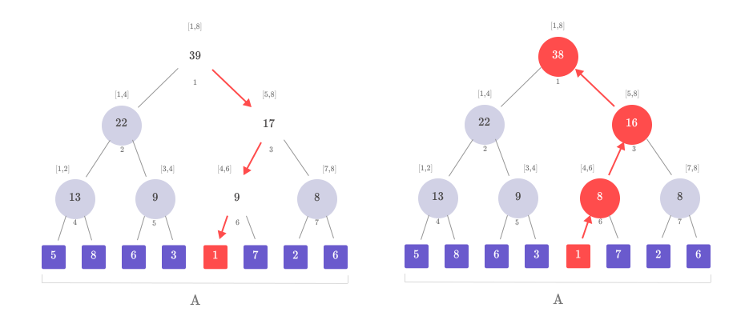
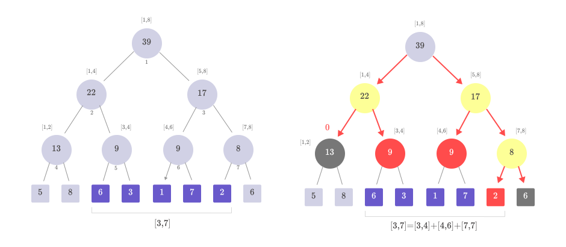
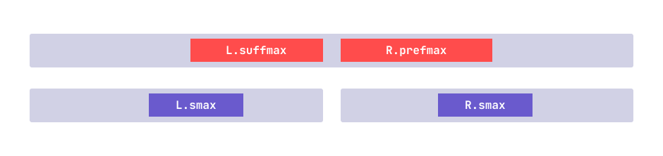
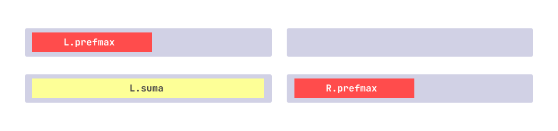

**Autor**: Alexandru Toma

In competitiile de informatica si olimpiada se intalnesc adesea probleme care implica operarea pe subsecventele unui vector. Spre exemplu, cum putem calcula eficient suma, maximul sau minimul pe o subsecventa a unui vector, mai ales cand acesta sufera **modificari in timp real**? 

!!! note "Observație"
    Dacă vectorul este static (nu suferă modificări), putem utiliza tehnici simple precum vectori de [sume parțiale](https://roalgo-discord.github.io/arhiva-educationala/usor/partial-sums/?h=sume) sau [RMQ](https://roalgo-discord.github.io/arhiva-educationala/rmq.md) (Range Minimum Query). Totuși, în scenariile unde vectorul se modifică frecvent, aceste tehnici devin ineficiente. Operațiile de query au o complexitate de \(O(1)\) atât pentru sume parțiale, cât și pentru RMQ. Însă, pentru actualizări, trebuie reconstruit tot tabelul de valori, ceea ce duce la o complexitate de \(O(n)\) pentru sume parțiale și \(O(n \log n)\) pentru RMQ.


**Arborii de intervale** (Segment Trees) reprezinta o solutie elegenta si eficienta pentru acest tip de probleme, permitand efectuarea rapida de interogari si actualizari in $O(log n)$ pentru ambele operatii.

În acest articol, vom explora conceptele de bază ale arborilor de intervale, modul de construire și utilizare a acestora, și vom analiza câteva aplicații frecvente în problemele de olimpiadă. Vom începe prin a defini structura unui arbore de intervale și vom continua prin a explica operațiile de actualizare, interogare și implementările acestora. În final, vom discuta și câteva probleme apărute în concursurile de programare competitivă. Fara prea multa vorbarie, sa incepem!

## Problema clasica

!!! note "Problema"
    Fie un vector $A$ cu $N$ elemente. Asupra lui se vor face $M$ operații de tipul:

    - `update(pos, val)` - actualizează valoarea de pe poziția `pos` în `val`
    - `query(x, y)` - aflați suma elementelor din intervalul $[x, y]$, $(A_{st} + A_{st+1} + ... + A_{dr})$


## Structura unui arbore de intervale

Un arbore de intervale este un arbore binar complet care este folosit pentru a stoca informații despre intervalele unui vector. Fiecare nod din arbore reprezintă un interval și stochează o anumită valoare (de exemplu, suma, minimul sau maximul) pentru intervalul respectiv.

### Cum se formeaza un arbore de intervale ?

Să considerăm un vector $A$ de dimensiune $N$. Arborele de intervale asociat acestui vector se construiește astfel:

  - Radacina arborelui va fi nodul $1$ si va avea asociat raspunsul pentru intervalul $[1,n]$
  - Un nod $k$ are asociat un interval $[st,dr]$, iar acesta are doi fii ce se vor afa pe pozitiile $2*k$ (fiul din stanga) si $2*k+1$ (fiul din dreapta). Fiul din stanga va avea raspunsul pentru intervalul $[st, m]$, iar fiul din dreapta pentru $[m+1, dr]$, unde m este mijlocul intervalului.

Sa consideram vectorul $A=[5,8,6,3,2,7,2,6]$, arborele de intervale asociat vectorului $A$ va arata in felul urmator:



### Care este memoria necesara stocarii ?

  - Numărul de frunze: Arborele de intervale are  N frunze, câte una pentru fiecare element din vectorul original. Aceste frunze sunt reprezentate în ultimul nivel al arborelui.
  - Numărul de noduri interne: avem $N-1$ noduri interne
  - Inaltimea maxima unui arbore binar complet cu $N$ frunze este $\lceil \log_2(N) \rceil$.
  
Astfel, in caz general, numarul total de noduri (frunze + noduri interne) dintr-un arbore binar complet de inaltime $h$ este:

$$
\begin{aligned}
2^{h+1} - 1 &= 2 \cdot 2^{\lceil \log_2(N) \rceil} - 1 \\[0.2cm]
&\leq 2 \cdot 2^{\log_2(N) + 1} - 1 \\[0.2cm]
&\leq 4 \cdot 2^{\log_2(N)} - 1 \\[0.2cm]
&= 4 \cdot N - 1
\end{aligned}
$$

!!! note "Observatie"
    Dimensiunea $4 \cdot N$ asigura faptul ca avem suficient spatiu pentru a construi un arbore de intervale complet, indiferent de dimensiunea vectorului original. Aceasta alocare permite mentinerea unui arbore echilibrat si eficient, permitand efectuarea de operatii de actualizare si interogare intr-un mod optim. 

## Operatii elementare

### Construirea arborelui

Construirea unui arbore de intervale se realizeaza intr-un mod recursiv bottom-up, pornind de la frunzele arborelui (care corespund elementelor vectorului initial) si mergand spre radacina. La fiecare nivel al arborelui, valorile nodurilor se determina pe baza fiilor sai.

Aceasta operatie se efectueaza in $O(n)$, unde $n$ este numarul de elemente din vectorul initial. De retinut ca exista si alta varianta de a construi arborele prin a actualiza fiecare pozitie cu valorea din vector, insa duce la o complexitate de $O(n \ log \ n)$.



În diagramele de mai sus, vedem că la fiecare pas, valorile din noduri sunt calculate pe baza sumelor subintervalelor din fiul stâng și fiul drept. Acest proces este realizat în codul de mai jos prin apeluri recursive, unde funcția `build` este apelată pentru fiecare subarbore (stâng și drept), iar valorile din noduri sunt apoi actualizate.

!!! info "De retinut"
    Arborii de intervale funcționează eficient doar cu **operații asociative** (ex: suma, maximul, minimul, cmmdc). Asociativitatea permite combinarea rezultatelor din subintervale fără a afecta corectitudinea rezultatului final.

Iata un exemplu de implementare a acestei operatii in C++:

```cpp
void build(int node, int st, int dr) {
  if (st == dr) {
    aint[node] = A[st];
    return;
  }
  int mid = (st + dr) / 2;

  build(2 * node, st, mid); // Construim subarborele stang
  build(2 * node + 1, mid + 1, dr); // Construim subarborele drept

  // Actualizam rezultatul nodului in functie de rezultatele fiilor
  aint[node] = aint[2 * node] + aint[2 * node + 1];
}
```

### Operatia de update

Pentru a efectua un update, ne vom deplasa in arbore pana la frunza care reprezinta elementul modificat. Odata ce am ajuns la frunza, inlocuim valoarea veche cu cea noua. Pe masura ce revenim din recursivitate, actualizam fiecare nod din drum, recalculand valorile pe baza celor doi fii, pentru a ne asigura ca arborele ramane corect.

Aceasta operatie se efectueaza in $O(\log n)$, unde $n$ este numarul de elemente din vectorul initial. Complexitatea este determinata de inaltimea arborelui, deoarece actualizarea trebuie propagata de la frunza pana la radacina.

Mai jos este prezentata o diagrama care ilustreaza cum se modifica structura arborelui de intervale dupa ce actualizam valoarea elementului de pe pozitia $5$ din $2$ in $1$.



În diagramele de mai sus, putem observa cum se modifica structura arborelui de intervale dupa ce modificam valoarea de pe pozitia 5 din 2 in 7. Nodurile afectate de aceasta modificare sunt evidentiate, iar valorile lor sunt actualizate pentru a reflecta noua configuratie.

Iata un exemplu de implementare a acestei operatii in C++:

```cpp
void update(int pos, int val, int node, int st, int dr) {
  if (st == dr) {
    aint[node] = val; // Daca am ajuns la pozitia pos, schimbam valoarea
    return;
  }

  int mid = (st + dr) / 2;
  if (pos <= mid)  // (1)
    update(pos, val, node * 2, st, mid);
  else
    update(pos, val, node * 2 + 1, mid + 1, dr);

  // La intoarcerea din apelul recursiv, actualizam nodul
  aint[node] = aint[node * 2] + aint[node * 2 + 1];
}
```

1. Daca nodul se afla in intervalul din stanga

### Operatia de query

Când dorim să efectuăm o interogare pe un interval \([x, y]\), scopul este de a găsi rapid răspunsul pentru acest subinterval fără a fi nevoie să parcurgem toți termenii din vectorul inițial. Arborele de intervale face acest lucru prin împărțirea intervalului \([x, y]\) în subintervale mai mici, pe care le combină pentru a găsi răspunsul final.

Această descompunere se bazează pe faptul că, pentru orice interval \([st, dr]\) gestionat de un nod din arbore, avem trei cazuri:

1. **Interval complet în afara intervalului de interogare** (gri inchis): Dacă intervalul \([st, dr]\) nu se suprapune cu intervalul \([x, y]\), atunci acel interval nu contribuie la răspuns și putem returna direct 0 sau altă valoare de identitate (pentru maxim, minim etc.).
2. **Interval complet inclus în intervalul de interogare** (portocaliu): Dacă intervalul \([st, dr]\) este complet inclus în intervalul \([x, y]\), returnăm valoarea stocată în nodul respectiv, deoarece aceasta reprezintă deja răspunsul pentru întregul interval.
3. **Interval parțial suprapus** (galben): În acest caz, descompunem intervalul în două subintervale, corespunzătoare fiilor nodului curent, și combinăm rezultatele interogărilor pentru aceste subintervale.



Iată un exemplu de implementare a operației de query în C++:

```cpp
int query(int x, int y, int node, int st, int dr) {
  if(dr < x || y < st) // Daca intervalul se afla complet in afara
    return 0;
  if(x <= st && dr <= y) // Daca intervalul este complet inclus
    return aint[node];

  int mid = (st + dr) / 2;
  int Q_st = query(x, y, node * 2, st, mid); // (1)
  int Q_dr = query(x, y, node * 2 + 1, mid + 1, dr); //(2)
  
  return Q_st + Q_dr;
}
```

1. Raspunsul pentru intervalul din stanga
2. Raspunsul pentru intervalul din dreapta

## Probleme rezolvate

!!! info "Tip"
    Înainte de a trece la problemele rezolvate, te încurajez să încerci să **implementezi** structura de date și **să rezolvi singur** câteva probleme de bază. Încearcă să implementezi arborele de intervale pentru a calcula suma și maximul pe un interval dat. In modul acesta vei vedea unde ai neclaritati. Dupa ce te-ai convins ca ai inteles tot ce s-a discutat pana acum, te invit sa discutam cateva probleme mai interesante. **Un alt mic sfat ar fi sa incerci problema inainte de a urmari rezolvarea completa.**

### 1. [Arbint](https://infoarena.ro/problema/arbint)

Fie un vector \( A \) cu \( N \) elemente naturale. Asupra lui se vor face \( M \) operații, codificate astfel în fișierul de intrare:

  - `0 a b` - Să se determine maximul din intervalul \([a, b]\).
  - `1 a b` - Valoarea elementului de pe poziția \( a \) va deveni \( b \).

Problema de baza, identica cu cea pe care am rezolvat-o anterior, singura diferenta este ca acum trebuie sa calculam elementul maxim. Solutia mea o puteti vedea [aici](https://infoarena.ro/job_detail/3239964?action=view-source).

### 2. [Maxq](https://www.infoarena.ro/problema/maxq)

Johnie a început să se joace cu un vector de numere. El dispune inițial de un vector \( V \) cu \( N \) numere întregi și poate efectua următoarele operații:

  - Schimbarea elementului de pe poziția \( p \) cu un alt număr întreg;
  - Aflarea subsecvemței de sumă maximă din \( V \) inclusă între indicii \( a \) și \( b \).

Pentru rezolvarea acestei probleme vom adopta aceeasi strategie, vom analiza modul in care putem combina doua segmente de lungime $L/2$ intr-un singur segment de lungime $L$. In cazul acestei probleme vom avea nevoie de mai multe informatii pentru fiecare nod:

```cpp
struct Node {
  int suma;     // Suma subsecventei
  int prefmax;  // Prefixul de suma maxima
  int suffmax;  // Sufixul de suma maxima
  int smax;     // Subsecventa de suma maxima
};
```

Sa analizam putin unde se poate afla segmentul de suma maxima dupa combinarea celor doua subsegmente.

  - Segmentul de suma maxima se afla in intervalul din stanga (L.smax)
  - Segmentul de suma maxima se afla in intervalul din dreapta (R.smax)
  - Segmentul de sumă maximă începe în intervalul stâng și se termină în cel drept. Aceasta este reprezentată prin combinația dintre L.suffmax și R.prefmax.



Pentru a calcula prefixul de suma maxima pentru fiecare nod luam maximul dintre prefixul gasit in stanga si intregul segment din stanga la care se adauga prefixul de suma maxima din dreapta.



Analog pentru sufixul de suma maxima, doar ca luam maximul dintre sufixul gasit in dreapta si intregul segment care incepe in dreapta si se continua in stanga.

```cpp
struct Node {
  int suma;     // Suma subsecventei
  int prefmax;  // Prefixul de suma maxima
  int suffmax;  // Sufixul de suma maxima
  int smax;     // Subsecventa de suma maxima
};

Node merge(Node L, Node R) {
  Node T;
  T.suma = L.suma + R.suma;
  T.prefmax = max(L.prefmax, L.suma + R.prefmax);
  T.suffmax = max(R.suffmax, R.suma + L.suffmax);
  T.smax = max( max(L.smax, R.smax), L.suffmax + R.prefmax );
}
```

!!! info "Intrebare"
    Cu ce valori initializam frunzele arborelui ?

Iata o posibila implementare a acestei problema in C++:

```cpp
#include <iostream>  
#include <fstream>  
#include <algorithm>  
using namespace std;

ifstream fin("maxq.in");
ofstream fout("maxq.out");

const int MAXN = 2e5 + 1;

struct Node {
  long long suma;    // Suma subsecventei
  long long prefmax; // Prefixul de suma maxima
  long long sufmax;  // Sufixul de suma maxima
  long long smax;    // Subsecventa de suma maxima
} aint[MAXN * 4];

int n;

Node combine(Node L, Node R) {
  Node T;
  T.suma = L.suma + R.suma;
  T.prefmax = max(L.prefmax, L.suma + R.prefmax);
  T.sufmax = max(R.sufmax, R.suma + L.sufmax);
  T.smax = max( max(L.smax, R.smax), L.sufmax + R.prefmax );
  return T;
}

void update(int pos, int val, int node = 1, int st = 1, int dr = n) {
  if(st == dr) {
    if(val > 0)
      aint[node] = {val, val, val, val};
    else
      aint[node] = {val, 0, 0, 0};
    return;
  }

  int mid = (st + dr) / 2;
  if(pos <= mid)
    update(pos, val, node * 2, st, mid);
  else
    update(pos, val, node * 2 + 1, mid + 1, dr);
  aint[node] = combine(aint[node * 2], aint[node * 2 + 1]);
}

Node query(int x, int y, int node = 1, int st = 1, int dr = n) {
  if(y < st || dr < x)
    return {0, 0, 0, 0};
  if(x <= st && dr <= y)
    return aint[node];

  int mid = (st + dr) / 2;
  Node Q1 = query(x, y, node * 2, st, mid);
  Node Q2 = query(x, y, node * 2 + 1, mid + 1, dr);
  return combine(Q1, Q2);
}

int main() {
  int q;
  fin >> n;
  for(int i = 1; i <= n; i++) {
    int x;
    fin >> x;
    update(i, x);
  }

  fin >> q;
  while(q--) {
    int op, x, y;
    fin >> op >> x >> y;
    if(op == 0)
      update(x + 1, y);
    else
      fout << query(x + 1, y + 1).smax << '\n';
  }

  return 0;
}
```

### 3. [NrInversiuni](https://www.pbinfo.ro/probleme/3206/nrinversiuni)

În această problemă, trebuie să determinăm numărul de inversiuni dintr-o permutare dată a unui vector de lungime \( n \). O inversiune este o pereche ordonată \((i, j)\) astfel încât \( 1 \leq i < j \leq n \) și \( v[i] > v[j] \).

**Soluția naivă** ar presupune să verificăm pentru fiecare pereche de elemente \((i, j)\) dacă \( v[i] > v[j] \). Acest lucru necesită două bucle imbricate, una pentru \( i \) și alta pentru \( j \), ceea ce duce la o complexitate de \( O(n^2) \).

**Solutia optima**. Această problemă poate fi rezolvată eficient cu ajutorul arborilor de intervale. Observația esențială este că fiecare element formează inversiuni cu toate elementele mai mari decât el care apar inaintea lui in vector. Pentru a implementa soluția, folosim un arbore de intervale care ne ajută să menținem numărul de elemente mai mare decat o anumita element pe masura ce parcurgem vectorul.

**Notă:** Folosind această metodă, complexitatea algoritmului se reduce la \( O(n \log n) \).

Iată cum se poate implementa soluția:

  - Pentru fiecare element $x$, calculăm câte elemente mai mari decât $x$ se află deja în arbore. Altfel spus, cate elemente se afla in intervalul $[x+1,n]$.
  - Actualizăm arborele, marcând apariția elementului $x$.

## Probleme de antrenament

Pentru problemele de pe codeforces, este necesar un cont pentru a putea accesa acest curs din sectiunea EDU (ITMO Academy)

  - [Intervalxy](https://www.pbinfo.ro/probleme/1591/intervalxy)
  - [NrInversiuni](https://www.pbinfo.ro/probleme/3206/nrinversiuni)
  - [Inversiuni](https://www.pbinfo.ro/probleme/1715/inversiuni)
  - [Rest](https://www.infoarena.ro/problema/rest)
  - [Sign Alternation](https://codeforces.com/edu/course/2/lesson/4/4/practice/contest/274684/problem/A) 
  - [Inversions](https://codeforces.com/edu/course/2/lesson/4/4/practice/contest/274684/problem/C)
  - [Xenia and bit operations](https://codeforces.com/contest/339/problem/D)
  - [Distinct Value Queries](https://cses.fi/problemset/task/1734)
  - [Increasing Subsequence II](https://cses.fi/problemset/task/1748)
  - [Intersectie segmente](https://www.pbinfo.ro/probleme/2103/intersectie-segmente) : baleiere

## Bibliografie + Resurse suplimentare

  - [USACO Guide](https://usaco.guide/gold/PURS?lang=cpp)
  - [Codeforces EDU](https://codeforces.com/edu/course/2/lesson/4): curs complet pentru introducerea in arbori de intervale
  - [CSAcademy](https://csacademy.com/lesson/segment_trees): articol care contine animatii pentru operatiile elementare
  - [CPAlgorithms](https://cp-algorithms.com/data_structures/segment_tree.html): articol mai avansat care prezinta mai multe tehnici
  - [Efficient and easy segment trees](https://codeforces.com/blog/entry/18051)
  - [Template arbori de intervale](https://github.com/alextm0/Data-Structures-Algorithms/blob/main/Segment%20Tree/aint.cpp): o clasă flexibilă care permite modificarea rapidă a operațiilor.
