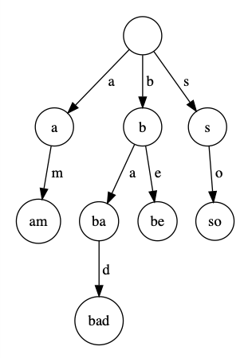

---
tags:
    - arbori
    - structuri de date
    - siruri de caractere
---

**Autor**: Matei Ionescu

!!! example "Cunoștințe necesare"
    - [Subprograme](../cppintro/functions.md)
    - [Introducere în STL](../cppintro/stl.md)
    - [Șiruri de caractere](../cppintro/strings.md)

## Ce este un Trie

Un trie (sau arbore de prefixe) este un _arbore de căutare $k$-ar_ (un arbore cu
rădăcină unde fiecare nod are maxim $k$ fii), reprezentând un mod unic de a
memora informațiile, numite și _chei_.

Numărul de fii al unui nod este în mare parte influențat de tipul informațiilor
memorate, dar de cele mai multe ori, un Trie este folosit pentru reținerea
șirurilor de caractere, astfel fiecare nod având maxim 26 fii.

Inițial arborele conține doar un singur nod, rădăcina, urmând ca apoi cuvintele
să fie introduse în ordinea citirii lor, de la stânga la dreapta. Observăm că
înălțimea arborelui este lungimea maximă a unui cuvânt. Complexitatea de timp
este $O(L)$, unde $L$ este lungimea maximă, iar memoria consumată, în cel mai
rău caz, este $O({ L \cdot k})$.

<figure markdown="span">

<figcaption>Un exemplu de trie pentru cuvintele am, bad, be și so</figcaption>
</figure>

## Moduri de implementare

Există două modalități standard prin care putem implementa un Trie, folosind
pointeri sau vectori. Ambele funcționează la fel de bine, însă operația de
_delete_ este mai greu de implementat cu vectori.

### Prin pointeri

Ne vom folosi de o structură unde vom reține un contor reprezentând de câte ori
am trecut prin nodul curent, cât și un vector de pointeri, reprezentând fiii
nodului curent.

```cpp
struct Trie {
    int cnt;
    Trie *fii[26];

    Trie() : cnt{0} {
        for (int i = 0; i < 26; ++i) {
            fii[i] = nullptr;
        }
    }

    ~Trie() {
        for (int i = 0; i < 26; ++i) {
            delete fii[i];
        }
    }
};

Trie *root = new Trie;
```

Operația de _insert_ poate fi foarte ușor scrisă recursiv.

```cpp
void insert(Trie *node, string a, int poz) {
    if (poz == a.size()) {
        node->cnt++;
        return;
    }

    int index = a[poz] - 'a';
    if (node->fii[index] == nullptr) {
        node->fii[index] = new Trie();
    }

    insert(node->fii[index], a, poz + 1);
}
```

În momentul în care am ajuns la un nod $node$ în arbore, verificăm dacă există
fiul pentru caracterul următor și dacă nu există, îl adăugăm în arbore, apoi
apelăm recursiv până ajungem la finalul stringului.

Pentru a elimina un string din trie ne mai trebuie o informație suplimentară, și
anume să știm câți fii are un nod. Așadar, dacă am eliminat un sufix al șirului
și nodul curent nu mai are fii nici nu mai este vizitat prin alt șir inserat,
putem da erase complet la pointerul respectiv.

```cpp
bool del(Trie *node, string a, int pos) {
    int idx = a[pos] - 'a';
    if (pos == a.size()) {
        node->cnt--;
    } else if (del(node->fii[idx], a, pos + 1)) {
        node->nrf--;
        node->fii[idx] = nullptr;
    }

    if (node->cnt == 0 && node->nrf == 0 && node != t) {
        delete node;
        return 1;
    }

    return 0;
}
```

Restul operațiilor se implementează similar, practic baza tuturor operațiilor
stă în modul de a parcurge trie-ul.

### Prin vectori

În loc de o structură vom folosi un vector cu $k$ coloane. În fiecare element
din vector vom reține poziția fiului respectiv.

```cpp
vector<vector<int>> trie(1, vector<int>(26, -1));
```

Astfel `trie[node][5]` va fi egal cu poziția în vectorul trie pentru al cincilea
fiu a lui `node`.

Operația de inserare este foarte similară față de cea precedentă, singurul lucru
care diferă este modul de implementare. În acest caz ne este mult mai ușor să
folosim o funcție care să itereze propriu-zis prin șirul de caractere.

```cpp
vector<vector<int>> trie(1, vector<int>(26, -1));
vector<int> cnt(1);

void insert(string a) {
    int root = 0;
    for (const char i : a) {
        int idx = i - 'a';
        if (trie[root][idx] == -1) {
            trie[root][idx] = trie.size();
            trie.emplace_back(26, -1);
            cnt.push_back(0);
        }
        cnt[root]++;
        root = trie[root][idx];
    }
    cnt[root]++;
}
```

Observăm faptul că incrementăm și la final contorul.

### Trie pe biți

Unele probleme necesită reținerea numerelor într-o structură de date, cum ar fi
un trie, însa vom înlocui șirurile de caractere cu reprezentarea binară a
numerelor.

### Problema xormax de pe Kilonova (ușoară)

Un exemplu bun este chiar problema [xormax](https://kilonova.ro/problems/1984),
unde ni se dă un vector cu $N$ elemente și trebuie să aflăm care este suma xor
maximă a unui interval. Suma _xor_ a unui interval cu capetele $[L, R]$ este
valoarea $v_L \oplus v_{L+1} \oplus \dots \oplus v_R$, unde $\oplus$ este
operatorul _xor_ pe biți.

Pentru a rezolva problema putem parcurge vectorul de la stânga la dreapta și să
aflam pentru fiecare $1 \leq i \leq N$ care este suma _xor_ maximă a unui
interval care se termină în $i$. Dacă construim vectorul $xp$, unde $xp[i] = v_1
\oplus v_2 \oplus \dots \oplus v_{i-1} \oplus v_i$, atunci suma _xor_ pe
intervalul $[L, R]$ este egală cu $xp[R] \oplus xp[L-1]$. Observăm că pentru un
$R$ fixat trebuie să găsim care este $L$-ul care maximizează relația de mai sus.
Pentru a face asta putem să introducem primii $R-1$ $xp$-uri într-un trie pe
biți și să căutăm bit cu bit, începând cu bitul semnificativ, $xp$-ul care va
maximiza rezultatul.

```cpp
#include <iostream>
#include <vector>

using namespace std;
const int N = 2e5 + 1;

vector<vector<int>> trie(1, vector<int>(2, -1));

int n, v[N], xp[N];

int find(int nr) {
    int root = 0;
    int ans = 0;
    for (int bit = 31; bit >= 0; bit--) {
        bool b = (nr & (1 << bit));
        if (trie[root][!b] == -1) {
            if (trie[root][b] == -1) {
                return ans;
            } else {
                root = trie[root][b];
            }
        } else {
            ans += (1 << bit);
            root = trie[root][!b];
        }
    }
    return ans;
}

void insert(int nr) {
    int root = 0;
    for (int bit = 31; bit >= 0; bit--) {
        bool b = (nr & (1 << bit));
        if (trie[root][b] == -1) {
            trie[root][b] = trie.size();
            trie.emplace_back(2, -1);
        }
        root = trie[root][b];
    }
}

int main() {
    cin.tie(nullptr)->sync_with_stdio(nullptr);
    cin >> n;

    for (int i = 1; i <= n; i++) {
        cin >> v[i];
        xp[i] = xp[i - 1] ^ v[i];
    }

    int ans = 0;
    insert(0);

    for (int i = 1; i <= n; i++) {
        int res = find(xp[i]);
        ans = max(ans, res);
        insert(xp[i]);
    }
    
    cout << ans;
}
```

O variantă care se folosește de implementarea cu pointeri este următoarea:

```cpp
#include <iostream>
#include <vector>

using namespace std;

struct Trie {
    Trie *_next[2];
    int _pos;

    explicit Trie(const int value)
        : _pos{value}
        , _next{nullptr, nullptr} {}

    Trie() : Trie{-1} {}

    ~Trie() {
        delete _next[0];
        delete _next[1];
    }
} *root;


void add(const int val, const int idx) {
    Trie *node = root;

    for (int i = 29; i >= 0; i--) {
        bool has = (val >> i) & 1;
        if (node->_next[has] == nullptr)
            node->_next[has] = new Trie(idx);
        node = node->_next[has];
    }
}

int query(const int val) {
    Trie *node = root;

    for (int i = 29; i >= 0; i--) {
        bool has = (val >> i) & 1;
        if (node->_next[!has])
            node = node->_next[!has];
        else if (node->_next[has])
            node = node->_next[has];
        else
            break;
    }
    return node->_pos;
}

int main() {
    ios_base::sync_with_stdio(false);
    cin.tie(nullptr);
    cout.tie(nullptr);

    root = new Trie(0);

    int n, x, sum = 0, value = 0;
    cin >> n;
    vector<int> sums(n + 1);

    add(sum, 0);

    for (int i = 1; i <= n; i++) {
        cin >> x;
        sum ^= x;
        sums[i] = sum;

        value = max(value, x);

        if (i > 1) {
            int qry = query(sum);
            value = max(value, sum ^ sums[qry]);
        }

        add(sum, i);
    }

    cout << value;

    delete root;

    return 0;
}
```

## Problema [XOR Construction](https://codeforces.com/contest/1895/problem/D) (medie)

În această problemă ni se dau $n-1$ numere, unde al $i$-lea are valoarea $a_i$,
iar noi trebuie să construim alt vector $b$, cu $n$ elemente, astfel încât să
existe toate numerele de la 0 la $n-1$ în $b$, iar $b_i \oplus b_{i+1} = a_i$.

În primul rând, dacă $b_i = 0$ atunci $b_{i+1} = a_i$, $b_{i+1} \oplus b_{i+2} =
a_{i+1}$ , deci $b_{i+2} = a_i \oplus a_{i+1}$ și $b_{i+3} = a_i \oplus a_{i+1}
\oplus a_{i+2}$. Prin urmare deducem o formă generală pentru $b_j$, unde $i < j$
, și anume $b_j = a_i \oplus a_{i+1} \oplus a_{i+2} \oplus \dots \oplus
a_{j-1}$. Proprietatea se respectă și pentru oricare $j < i$, avem $b_j = a_j
\oplus a_{j+1} \oplus \dots \oplus a_{i-1}$.

În al doilea rând, enunțul problemei asigură faptul că mereu va exista soluție.
Dar când nu avem soluție? Păi în momentul în care se repetă două elemente în
vectorul $b$, ceea ce înseamnă faptul că trebuie să existe o secvență cu suma
_xor_ egală cu 0. Pentru simplitate vom spune că pe poziția $k$ va fi $b_k =
0$. Dacă $i < j$ și $b_i = b_j$ și $j < k$, atunci $a_i \oplus a_{i+1} \oplus
a_{i+2} \oplus \dots \oplus a_{j-1} = 0$, analog pentru $i > j > k$. Dacă $i < k
< j$ și $b_i = b_j$ atunci $b_i = a_i \oplus a_{i+1} \oplus \dots \oplus
a_{k-1}$, $b_j = a_k \oplus a_{k+1} \dots \oplus a_{j-1}$. Prin urmare $a_i
\oplus a_{i+1} \oplus \dots \oplus a_{j-1} = 0$. Așadar, știm ca mereu în
vectorul $b$ elementele vor fi distincte.

În al treilea rând, observăm că vectorul $b$ este generat în funcție de ce
valoare are $k$. Deci o primă idee ar fi să fixăm mai întâi unde vom pune 0-ul
în vectorul $b$ și să-l construim în $O(n)$, complexitatea temporală fiind
$O(n^2)$. Dar putem să ne folosim de a doua observație, și anume că mereu
vectorul $b$ va avea elementele distincte. Deci ne este suficient să știm care
va fi valoarea maximă din $b$ dacă 0-ul se află pe poziția $k$. Pentru a face
asta putem să folosim 2 trie-uri, unul pentru sufix, altul pentru prefix,
complexitatea finală devenind $O(n \log n)$.

```cpp
#include <iostream>
#include <vector>

using namespace std;
const int N = 2e5 + 1;

int n;
vector<int> v(N), ans(N);
vector<int> xr1(N), xr2(N);

vector<vector<int>> trie1(1, vector<int>(2, -1)),
                    trie2(1, vector<int>(2, -1));

vector<int> maxim1(N), maxim2(N);

void insert(vector<vector<int>> &trie, int nr) {
    int root = 0;
    for (int i = 30; i >= 0; i--) {
        bool bit = (nr & (1 << i));
        if (trie[root][bit] == -1) {
            trie[root][bit] = trie.size();
            trie.push_back(vector<int>(2, -1));
        }
        root = trie[root][bit];
    }

}

int get_max(vector<vector<int>> &trie, int nr) {
    int ans = 0;
    int root = 0;
    for (int i = 30; i >= 0; i--) {
        bool bit = (nr & (1 << i));
        if (trie[root][!bit] != -1) {
            ans += (1 << i);
            root = trie[root][!bit];
        } else if (trie[root][bit] != -1) {
            root = trie[root][bit];
        }
    }
    return ans;
}

int main() {
    cin >> n;
    int xr = 0;
    for (int i = 1; i < n; i++) {
        cin >> v[i];
        xr1[i] = xr1[i - 1] ^ v[i];
    }
    for (int i = n - 1; i >= 1; i--) {
        xr2[i] = xr2[i + 1] ^ v[i];
    }

    maxim1[1] = 0;
    maxim2[n] = 0;
    insert(trie1, xr2[1]);

    for (int i = 2; i <= n; i++) {
        maxim1[i] = get_max(trie1, xr2[i]);
        insert(trie1, xr2[i]);
    }

    insert(trie2, xr1[n - 1]);
    for (int i = n - 2; i >= 0; i--) {
        maxim2[i] = get_max(trie2, xr1[i]);
        insert(trie2, xr1[i]);
    }


    for (int i = 1; i <= n; i++) {
        if (max(maxim1[i], maxim2[i - 1]) == n - 1) {
            int xr1 = 0, xr2 = 0;
            vector<int> fr(2 * n + 1);
            fr[0] = 1;
            ans[i] = 0;
            for (int j = i - 1; j >= 1; j--) {
                ans[j] = v[j] ^ ans[j + 1];
                xr1 ^= v[j];
                fr[ans[j]]++;
                if (fr[ans[j]] >= 2) {
                    break;
                }
            }
            for (int j = i; j < n; j++) {
                ans[j + 1] = v[j] ^ xr2;
                xr2 ^= v[j];
                fr[ans[j + 1]]++;
                if (fr[ans[j + 1]] >= 2) {
                    break;
                }
            }
            int ok = 1;
            for (int j = 0; j < n; j++) {
                if (fr[j] != 1) {
                    ok = 0;
                    break;
                }
            }
            if (1) {
                for (int j = 1; j <= n; j++) {
                    cout << ans[j] << " ";
                }
                return 0;
            }
        }
    }
}
```

## Problema [cuvinte](https://kilonova.ro/problems/65) (medie-grea)

Se dau $N$ cuvinte formate doar din primele $K$ litere mici ale alfabetului
englez și un șir $x_i$, de $M$ numere naturale. Trebuie să se formeze $M$
cuvinte astfel încât oricare cuvânt $(1 \leq i \leq M)$ să respecte următoarele
proprietăți:

- Să aibă lungimea $x_i$.
- Să fie format doar din primele $K$ litere mici ale alfabetului englez.
- Să nu existe $j \leq M,\, j \neq i$, sau un cuvânt $cuv$ din cele $N$, astfel
  încât cuvântul $j$ să fie prefix pentru cuvântul $i$, sau $cuv$ să fie prefix
  pentru $i$.
- Să nu existe $j \leq M,\, j \neq i$, sau un cuvânt $cuv$ din cele $N$, astfel
  încât cuvântul $i$ să fie prefix pentru cuvântul $j$, sau $i$ să fie prefix
  pentru $cuv$.

### Soluție

Prima idee ar fi să sortam vectorul $x$. Fie $dp_i$ = în câte moduri putem alege
primele $i$ cuvinte. Putem considera toate posibilitățile de a forma șirurile ,
iar abia apoi să vedem cum eliminăm pe cele care nu sunt bune. Cu alte cuvinte,
fie $(s_1, s_2, .. , s_{i-1})$ primele $i-1$ cuvinte alese astfel încât să
respecte condițiile impuse de problemă. Sunt în total $dp_{i-1} \cdot K^{x_i}$
moduri de a forma un set de șiruri cu primele $i$ cuvinte.

!!! info "Observație"

    Nu există două cuvinte, $s_x$ și $s_y$, astfel încât ambele să fie prefixe
    pentru $s_i$.

    Dacă ambele ar fi prefixe pentru $s_i$, atunci fie $s_x$ este prefix pentru
    $s_y$, fie invers, ceea ce este fals, pentru că noi am generat primele $i-1$
    cuvinte optim.

Astfel dacă pentru fiecare cuvânt $k$, $k < i$, putem să scădem din numărul
total de posibilități șirurile unde $s_k$ este prefix pentru $s_i$, nu vom
elimina două configurații la fel.

$$ dp_i = dp_{i-1} \cdot K^{x_i} - dp_{i-1} \cdot \sum_{j = 1}^{i-1} K^{x_i -
x_j} $$

!!! info "Observație"

    Nu există două cuvinte, unul provenit din cele $N$ date și celălalt ($s_k$)
    din primele $i-1$ astfel încât ambele să fie prefixe pentru $s_i$. Dacă
    ambele sunt prefixe pentru $s_i$, atunci fie $s_k$ este prefix pentru un
    cuvânt din cele $N$, fie invers.

Deci, putem să fixam un cuvânt din cele $N$ date inițial și să eliminăm numărul
de posibilități ca el să fie prefix pentru $s_i$. Datorită observației, nu vom
elimina o posibilitate dacă a fost eliminată deja în prima etapă.

În mod natural vom zice că din dp-ul nostru vom scădea în mod similar $dp_{i-1}
\cdot \sum_{j = 1}^{N} K^{x_i - len(j)}$, unde $len(j)$ = lungimea cuvântului
$j$, cu $x_i \geq len(j)$. Însă nu este adevărat, pentru că dacă avem două
cuvinte $x$ și $y$ , unde $x$ este prefix pentru $y$, atunci suma de mai sus va
număra 2 configurații de două ori. Observăm că nouă ne trebuie practic doar
acele cuvinte $x$, pentru care nu există alt cuvânt $y$, cu $y$ prefix pentru
$x$, iar $len(x) \leq x_i$.

Astfel putem parcurge direct pe Trie-ul cuvintelor. Dacă suntem la un nod
$node$, acesta este capătul unui cuvânt, iar $len(cuv) \leq x_i$, atunci putem
scădea din dp-ul nostru $dp_{i-1} \cdot K^{x_i - len(cuv)}$ și să oprim
parcurgerea. Dacă suntem la un nod $node$, acesta are lungimea egală cu $x_i$,
atunci scădem din dp $dp_{i-1}$ și oprim parcurgerea.

Cu alte cuvinte, o soluție în $O(M^2 + M \cdot S)$ este posibilă, unde $S =
\sum_{i=1}^{N} len(i)$. Putem optimiza soluția, observând că de fiecare dată
putem face tranzițiile în $O(1)$. Soluția finală devine $O(M + S)$ sau $O(M
\cdot \log + S)$.

```cpp
#include <bits/stdc++.h>
using namespace std;
const int mod = 1e9 + 7, N = 3e5 + 1;
struct Mint
{
    int val;
    Mint(int x = 0)
    {
        val = x % mod;
    }
    Mint(long long x)
    {
        val = x % mod;
    }
    Mint operator+(Mint oth)
    {
        return val + oth.val;
    }
    Mint operator*(Mint oth)
    {
        return 1LL * val * oth.val;
    }
    Mint operator-(Mint oth)
    {
        return val - oth.val + mod;
    }
    Mint fp(Mint a, long long n){
        Mint p = 1;
        while(n){
            if(n & 1){
                p = p * a;
            }
            a = a * a;
            n /= 2;
        }
        return p;
    }
    Mint operator/(Mint oth){
        Mint invers = fp(oth, mod - 2);
        return 1LL * val * invers.val;
    }
    friend ostream& operator << (ostream& os, const Mint& lol){
        os << lol.val;
        return os;
    }
};

int n, m, k;
vector<Mint> dp(N);
vector<int> x(N), depth(N), cnt1(N);
vector<vector<int>> trie(1, vector<int>(26,-1));
vector<bool> cnt(1);
Mint spm = 0;
Mint fp(Mint a, int n){
 Mint p = 1;
 while(n){
  if(n & 1) p = a * p;
  a = a * a;
  n /= 2;
 }
 return p;
}

void insert(string a){
    int root = 0;
    for(int i = 0; i < a.size(); i++){
        if(trie[root][a[i]-'a'] == -1){
            trie[root][a[i]-'a'] = trie.size();
            trie.push_back(vector<int>(26, -1));
            cnt.push_back(0);
        }
        root = trie[root][a[i]-'a'];
    }
    cnt[root]=1;
}
void dfs(int node, int lenx, int len){
    if(lenx == len){
        return;
    }
    if(cnt[node]){
        spm = spm + fp(k, lenx - len);
        return;
    }
    for(int i = 0; i < 26; i++){
        if(trie[node][i] != -1){
            dfs(trie[node][i], lenx, len + 1);
        }
    }
}
void dfs1(int node, int len){
    depth[len]++;
    if(cnt[node]){
        cnt1[len]++;
        return;
    }
    for(int i = 0; i < 26; i++){
        if(trie[node][i] != -1){
            dfs1(trie[node][i], len+1);
        }
    }
}
int main(){
 cin.tie(0)->sync_with_stdio(0);
 cin >> n >> m >> k;
 for(int i = 1; i <= n; i++){
  string a;
  cin >> a;
  insert(a);
 }
 for(int i = 1; i <= m; i++){
  cin >> x[i];
 }
 sort(x.begin() + 1, x.begin() + 1 + m);
 dp[1] = fp(k, x[1]);
 Mint sm = 0;
 dfs(0, x[1], 0);
    dfs1(0, 0);
    dp[1] = dp[1] - depth[x[1]];
    dp[1] = dp[1] - spm;
 for(int i = 2; i <= m; i++){
  dp[i] = dp[i - 1] * fp(k, x[i]);
  sm = sm * fp(k, x[i]-x[i-1]);
  sm = sm + fp(k, x[i]-x[i-1]);
  dp[i] = dp[i] - dp[i-1]*sm;
        spm = spm * fp(k, x[i]-x[i-1]);
        for(int j = x[i-1]; j < x[i]; j++){
            spm = spm + fp(k, x[i] - j) * cnt1[j];
        }
        dp[i] = dp[i] - dp[i-1]*depth[x[i]];
        dp[i] = dp[i] - dp[i-1]*spm;
 }
 cout << dp[m];
}
```

## Problema [cli](https://kilonova.ro/problems/274) (medie-grea)

Se dau $N$ cuvinte care trebuie tastate într-un terminal. Un cuvânt este
considerat tastat dacă el va apărea în terminal cel puțin odată pe parcursul
tastării. Avem două tipuri de operații la dispoziție: adăugăm un caracter la
finalul șirul tastat deja, eliminăm un caracter de la finalul șirului (dacă nu
este vid). Pentru fiecare $i = \overline{1, K}$, noi trebuie să aflam care este
numărul minim de operații pentru a tasta exact $i$ cuvinte distincte dintre cele
date. În momentul în care începem să tastăm un cuvânt, trebuie mereu să începem
de la un șir vid $(\emptyset)$, și să terminăm tastarea tot la un șir vid. Un
exemplu de tastare corectă este: $\emptyset \rightarrow a \rightarrow ab
\rightarrow abc \rightarrow ab \rightarrow a \rightarrow \emptyset$.

Ne vom folosi din nou de metoda programării dinamice, dar de data asta vom face
dp direct pe trie. Astfel, fie $dp[nod][i]$ = numărul minim de operații pentru a
tasta $i$ cuvinte cu prefixul format din lanțul de la rădăcină la $nod$. Acum,
pentru un nod fixat din trie-ul nostru, putem presupune că în momentul tastării
vom începe mereu cu șirul format de la rădăcină la $nod$, în loc de $\emptyset$.
De exemplu, dacă cuvintele au prefixul *abab*, atunci noi vom presupune o
succesiune validă de operații: $abab \rightarrow abab\textbf{c} \rightarrow
\dots \rightarrow abab\textbf{c} \rightarrow abab$. Putem deci face un rucsac
pentru fiii nodului, $dp1[i][j]$ = care e numărul minim de operații pentru a
tasta $j$ cuvinte din primii $i$ fii. Pentru că prefixul necesită
$\text{len}(prefix)$ operații de adăugare și ștergere, vom începe $dp$-ul nostru
cu $2 \cdot \text{len}(prefix)$ operații deja făcute. Cu alte cuvinte, pentru a
tasta 0 cuvinte vom face $dp1[0][0] = 2 \cdot \text{len}(prefix)$. În momentul
în care trecem de la $i$ la $i+1$ avem 2 cazuri: fie nu luăm fiul respectiv în
considerare, fie alegem $p$ șiruri pe care le vom tasta în $dp[fiu(i)][p] - 2
\cdot \text{len}(prefix)$ operații.

```cpp
for (int i = 1; i <= 26; i++) {
    for (int k1 = 0; k1 <= min(sz[nod], k); k1++) {
        dp1[i][k1] = min(dp1[i][k1], dp1[i - 1][k1]);

        const auto nod2 = trie[nod][i - 1];
        for (int k2 = 1; k2 <= k1 && nod2 != -1 && k2 < dp[nod2].size(); k2++) {
            dp1[i][k1] =
                min(dp1[i][k1], dp1[i - 1][k1 - k2] + dp[nod2][k2] - 2 * len);
        }
    }
}
```

Problema constă în faptul că secvența de cod de mai sus rulează pentru fiecare
nod din trie, ceea ce ar rezulta într-o complexitate de $O(N \cdot K^2)$. Doar
că, în practică soluția are complexitatea de $O(N \cdot K)$. În momentul în care
facem rucsac pe un arbore, este foarte important să fim atenți la memoria și la
timpul consumate. Observăm faptul că cele două bucle merg până la
$\min(sz[nod], k)$, lucru ce îmbunătățește timpul de execuție considerabil.
Puteți citi mai multe din [soluția problemei
Barricades](http://www.lookingforachallengethebook.com/uploads/1/4/5/5/14555448/preview-_looking_for_a_challenge.pdf),
iar sursa completă o puteți vizualiza
[aici](https://kilonova.ro/submissions/140069).

## Probleme suplimentare

- [intervalxor2](https://kilonova.ro/problems/456) (Trie pe biți persistent.
  Puteți face queriurile și offline)
- [xortree2](https://kilonova.ro/problems/361) (Problemă ok cu trie pe biți)
- [rps](https://kilonova.ro/problems/371) (Alt exemplu de dp pe trie)
- [ratina](https://www.infoarena.ro/problema/ratina) (Lowest Common Ancestor pe
  trie)
- [aiacupalindroame](https://www.infoarena.ro/problema/aiacupalindroame)
- [Facebook Search](https://www.infoarena.ro/problema/fbsearch)
- [Perfect Security](https://codeforces.com/contest/948/problem/D)
- [Collapsing Strings](https://codeforces.com/contest/1902/problem/E)

## Resurse suplimentare

- [Trie (USACO Guide)](https://usaco.guide/adv/string-search?lang=cpp#tries)
- [Using a Trie -
  Topcoder](https://www.topcoder.com/thrive/articles/Using%20Tries)
