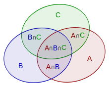

---
tags:
    - matematica
    - combinatorica
    - multimi
---

**Autor**: Ștefan-Cosmin Dăscălescu

În unele probleme de algoritmică, suntem nevoiți să calculăm numărul de răspunsuri care se potrivesc cu o anumită regulă, dar numărarea directă a fiecărei reguli în mod individual nu aduce cu ușurință răspunsul corect. În cazul acestor probleme, vom apela la un principiu matematic folosit în foarte mulți algoritmi elementari studiați până acum, formalizând discuția și aducând mai multe asemenea probleme în discuție. 

!!! info "Definiție"
    Principiul includerii și al excluderii (de asemenea denumit pinex) este un principiu matematic care este folosit atunci când vrem să aflăm reuniunea a două sau mai multe mulțimi, generalizându-se modul de calculare a răspunsurilor pentru această clasă de probleme. 

Cu alte cuvinte, dacă avem două sau mai multe condiții care se intersectează, vrem să evităm numărarea de mai multe ori a unor elemente. Vom pleca de la exemple simple pentru a putea generaliza mai ușor. 

## Aplicarea PINEX pentru două mulțimi

Dacă avem două mulțimi $A$ și $B$, pentru a afla numărul de valori care se regăsesc în cel puțin una dintre mulțimi putem să scădem din suma cardinalelor lui $A$ și $B$, cardinalul intersecției celor două mulțimi. Mai formal, vom avea următoarea formulă:

$$
|A \cup B| = |A| + |B| - |A \cap B|
$$

Se poate observa că versiuni rudimentare ale acestei tehnici au fost folosite și în cazul calculării unor răspunsuri pe baza sumelor parțiale (suma valorilor de la poziția $L$ la $R$ este suma primelor $R$ valori din care scădem suma primelor $L-1$ valori) sau în cazul unor alte probleme celebre.

### Problema [MooBuzz - USACO Silver](https://usaco.org/index.php?page=viewproblem2&cpid=966)

Această problemă este o adaptare a celebrei probleme FizzBuzz, cerându-se aflarea celui de-al $n$-lea număr scris pe tablă. Pentru a face acest lucru, vom putea căuta binar răspunsul, știind că la fiecare pas, putem afla câte numere au fost scrise pe tablă care sunt mai mici sau egale cu $k$. 

Pentru aflarea acestui răspuns, vom avea două mulțimi:

* $A = \{x | x \ \% \ 3 = 0, x \leq k \}$
* $B = \{x | x \ \% \ 5 = 0, x \leq k \}$

Este evident că vom scădea din $|A| + |B|$ valoarea $|A \cap B|$, care reprezintă mulțimea numerelor care se împart la $15$, soluția devenind una în timp constant, singurul factor de timp prezent fiind cel corespunzător căutării binare. Mai jos puteți găsi implementarea în limbajul C++.

```cpp
#include <fstream>
using namespace std;
 
int main() {
    ifstream cin("moobuzz.in");
    ofstream cout("moobuzz.out");
    
    int n;
    cin >> n;
    
    long long L = 1;
    long long R = 2000000000;
    long long ans = 0;
    
    while (L <= R) {
        long long mid = (L + R) / 2;
        long long cnt = mid/3 + mid/5 - mid/15;
        if (mid - cnt >= n) {
            ans = mid;
            R = mid - 1;
        }
        else {
            L = mid + 1;
        }
    }
    
    cout << ans << '\n';
    return 0;
}
```

## Aplicarea PINEX pentru trei sau mai multe mulțimi

Pentru a aplica aceeași formulă pentru trei sau mai multe mulțimi, vom prezenta o proprietate importantă care ne va ajuta de-a lungul formulelor viitoare. 

!!! note "Observație"
    Pentru a calcula răspunsul unei probleme la care va trebui să aplicăm acest principiu, vom aduna mereu la răspuns rezultatele mulțimilor cu cardinal impar și vom scădea din răspuns rezultatele mulțimilor cu cardinal par. 



De exemplu, când avem trei mulțimi, formula de mai devreme devine

$$
|A \cup B \cup C| = |A| + |B| + |C| - |A \cap B| - |A \cap C| - |B \cap C| + |A \cap B \cap C|
$$

În mod general, dacă avem $k$ mulțimi, răspunsul va deveni următorul, unde $A_i$ reprezintă cea de-a $i$-a mulțime:

$$
\left| \bigcup_{i=1}^n A_i \right| = \sum_{i=1}^n|A_i| - \sum_{1\leq i<j\leq n} |A_i \cap A_j| + \sum _{1\leq i<j<k\leq n}|A_i \cap A_j \cap A_k| - \cdots + (-1)^{n-1} | A_1 \cap \cdots \cap A_n |
$$

Pe scurt, formula va deveni următoarea:

$$
\bigg|\bigcup_{i=1}^nA_i \bigg|= \sum_{0 \neq J \in \{1, 2,...,n\} } (-1)^{|J|-1} \bigg| \bigcap_{j \in J} A_j \bigg|
$$

Acest lucru ne garantează că pentru un element care apare în mai multe mulțimi, deși este adunat individual de mai multe ori, se scad părțile care apar în plus în calculul final. 

!!! note "Observație"
    Dacă avem de-a face cu o problemă la care trebuie să recurgem la aflarea complementului răspunsului folosind PINEX, termenii care se adună și cei care se scad se inversează. 

### Problema [Prime Multiples](https://cses.fi/problemset/task/2185)

Pentru a afla câte valori se împart la măcar unul din cele $n$ numere prime date, vom afla pentru fiecare submulțime de numere câte numere se împart la produsul numerelor din submulțime, adunând sau scăzând din răspuns după caz. Pentru a face asta ușor, vom reprezenta fiecare submulțime folosind o mască pe biți, tehnică explicată [în acest articol](https://roalgo-discord.github.io/arhiva-educationala/mediu/bitwise-ops/). Singurul lucru la care trebuie avut grijă este obținerea produselor submulțimilor, pentru a evita overflow-urile. 

```cpp
#include <iostream>
#include <vector>

using namespace std;
 
int main() {
    long long n, k;
    cin >> n >> k;
    
    vector<long long> v(k);
    for (int i = 0; i < k; ++i) {
        cin >> v[i];
    }
    
    long long sum = 0;
    for (int msk = 1; msk < (1<<k); ++msk) {
        long long prod = 1;
        int cnt = 0;
        for(int i = 0; i < k; ++i) {
            if(msk & (1<<i)) {
                if(n / prod < v[i]) { // evitam overflowul
                    prod = n+1;
                }
                else {
                    prod = prod * v[i];
                }
                ++cnt;
            }
        }
        if (cnt % 2 == 1) {
            sum += n/prod;
        }
        else {
            sum -= n/prod;
        }
    }
    
    cout << sum;
    return 0;
}
```

## Aplicarea PINEX în probleme mai complexe 

Pe lângă aplicarea [funcției Möbius](https://roalgo-discord.github.io/arhiva-educationala/mediu/mobius/) în problemele dificile ce folosesc PINEX, se mai regăsește o formă de aplicare a acestui principiu, atunci când trebuie să numărăm câte perechi sau mulțimi de valori au o anumită valoare a unei funcții. De foarte multe ori, funcțiile ce apar în aceste probleme sunt multiplicative, deci scopul va fi acela de a exclude mulțimile care au drept răspuns o valoare multiplu de numărul pe care îl căutăm.

### Problema [Counting Coprime Pairs](https://cses.fi/problemset/task/2417/)

Pentru a afla numărul de perechi de numere prime între ele, vom afla pentru fiecare valoare posibilă a celui mai mare divizor comun câte asemenea perechi există. Pentru a face acest lucru, vom itera în ordine descrescătoare și vom afla mai întâi numărul de numere multiple cu $i$ din șirul dat, iar mai apoi vom scădea din numărul de perechi posibile care se pot genera, numărul de perechi deja aflate la pașii anteriori, când am verificat valori mai mari ale celui mai mare divizor comun. Mai jos se poate vedea o asemenea implementare.

```cpp
#include <iostream>
#include <vector>
 
using namespace std;
 
int main()
{
    vector<long long> fr(1000001), cnt(1000001);
    
    int n;
    cin >> n;
    
    for (int i = 1; i <= n; ++i) {
        int val;
        cin >> val;
        fr[val]++;
    }
    
    long long ans = 1LL * n * (n-1) / 2;
    for (int i = 1000000; i >= 2; --i) {
        long long val = 0;
        // aflam cate valori sunt multipli de i
        for (int j = i; j <= 1000000; j += i) {
            val += fr[j];
        }
        cnt[i] = val * (val-1) / 2;
        // scadem perechile deja calculate
        for (int j = i+i; j <= 1000000; j += i) {
            cnt[i] -= cnt[j];
        }
        ans -= cnt[i];
    }
    
    cout << ans;
    return 0;
}
```

## Concluzii

Principiul includerii și excluderii este un principiu ce se dovedește a fi util în foarte multe probleme de numărare, cunoașterea acestuia dovedindu-se a fi esențială în multe probleme, începând de la concursurile de juniori (lot, concursuri internaționale) și terminând cu diverse competiții online în care teoria numerelor își face apariția. Mai târziu, funcții sau constante ce se bazează pe PINEX vor demonstra o dată în plus utilitatea acestui principiu. Problemele de mai jos pot avea și alte abordări, în afară de cea cu PINEX, toate fiind foarte utile și folositoare în competițiile de informatică. 

## Probleme suplimentare

* [infoarena frac](https://infoarena.ro/problema/frac)
* [infoarena reuniune](https://infoarena.ro/problema/reuniune)
* [infoarena pairs](https://infoarena.ro/problema/pairs)
* [Codeforces Orac and LCM](https://codeforces.com/contest/1349/problem/A)
* [OJI 2024 Poseidon](https://kilonova.ro/problems/2506/)
* [Codeforces Count GCD](https://codeforces.com/contest/1750/problem/D)
* [USACO Gold Cowpability](http://www.usaco.org/index.php?page=viewproblem2&cpid=862)
* [Codeforces Small GCD](https://codeforces.com/contest/1900/problem/D)
* [Lot Juniori 2015 cardinal](https://kilonova.ro/problems/1639)
* [Lot Juniori 2019 divizori](https://kilonova.ro/problems/1807)
* [Lot Juniori 2024 pmo](https://kilonova.ro/problems/2807)
* [RoAlgo Contest #1 Echipe](https://kilonova.ro/problems/652)
* [infoarena cowfood](https://infoarena.ro/problema/cowfood)
* [ONI 2019 TreeGCD](https://kilonova.ro/problems/11)
* [Atcoder DP Contest Grid 2](https://atcoder.jp/contests/dp/tasks/dp_y)
* [Probleme cu PINEX de pe Kilonova](https://kilonova.ro/tags/292)

## Lectură suplimentară

* [Pinex - Infoarena](https://infoarena.ro/problema/pinex)
* [Inclusion-Exclusion Principle - Codeforces](https://codeforces.com/blog/entry/64625)
* [The Inclusion-Exclusion Principle - CP-algorithms](https://cp-algorithms.com/combinatorics/inclusion-exclusion.html)
* [Inclusion-Exclusion Principle - USACO Guide](https://usaco.guide/plat/PIE?lang=cpp)
* [PIE - University of Victoria](https://www.math.uvic.ca/faculty/gmacgill/guide/PIE.pdf)
* [Principiul includerii și excluderii - Viitori Olimpici](https://www.viitoriolimpici.ro/uploads/attach_data/9/2/24//5e01c06.pdf)
* [Inclusion–exclusion principle - Wikipedia](https://en.wikipedia.org/wiki/Inclusion%E2%80%93exclusion_principle)
* [Principle of Inclusion and Exclusion (PIE) - Brilliant](https://brilliant.org/wiki/principle-of-inclusion-and-exclusion-pie/)