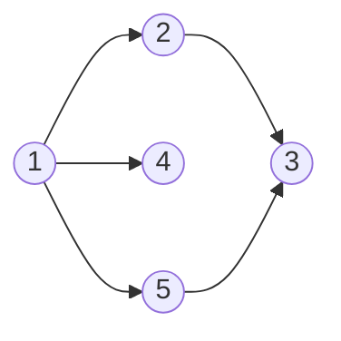
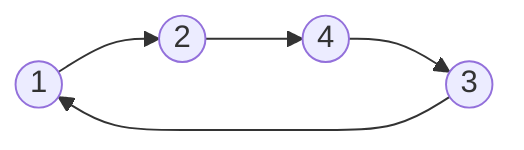
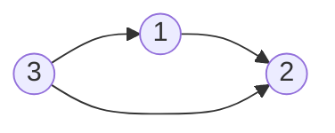

# Sortare Topologică

**Autor : Radu Mocănașu**

## Cunoștințe necesare:
* Grafuri.
* Recursivitate.
* Liste de Adiacență.
* Câteva noțiuni legate de vectorii STL.

## Teorie

Într-un graf orientat și aciclic, definim sortarea topologică ca fiind o ordine a nodurilor (nu neapărat unică), astfel încât, dacă notăm cu **P** lista pozițiilor nodurilor, iar **A** și **B** sunt două noduri, cu muchie de la **A** la **B**,
 $$P_A < P_B $$

### Spre exemplu:


În acest graf, o sortare topologică validă ar fi: **1, 2, 5, 3, 4**, deoarece **1** se află înaintea lui **2**, **5** înaintea lui **3**, etc. Un alt exemplu ar fi **1, 4, 5, 2, 3**. O ordine incorectă ar fi însă **1, 4, 2, 3, 5**, deoarece **5** se află după **3**, deși există muchie de la **5** la **3**.

### Un alt exemplu:


Acest graf conține un ciclu (de fapt chiar este unul), mai exact **1, 2, 3, 4** . Astfel, putem alege 2 noduri, **A** și **B**, astfel încât ele aparțin aceluiași ciclu (se poate ajunge de la **A** la **B** și viceversa). Dar asta implică faptul că în sortarea topologică, **A** se află în fața lui **B**, dar și că **B** se află înaintea lui **A**, ceea ce duce la o contradicție. Așadar, într-un graf ce conține un ciclu, nu există nicio sortare topologică.

## Algoritmul

Întâi, vom presupune că graful este aciclic.

Numim vecin al unui nod **U**, un nod **V**, astfel încât există muchie de la **U** la **V**. Însă, știm că pentru orice două noduri **U** și **V**, pentru care există muchie de la **U** la **V**, **U** se află înaintea lui **V** în ordinea topologică.

Așadar, în sortarea topologică, orice nod se află înaintea vecinilor săi.

În același timp, într-o parcurgere DFS, vom intra în vecinii unui nod după ce intrăm în acesta. Putem defini timpul de ieșire al unui nod ca fiind momentul la care ne întoarcem din recursivitate înapoi la el (pentru simplitate, timpii pot fi numerotați de la **1** la **n**, unde **n** este numărul de noduri). Astfel, timpul de ieșire al unui nod va fi tot timpul mai mare decât cel al vecinilor săi, deci pentru a afla ordinea topologică, trebuie doar să sortăm nodurile descrescător după timpii de ieșire.

Pentru a face acest lucru mai simplu, putem doar să adăugăm nodurile într-o listă goală, pe care o vom inversa la sfârșit. Să ne uităm la următoarea secvență de cod:

```c++
#include <iostream>
#include <vector>
#include <algorithm>

//valoare maxima arbitrara pentru numarul maxim de noduri
const int NMAX = 10002;

//listele de adiacenta
std::vector <int> lista_adj[NMAX];

//lista nodurilor sortate dupa timpii de iesire
std::vector <int> ord;

//daca un nod a mai fost vizitat pana acum sau nu
bool viz[NMAX];
void dfs(int nod){
    
    viz[nod] = 1;
    //parcurgem lista vecinilor
    for(int vecin : lista_adj[nod]){
        //ne intereseaza doar cei care nu au mai fost vizitati
        if(!viz[vecin])
            dfs(vecin);
    }
    
    //la intoarcerea din recursivitate adaugam nodul in lista
    ord.push_back(nod);
    
}

int main()
{
    int n,m,u,v;
    //citire
    std::cin >> n >> m;
    while(m--){
        std::cin >> u >> v;
        lista_adj[u].push_back(v);
    }
    
    //incepem parcurgerea dfs
    dfs(1);
    
    //inversam lista nodurilor sortate dupa timpii de iesire
    std::reverse(ord.begin(), ord.end());
    for(int nod : ord){
        std::cout << nod << " ";
    }
    return 0;
}
```

Acest cod este însă greșit și nu va da rezultatul corect pentru anumite cazuri. Să luăm următorul exemplu:



Începând dintr-un nod arbitrar (în acest caz, **1**), noi vom vizita doar nodurile în care putem ajunge din el. Însă, în exemplul dat, asta înseamnă că vom ignora nodul **3**, care în sortare s-ar afla înaintea lui **1**.

Pentru a rezolva asta, putem parcurge lista tuturor nodurilor și să verificăm pentru fiecare dacă este vizitat sau nu. Pentru orice nod nevizitat, știm că nu se poate ajunge la el din niciun nod vizitat, deci este corect să spunem că orice nod nevizitat se poate afla înaintea nodurilor deja vizitate.

Așadar, pentru orice nod nevizitat, putem începe o parcurgere **dfs** din el și putem adăuga în continuare nodurile în lista finală, în funcție de timpul lor de ieșire.

```c++
#include <iostream>
#include <vector>
#include <algorithm>

//valoare maxima arbitrara pentru numarul maxim de noduri
const int NMAX = 10002;

//listele de adiacenta
std::vector <int> lista_adj[NMAX];

//lista nodurilor sortate dupa timpii de iesire
std::vector <int> ord;

//daca un nod a mai fost vizitat pana acum sau nu
bool viz[NMAX];
void dfs(int nod){
    
    viz[nod] = 1;
    //parcurgem lista vecinilor
    for(int vecin : lista_adj[nod]){
        //ne intereseaza doar cei care nu au mai fost vizitati
        if(!viz[vecin])
            dfs(vecin);
    }
    
    //la intoarcerea din recursivitate adaugam nodul in lista
    ord.push_back(nod);
    
}

int main()
{
    int n,m,u,v;
    //citire
    std::cin >> n >> m;
    while(m--){
        std::cin >> u >> v;
        lista_adj[u].push_back(v);
    }

    //iteram prin lista nodurilor
    for(int i = 1; i <= n; i++){
        //daca este nevizitat, incepem parcurgerea DFS din el
        if(!viz[i]){
            dfs(i);
        }
    }
    
    //inversam lista nodurilor sortate dupa timpii de iesire
    std::reverse(ord.begin(), ord.end());
    for(int nod : ord){
        std::cout << nod << " ";
    }
    return 0;
}
```

Acest cod este corect si va returna o sortare topologica valida (nu neaparat unica).

## Exemplu de Problema: [CSES - Course Schedule](https://cses.fi/problemset/task/1679)

### Cerință:

Se dau **n** cursuri, numerotate de la **1** la **n** și **m** condiții ce trebuie îndeplinite, de forma a doi indici, **i** și **j**, cu proprietatea ca acel curs cu numărul **i** trebuie terminat înaintea cursului cu numărul **j**.

$$1 \leqslant i < j \leqslant n$$

Se cere să se afișeze o ordine în care să fie făcute aceste cursuri, astfel încât toate condițiile să fie îndeplinite. Dacă nu există nicio soluție, se va afișa "IMPOSSIBLE".

### Soluție: 

Nu este greu să ne dăm seama că acele 'condiții' pot fi reprezentate ca niște muchii orientate într-un graf, iar ordinea validă a realizării task-urilor va fi cea din sortarea topologică a grafului rezultat. În cazul în care graful conține cicluri, algoritmul tot va returna o anumită ordine a nodurilor. Astfel, putem parcurge din nou fiecare condiție și să verificăm dacă fiecare condiție e îndeplinită, iar dacă nu e, înseamnă că nu avem soluție. Putem verifica acest lucru ușor ținând minte într-un vector pozițiile nodurilor din sortarea topologică și să le comparăm, cum este evidențiat și în acest cod:

```c++
#include <iostream>
#include <vector>
#include <algorithm>

//algoritmul descris mai sus, doar ca am schimbat un pic denumirile
std::vector <int> G[100005];

//vector cu toate muchiile
std::vector < std::pair <int, int> > edges;

std::vector <int> ord;

bool viz[100005];

//pozitia fiecarui nod in ordinea topologica
int poz[100005];

void dfs(int nod){
    viz[nod] = 1;
    for(int x : G[nod]){
        if(!viz[x])
            dfs(x);
    }
    ord.push_back(nod);
}

int main()
{
    int n,m,u,v;

    std::cin >> n >> m;
    while(m--){
        std::cin >> u >> v;
        G[u].push_back(v);
        //adaugam muchia in lista de muchii
        edges.push_back(std::make_pair(u,v));
    }

    for(int i = 1; i <= n; i++){
        if(!viz[i]){
            dfs(i);
        }
    }

    std::reverse(ord.begin(), ord.end());

    for(int i = 0; i < ord.size(); i++){
        poz[ord[i]] = i + 1;
    }

    //parcurgem din nou toate muchiile si verificam
    for(std::pair <int, int> e : edges){
        if(poz[e.first] > poz[e.second]){
            //am gasit o muchie pentru care nu este respectata ordinea topologica
            std::cout << "IMPOSSIBLE";
            return 0;
        }
    }

    //daca ordinea respecta toate conditiile, o afisam
    for(int x : ord){
        std::cout << x << " ";
    }
    return 0;
}
```

## Resurse Utile

### Probleme și Articole Recomandate

* [USACO Guide](https://usaco.guide/gold/toposort)
* [Sortare Topologica - Infoarena](https://www.infoarena.ro/problema/sortaret)
* [Path - Infoarena](https://www.infoarena.ro/problema/path)
* [Leximin - Kilonova](https://kilonova.ro/problems/1016)

### Probleme adiționale

* [Easygraph - Infoarena](https://www.infoarena.ro/problema/easygraph)
* [xy - Kilonova](https://kilonova.ro/problems/2627)
* [Somnoros - Kilonova](https://kilonova.ro/problems/677)
* [Alpin - Infoarena](https://infoarena.ro/problema/alpin)
