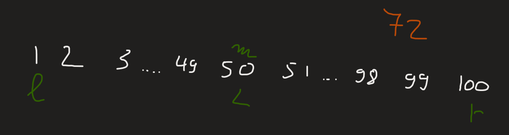
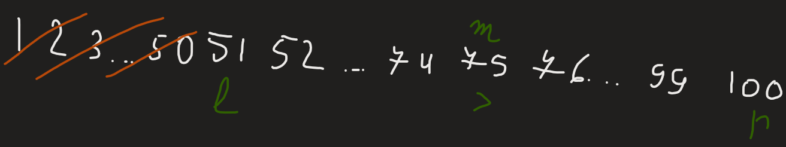
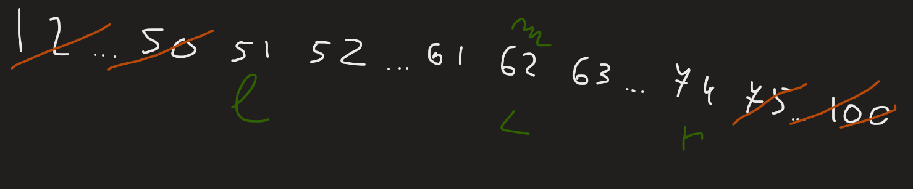
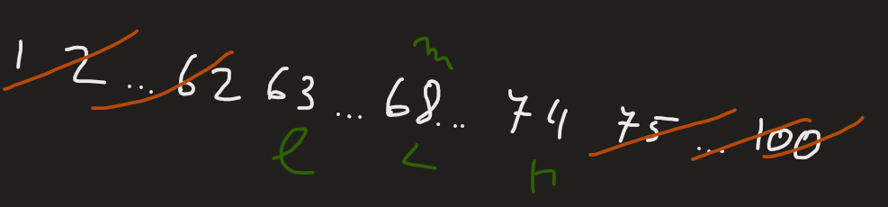
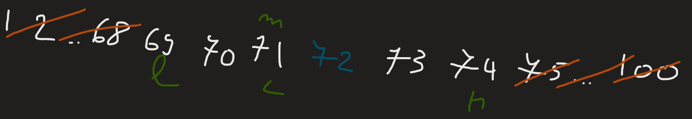
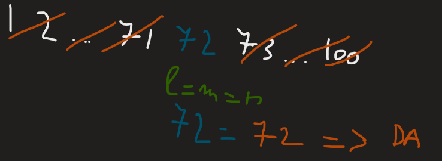

---
tags:
    - vectori
---

**Autor**: Cineva

Să presupunem că avem un șir de $N$ numere și memorie astfel încât să putem
reține _doar_ șirul (plus evident alte variabile, dar nu foarte multe). Noi
primim mai multe întrebări, de forma: Există valoarea $X$ în șir?

În mod evident, o soluție foarte trivială este să parcurgem manual șirul pentru
fiecare întrebare, și să vedem dacă elementul cerut apare sau nu în șir, astfel
obținând complexitate totală de $O(N \cdot Q)$. Singura noastră problemă este că
noi o să avem $N$ și $Q$ undeva în jur de $10^6$, ceea ce va face ca această
abordare să pice clar în timp, deci va trebui găsită o soluție mult mai
eficientă. Aici intervine algoritmul de _căutare binară_.

## Prezentarea algoritmului

!!! note "Notă"
    De acum încolo, se va presupune că șirul nostru este sortat crescător.
    Căutarea binară pe un șir nesortat va da mereu răspunsuri eronate.

În algoritmul de căutare binară se va pleca de la analiza șirului pe întreaga sa
lungime, și se va fixa punctul de mijloc din sir. Dacă valoarea poziției din
mijloc este mai mică decât valoarea căutată, atunci sigur valoarea căutată se
poate (că nu știm sigur dacă există!) afla în a doua jumătate, altfel, se poate
afla în prima jumătate. Mai departe, nu va mai fi necesar sa analizăm tot șirul,
ci doar jumătatea relevantă (cea în care considerăm noi că există o șansă să
găsim valoarea noastră), și algoritmul se va repeta până când lungimea devine
$1$ și putem determina răspunsul. Dat fiind faptul că noi la fiecare pas
împărțim la $2$ lungimea șirului, acest lucru ne va da complexitate logaritmică
la determinarea răspunsului, deci vom avea complexitate $O(Q \log N)$ (dacă
șirul nostru nu este sortat din input, se mai adaugă și un $O(N \log N)$ la
complexitate), cu memorie $O(N)$.

Pentru o înțelegere mai clară a algoritmului, să presupunem următorul exemplu: se dă un șir sortat crescător unde apar toate numerele de la $1$ la $100$, și se cere să determinăm dacă există în șir valoarea $72$.










O întrebare la care trebuie totuși dat răspuns este: De ce împărțim în două
jumătăți și de ce nu în $3$ treimi? Da, $\log_3 N < \log_2 N$, dar numărul de
verificări efectuate va fi mai mare la împărțirea în $3$ treimi, deci în
continuare este mai eficient să împărțim în două jumătăți. În mod inductiv se va
demonstra pentru orice împărțire posibilă.

## O implementare banală

Cea mai des întâlnită implementare a căutării binare este următoarea:

```cpp
void cb1(int n) {
    int l = 1, r = n, ans = -1;
    while (l <= r) {
        int mij = (l + r) / 2;
        if (conditie) {
            ans = mij;
            l = mij + 1;
        } else {
            r = mij - 1;
        }
    }
}
```

Implementarea de mai sus este una corectă, dar se pot întâlni următoarele bug-uri:

* Schimbarea în $l = mij$ și $r = mij$ va face ca programul nostru să ruleze
  într-o buclă infinită (deoarece ambele valori vor atinge la un moment dat
  valoarea $mij$, și deci va fi respectată mereu condiția $l \leq r$)

* În timp ce-l calculăm pe $mij$, ne putem lua overflow (dacă prin absurd
  ajungem să căutam fix pe la valorile maxime pe care le poate reține tipul
  nostru de date, este inevitabil un overflow generat de $l + r$). De aceea,
  următoarea variantă prezentată se va axa fix pe rezolvarea acestui bug.

## O implementare corectă

```cpp
void cb2(int n) {
    int l = 1, r = n, ans = -1;
    while (l < r) {
        int mij = l + (r - l) / 2;
        if (conditie) {
            ans = mij;
            l = mij + 1;
        } else {
            r = mij - 1;
        }
    }
}
```

Această căutare binară se bazează pe principiul menționat mai sus: noi
înjumătățim de fiecare dată lungimea șirului pe care încercăm să căutăm ceea ce
ne interesează. Formula de mai sus pentru calcularea mijlocului este echivalentă
cu cea din prima căutare, dar mai mult, nu are cum să ne dea overflow.

De fiecare dată când mijlocul nostru verifică _condiție_, noi facem un _„salt”_
de la o poziție $l$ la alta. La finalul căutării, indicele $l$ final va fi
defapt o sumă a salturilor, iar ca pe orice număr întreg, noi acest număr îl
putem descompune într-o altă bază numerică. Hai să vedem cum putem rafina
această idee cu o altă implementare mai jos.

## Căutarea binară a lui Mihai Pătrașcu

```cpp
void cb3_patrascu(int n) {
    int l = 0, e = 31;
    while (e >= 0) {
        if (l + (1 << e) <= n && conditie) {
            l += (1 << e);
        }
        e--;
    }
}
```

Baza în care noi vom descompune suma va fi baza $2$, pentru a menține în
continuare complexitatea $\log_2 N$. Inițial, vom pleca cu un exponent $e$, unde
$2^e$ va reprezenta lungimea secvenței pe care o analizăm (atenție să nu ieșim
din vector!). Chiar dacă noi vom analiza inițial o lungime care este putere de
$2$, care foarte probabil să fie diferită de $N$, se poate demonstra foarte ușor
că noi (dacă o să fie necesar), vom putea căuta valori și în acea secvență
neacoperită inițial. Lăsăm această demonstrație ca temă pentru cititor.

Căutarea de mai sus poartă și numele de _Căutarea binară a lui [Mihai
Pătrașcu](http://people.csail.mit.edu/mip/)_, sau _căutarea pe biți_.

În mare parte, aceste căutări binare ne vor da aceeași complexitate peste tot,
în schimb, când vrem să implementăm algoritmul de Lowest Common Ancestor (LCA)
cu Binary Lifting, căutarea binară pe biți reduce algoritmul de la $O(\log^2{H})$
la $O(\log{H})$, unde $H$ reprezintă adâncimea maximă a arborelui.

## Căutarea binară pe răspuns

Aici trebuie completat

## Funcții de sistem pentru căutarea binară

Și aici trebuie completat

## Concluzii și lecturi suplimentare

Căutarea binară este unul dintre cele mai fundamentale principii ale
algoritmicii, fiind absolut necesar pentru a optimiza probleme unde ni se cere
să determinăm existența unei valori într-un șir, sau determinarea unui număr
maxim/minim care să respecte o condiție impusă de problemă etc.

Pentru aprofundarea a algoritmului, recomand rezolvarea următoarelor probleme și
citirea următoarelor articole:

Și aici trebuie destule probleme și exemple

* [Problema cautbin (Infoarena)](https://www.infoarena.ro/problema/cautbin)
* [Binary Search - USACO Guide](https://usaco.guide/silver/binary-search?lang=cpp)
* [Cursurile Edu de pe Codeforces, este necesară înregistrarea anterioară](https://codeforces.com/edu/course/2/lesson/6)
